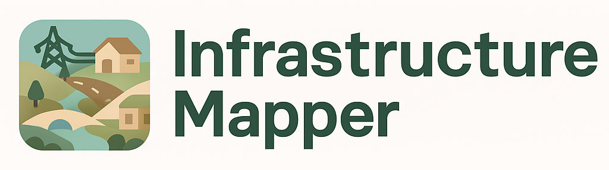
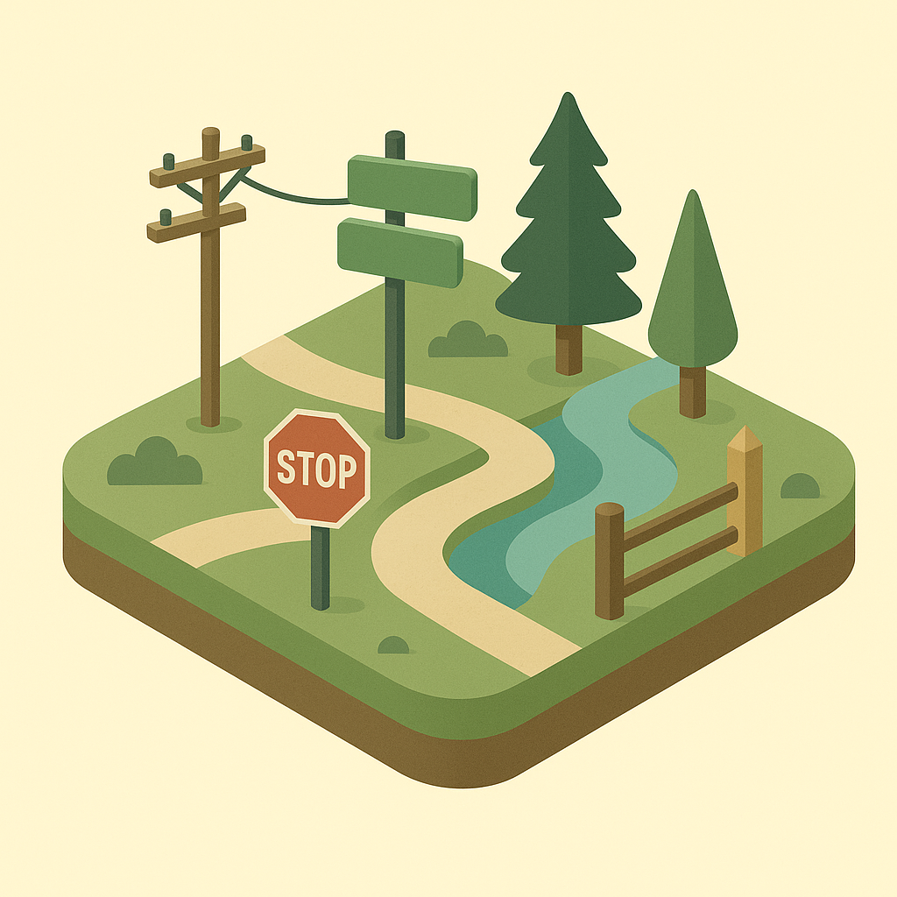

# 🌐 Infrastructure Mapper
<!-- cspell:ignore landuse -->



Welcome to **Infrastructure Mapper**! This repository contains guidelines and conventions for a spatial database intended to be used managing infrastructure-related data.

---

## 📖 Table of Contents

- [🌐 Infrastructure Mapper](#-infrastructure-mapper)
  - [📖 Table of Contents](#-table-of-contents)
  - [🚀 Project Overview](#-project-overview)
  - [📜 License](#-license)
  - [📂 Folder Structure](#-folder-structure)
  - [🤖 Using 'AI' (Large Language Models)](#-using-ai-large-language-models)
  - [🌿 Design Aesthetic](#-design-aesthetic)
  - [Data Model](#data-model)
  - [⚒️ Using](#️-using)
  - [🛠️ Scripts Overview](#️-scripts-overview)
  - [🧊 Using the Nix Flake](#-using-the-nix-flake)
  - [✨ Contributing](#-contributing)
  - [📧 Contact](#-contact)
  - [Contributors](#contributors)

---

## 🚀 Project Overview


| Test | Description |
|-----------|-------------|
|[](https://github.com/kartoza/InfrastructureMapper/actions/workflows/YamlChecks.yml)           | Check that all yaml files are well formed. |
|[](https://github.com/kartoza/InfrastructureMapper/actions/workflows/MarkdownChecks.yml)           | Check that all markdown files are well formed.            |
|[](https://github.com/kartoza/InfrastructureMapper/actions/workflows/LoadSchema.yml)           | Check that PostgreSQL / PostGIS fixtures load.             |
|[](https://github.com/kartoza/InfrastructureMapper/actions/workflows/SQLChecks.yml)           |  Check that all SQL files are well formed and formatted.           |
|           |             |
|           |             |
|           |             |
|           |             |
|           |             |
|           |             |

[](https://github.com/kartoza/InfrastructureMapper/actions/workflows/LoadSchema.yml)

[](https://github.com/kartoza/InfrastructureMapper/actions/workflows/SQLFluff.yml)

This project consists of:

1. a [SQL Schema](sql/schema.README.md) for PostgreSQL,
2. a set of fixtures to load that schema with default values (particularly for lookup tables)
3. a set of QGIS forms and layer styles for visualising the data

---

## 📜 License

This project is licensed under the **MIT License**. See the [LICENSE](LICENSE) file for details.

---

## 📂 Folder Structure

```plaintext
InfrastructureMapper/
├── img/               # Images and media resources used in this documentation
├── qml/               # QGIS layer style and form definitions
├── diagrams/          # Documentation and ERD diagrams
├── presentations/     # Presentations for this project and each model created using Marp
├── sql/               # Schema and fixtures to load into postgres
├── scripts/           # Helper scripts
└── README.md          # Project overview and conventions
```

---

## 🤖 Using 'AI' (Large Language Models)

We are fine with using LLM's and Generative Machine Learning to act as general assistants, but the following three guidelines should be followed:

1. **Repeatability:** Although we understand that repeatability is not possible generally, whenever you are verbatim using LLM or Generative Machine Learning outputs in this project, you **must** also provide the prompt that you used to generate the resource.
2. **Declaration:** Sharing the prompt above is implicit declaration that a machine learning assistant was used. If it is not obvious that a piece of work was generated, include the robot (🤖) icon next to a code snippet or text snippet.
3. **Validation:** Outputs generated by a virtual assistant should always be validated by a human and you, as contributor, take ultimate responsibility for the correct functionality of any code and the correct expression in any text or media you submit to this project.

---

## 🌿 Design Aesthetic


Our design aesthetic is an isometric style with a nature and environment inspired palette. We use an the color palette in the table below. The design approach can be personified by:

- Clean vector isometric projection
- Layered terrain with shadows
- Gentle color blending without gradients
- Minimal outlines for clarity
- Selective use of texture (like grass patterns or water ripples)

You can use the notes above and the table below if you are prompt engineering additional graphics for this project using tools like ChatGPT.

Our colour swatch looks like this:


| Name               | Hex      | Use Case                  | Preview                |
|--------------------|----------|---------------------------|------------------------|
| Forest Green       | `#2F5D50`| Dominant vegetation tone  | <span style="display:inline-block;min-width:90px;padding:2px 8px;background:#f5f5f5;border-radius:4px;"><span style="color:#2F5D50;font-weight:bold;">#2F5D50</span></span> |
| Moss Green         | `#7C9C75`| Soft background greenery  | <span style="display:inline-block;min-width:90px;padding:2px 8px;background:#f5f5f5;border-radius:4px;"><span style="color:#7C9C75;font-weight:bold;">#7C9C75</span></span> |
| Earth Brown        | `#A9825A`| Soil, tree bark           | <span style="display:inline-block;min-width:90px;padding:2px 8px;background:#f5f5f5;border-radius:4px;"><span style="color:#A9825A;font-weight:bold;">#A9825A</span></span> |
| Sandstone Beige    | `#E0D2B2`| Pathways, terrain shading | <span style="display:inline-block;min-width:90px;padding:2px 8px;background:#f5f5f5;border-radius:4px;"><span style="color:#E0D2B2;font-weight:bold;">#E0D2B2</span></span> |
| Sky Blue           | `#A4DDED`| Sky, water elements       | <span style="display:inline-block;min-width:90px;padding:2px 8px;background:#f5f5f5;border-radius:4px;"><span style="color:#A4DDED;font-weight:bold;">#A4DDED</span></span> |
| Deep Teal          | `#2B7A78`| Shadows, water depth      | <span style="display:inline-block;min-width:90px;padding:2px 8px;background:#f5f5f5;border-radius:4px;"><span style="color:#2B7A78;font-weight:bold;">#2B7A78</span></span> |
| Leaf Yellow-Green  | `#C1E1C1`| Highlights on foliage     | <span style="display:inline-block;min-width:90px;padding:2px 8px;background:#f5f5f5;border-radius:4px;"><span style="color:#C1E1C1;font-weight:bold;">#C1E1C1</span></span> |
| Rock Gray          | `#9FA8A3`| Mountains, stones         | <span style="display:inline-block;min-width:90px;padding:2px 8px;background:#f5f5f5;border-radius:4px;"><span style="color:#9FA8A3;font-weight:bold;">#9FA8A3</span></span> |
| Cloud White        | `#F5F5F2`| Clouds, light accents     | <span style="display:inline-block;min-width:90px;padding:2px 8px;background:#f5f5f5;border-radius:4px;"><span style="color:#F5F5F2;font-weight:bold;">#F5F5F2</span></span> |

> 🤖 **Prompt:** Generate me a beautiful circular swatch with these colours. Invent nice unique, human names for each colour:
>
> #7C9C75 #A9825A #E0D2B2 #A4DDED #2B7A78 #C1E1C1 #9FA8A3 #F5F5F2

These colors are soft but grounded, avoiding over-saturation while maintaining a naturalistic feel that suits isometric vector work.

---

## Data Model

This section describes each component of the infrastructure mapper data model. You can also find a complete diagram of the data model in [diagrams/Schema.drawio](./diagrams/Schema_2025.drawio) ([image render](./diagrams/Schema_2025.png)).

| Icon | Description |
|------|-------------|
|  | [Electricity](./sql/2-electricity.md) infrastructure such as power lines, transformers, and substations. |
|  | General [infrastructure](./sql/1-infrastructure.md) elements like bridges, dams, and towers. |
|  | [Water](./sql/3-water.md)-related infrastructure including pipes, tanks, and pumps. |
|  | [Vegetation](./sql/4-vegetation.md) features such as trees, hedges, and planted areas. |
|  | [Monitoring](./sql/5-monitoring.md) devices and their observations (e.g., sensors, cameras). |
|  | [Buildings](./sql/6-buildings.md) and associated structures. |
|  | [Fencing](./sql/7-fencing.md) and enclosure features, including standalone gates. |
|  | [Points of Interest](./sql/8-poi.md) (POI) for notable locations or features. |
|  | [Land use areas](./sql/9-landuse.md) such as agricultural, residential, or conservation zones. |
|  | [Gates](./sql/10-gates.md) as access points for properties or enclosures. |
|  | [Poles](./sql/11-poles.md) for lighting, signage, or utility support. |
|  | [Culinary facilities](./sql/12-culinary.md) like kitchens, canteens, and food storage. |
|  | [Roads](./sql/13-roads.md), tracks, and paths for transportation infrastructure. |

---

## ⚒️ Using

Simply take the sql files in the sql folder and load them into postgres.

---

## 🛠️ Scripts Overview

The `scripts/` folder contains utility scripts to assist with database setup, data loading, and project maintenance. Below is a summary of each script:

| Script Name                | Description                                                                                  |
|----------------------------|----------------------------------------------------------------------------------------------|
| `start_pg.sh`              | Nix specific to start a sandboxed postgresql instance with data stored in ./pgdata           |
| `load_schema.sh`           | Loads the SQL schema files into the target database, setting up all required tables.         |
| `stop_pg.sh`               | Nix specific script to stop the postgres database                                            |
| `check.sh`                 | Git precommit check and format SQL files                                                     |
| `gource.sh`                | Visualise the code history using gource                                                      |
| `vscode.sh`                | Launch VSCode with all settings and extensions needed to productively work on this project   |
| `create_presentations.sh`  | Generate presentations using marp.                                                           |
| `scripts/codebase_size_check.sh` | Precommit hook for checking if the codebase has grown. |
| `scripts/commit_test_stats.py`| Precommit hook for checking if the test suite has grown. |
| `scripts/docstrings_check.sh` | Precommit hook for checking that docstrings were used when creating new python code. |
| `scripts/encoding_check.sh` | Precommit hook for checking python modules have their encoding set. |
| `scripts/license_check.sh` | Precommit hook for license and copyright in source files. |

> ✏️ **Note:** Run each script from the project root. Some scripts may require environment variables or configuration—see comments within each script for usage details.

---

## 🧊 Using the Nix Flake

You can use the provided `flake.nix` to get a fully reproducible development environment and to run QGIS with the correct profile.

1. **Install [Nix](https://nixos.org/download.html)** (if you haven’t already).
2. **Enter the development shell:**

```bash
nix develop
```

This gives you all the tools and dependencies you need for working on this project.

1. **Run QGIS with the project profile:**

```bash
  nix run .#qgis
```

Or, for the long-term release version:

```bash
nix run .#qgis-ltr
```

1. **VSCode users:**  

You can launch a ready-to-use VSCode environment:

```bash
./scripts/vscode.sh
```

---

This makes it easy to get started and ensures everyone is using the same environment!

## ✨ Contributing

We welcome contributions! Please read the [CONTRIBUTING.md](CONTRIBUTING.md) for guidelines on how to get started.

---

## 📧 Contact

Have questions or feedback? Feel free to reach out!  
📧 Email: [info@kartoza.com](mailto:info@kartoza.com)  
🌐 Website: [kartoza.com](https://kartoza.com)

## Contributors

- [Tim Sutton](https://github.com/timlinux) - project lead
-  

---

Made with ❤️ by Tim Sutton (@timlinux) and Kartoza Interns.
