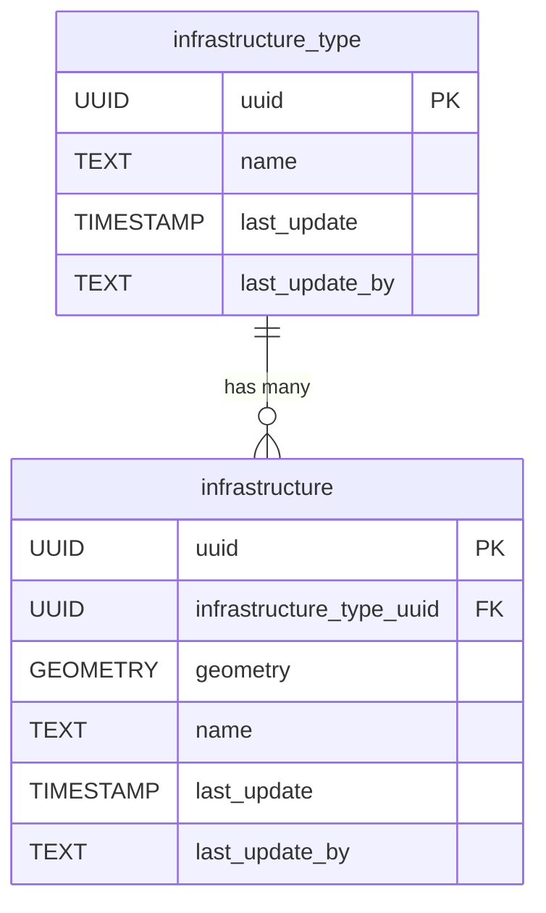

<!-- SPDX-FileCopyrightText: Tim Sutton -->
<!-- SPDX-License-Identifier: MIT -->
# 🏗️ Infrastructure

The **Infrastructure** component defines the core entities for representing general infrastructure elements and their types. It provides a flexible structure for categorizing and storing spatial features that do not fit into more specific categories like buildings or roads.

**Entities from `sql/1-infrastructure.sql`:**

- `infrastructure_type`: Lookup table for different types of infrastructure (e.g., bridge, dam, tower).
- `infrastructure`: Represents individual infrastructure elements, with geometry and a reference to `infrastructure_type`.

<!-- SCHEMA-REFERENCE-START - auto-generated, do not edit by hand -->
## Schema Reference

_Materialized at **v0.1.0** - baseline plus every applied PG migration._

_Source: `1-infrastructure.sql`. 4 table(s)._

### `infrastructure_type`

Lookup table for the types of infrastructure available, e.g. Furniture .

| Column | Type | Nullable | Default | Description |
|---|---|---|---|---|
| `id` | `integer` | no | `nextval('infrastructure_type_id_seq'::regclass)` | The unique infrastructure type ID. This is the Primary Key. |
| `uuid` | `uuid` | no | `gen_random_uuid()` | The unique user ID. |
| `last_update` | `timestamp without time zone` | no | `now()` | The date that the last update was made (yyyy-mm-dd hh:mm:ss). |
| `last_update_by` | `text` | no |  | The name of the user responsible for the latest update. |
| `name` | `text` | no |  | The infrastructure type name. |
| `notes` | `text` | yes |  | Additional information of the infrastructure type. |
| `image` | `text` | yes |  | Image of the infrastructure type. |

**Constraints:**

- PRIMARY KEY `infrastructure_type_pkey`: `PRIMARY KEY (id)`
- UNIQUE `infrastructure_type_name_key`: `UNIQUE (name)`
- UNIQUE `infrastructure_type_uuid_key`: `UNIQUE (uuid)`

### `infrastructure_item`

Infrastructure item refers to any physical components found in the area, e.g. desk, chair.

| Column | Type | Nullable | Default | Description |
|---|---|---|---|---|
| `id` | `integer` | no | `nextval('infrastructure_item_id_seq'::regclass)` | The unique infrastructure item ID. Primary Key. |
| `uuid` | `uuid` | no | `gen_random_uuid()` | The unique user ID. |
| `last_update` | `timestamp without time zone` | no | `now()` | The date that the last update was made (yyyy-mm-dd hh:mm:ss). |
| `last_update_by` | `text` | no |  | The name of the user responsible for the latest update. |
| `name` | `text` | no |  | The name of the infrastructure item. |
| `notes` | `text` | yes |  | Additional information of the infrastructure item. |
| `image` | `text` | yes |  | Image of the infrastructure item. |
| `geometry` | `USER-DEFINED` | yes |  | The centroid location of the infrastructure item. Follows EPSG: 4326. |
| `infrastructure_type_uuid` | `uuid` | no |  |  |

**Constraints:**

- PRIMARY KEY `infrastructure_item_pkey`: `PRIMARY KEY (id)`
- UNIQUE `infrastructure_item_uuid_key`: `UNIQUE (uuid)`
- FOREIGN KEY `infrastructure_item_infrastructure_type_uuid_fkey`: `FOREIGN KEY (infrastructure_type_uuid) REFERENCES infrastructure_type(uuid)`

### `infrastructure_log_action`

Infrastructure log action refers to the actions taken to maintain infrastructure items, e.g. Screwing, Painting, Welding.

| Column | Type | Nullable | Default | Description |
|---|---|---|---|---|
| `id` | `integer` | no | `nextval('infrastructure_log_action_id_seq'::regclass)` | The unique log action ID. Primary Key. |
| `uuid` | `uuid` | no | `gen_random_uuid()` | The unique user ID. |
| `last_update` | `timestamp without time zone` | no | `now()` | The date that the last update was made (yyyy-mm-dd hh:mm:ss). |
| `last_update_by` | `text` | no |  | The name of the user responsible for the latest update. |
| `name` | `text` | no |  | The name of the action taken. |
| `notes` | `text` | yes |  | Additional information of the action taken. |
| `image` | `text` | yes |  | Image of the action taken. |

**Constraints:**

- PRIMARY KEY `infrastructure_log_action_pkey`: `PRIMARY KEY (id)`
- UNIQUE `infrastructure_log_action_name_key`: `UNIQUE (name)`
- UNIQUE `infrastructure_log_action_uuid_key`: `UNIQUE (uuid)`

### `infrastructure_management_log`

Infrastructure management log refers to the process of task that needs to be done on an infrastructure item, e.g. Repair.

| Column | Type | Nullable | Default | Description |
|---|---|---|---|---|
| `id` | `integer` | no | `nextval('infrastructure_management_log_id_seq'::regclass)` | The unique management log ID. Primary Key. |
| `uuid` | `uuid` | no | `gen_random_uuid()` | The unique user ID. |
| `last_update` | `timestamp without time zone` | no | `now()` | The date that the last update was made (yyyy-mm-dd hh:mm:ss). |
| `last_update_by` | `text` | no |  | The name of the user responsible for the latest update. |
| `name` | `text` | no |  | The name of the process. |
| `notes` | `text` | yes |  | Additional information of the process. |
| `image` | `text` | yes |  | Image of the work flow. |
| `condition` | `text` | no |  | Circumstances or factors affecting the infrastructure item type. |
| `infrastructure_item_uuid` | `uuid` | no |  |  |
| `infrastructure_log_action_uuid` | `uuid` | no |  |  |

**Constraints:**

- PRIMARY KEY `infrastructure_management_log_pkey`: `PRIMARY KEY (id)`
- UNIQUE `infrastructure_management_log_name_key`: `UNIQUE (name)`
- UNIQUE `infrastructure_management_log_uuid_key`: `UNIQUE (uuid)`
- FOREIGN KEY `infrastructure_management_log_infrastructure_item_uuid_fkey`: `FOREIGN KEY (infrastructure_item_uuid) REFERENCES infrastructure_item(uuid)`
- FOREIGN KEY `infrastructure_management_log_infrastructure_log_action_uu_fkey`: `FOREIGN KEY (infrastructure_log_action_uuid) REFERENCES infrastructure_log_action(uuid)`
<!-- SCHEMA-REFERENCE-END -->
