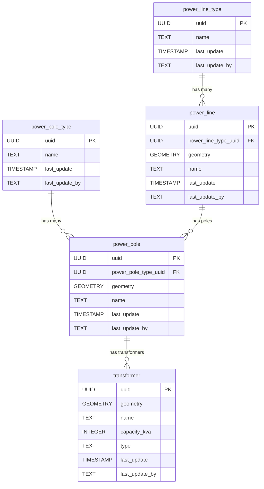

<!-- SPDX-FileCopyrightText: Tim Sutton -->
<!-- SPDX-License-Identifier: MIT -->
# ⚡ Electricity

{ .kz-domain-hero }

The **Electricity** component models electrical infrastructure, including power lines, poles, and transformers. This schema enables the representation of the spatial layout and relationships of electricity distribution elements.

**Entities from `sql/2-electricity.sql`:**

- `power_line_type`: Lookup table for types of power lines (e.g., high voltage, low voltage).
- `power_line`: Represents individual power lines, with geometry and a reference to `power_line_type`.
- `power_pole_type`: Lookup table for types of power poles.
- `power_pole`: Represents individual power poles, with geometry and a reference to `power_pole_type`.
- `transformer`: Represents transformers, with geometry and attributes for capacity and type.

<!-- SCHEMA-REFERENCE-START - auto-generated, do not edit by hand -->
## Schema Reference

_Materialized at **v0.2.0** - baseline plus every applied PG migration._

_Source: `2-electricity.sql`. 4 table(s)._

### `electricity_line_type`

Look up table for the types of electricity lines, e.g. Low-voltage line, High-voltage line etc.

| Column | Type | Nullable | Default | Description |
|---|---|---|---|---|
| `id` | `integer` | no | `nextval('electricity_line_type_id_seq'::regclass)` | The unique electricity line type ID. Primary key. |
| `uuid` | `uuid` | no | `gen_random_uuid()` | The unique user ID. |
| `last_update` | `timestamp without time zone` | no | `now()` | The date that the last update was made (yyyy-mm-dd hh:mm:ss). |
| `last_update_by` | `text` | no |  | The name of the user responsible for the latest update. |
| `name` | `text` | no |  | The name of the electricity line type. |
| `notes` | `text` | yes |  | Additional information of the electricity line type. |
| `image` | `text` | yes |  | Image of the electricity line type |
| `sort_order` | `integer` | yes |  | Defines the pattern of how electricity line type records are to be sorted. |
| `current_a` | `double precision` | no |  | The electricity line current measured in ampere. |
| `voltage_v` | `double precision` | no |  | The electricity line voltage measured in volt. |

**Constraints:**

- PRIMARY KEY `electricity_line_type_pkey`: `PRIMARY KEY (id)`
- UNIQUE `electricity_line_type_current_a_voltage_v_key`: `UNIQUE (current_a, voltage_v)`
- UNIQUE `electricity_line_type_name_key`: `UNIQUE (name)`
- UNIQUE `electricity_line_type_sort_order_key`: `UNIQUE (sort_order)`
- UNIQUE `electricity_line_type_uuid_key`: `UNIQUE (uuid)`

### `electricity_line`

Electricity line refers to the geolocated wire or conductor used for transmitting or supplying electricity.

| Column | Type | Nullable | Default | Description |
|---|---|---|---|---|
| `id` | `integer` | no | `nextval('electricity_line_id_seq'::regclass)` | The unique electricity line ID. Primary key. |
| `uuid` | `uuid` | no | `gen_random_uuid()` | The unique user ID. |
| `last_update` | `timestamp without time zone` | no | `now()` | The date that the last update was made (yyyy-mm-dd hh:mm:ss). |
| `last_update_by` | `text` | no |  | The name of the user responsible for the latest update. |
| `notes` | `text` | yes |  | Additional information of the electricity line. |
| `image` | `text` | yes |  | Image of the electricity line |
| `geometry` | `USER-DEFINED` | no |  | The location of the electricity line. Follows EPSG: 4326. |
| `electricity_line_type_uuid` | `uuid` | no |  |  |

**Constraints:**

- PRIMARY KEY `electricity_line_pkey`: `PRIMARY KEY (id)`
- UNIQUE `electricity_line_uuid_key`: `UNIQUE (uuid)`
- FOREIGN KEY `electricity_line_electricity_line_type_uuid_fkey`: `FOREIGN KEY (electricity_line_type_uuid) REFERENCES electricity_line_type(uuid)`

### `electricity_line_condition_type`

Look up table for the types of electricity line conditions, e.g. Working, Broken etc.

| Column | Type | Nullable | Default | Description |
|---|---|---|---|---|
| `id` | `integer` | no | `nextval('electricity_line_condition_type_id_seq'::regclass)` | The unique electricity line condition ID. Primary key. |
| `uuid` | `uuid` | no | `gen_random_uuid()` | The unique user ID. |
| `last_update` | `timestamp without time zone` | no | `now()` | The date that the last update was made (yyyy-mm-dd hh:mm:ss). |
| `last_update_by` | `text` | no |  | The name of the user responsible for the latest update. |
| `name` | `text` | no |  | The name of the electricity line condition. |
| `notes` | `text` | yes |  | Additional information of the electricity line condition. |
| `image` | `text` | yes |  | Image of the electricity line condition. |
| `sort_order` | `integer` | yes |  | Defines the pattern of how  electricity line condition records are to be sorted. |

**Constraints:**

- PRIMARY KEY `electricity_line_condition_type_pkey`: `PRIMARY KEY (id)`
- UNIQUE `electricity_line_condition_type_name_key`: `UNIQUE (name)`
- UNIQUE `electricity_line_condition_type_sort_order_key`: `UNIQUE (sort_order)`
- UNIQUE `electricity_line_condition_type_uuid_key`: `UNIQUE (uuid)`

### `electricity_line_conditions`

Associative table which stores the electricity line and its condition on a particular day.

| Column | Type | Nullable | Default | Description |
|---|---|---|---|---|
| `uuid` | `uuid` | no | `gen_random_uuid()` | The unique user ID. |
| `last_update` | `timestamp without time zone` | no | `now()` | The date that the last update was made (yyyy-mm-dd hh:mm:ss). |
| `last_update_by` | `text` | no |  | The name of the user responsible for the latest update. |
| `notes` | `text` | yes |  | Additional information of the electricity line and condition. |
| `image` | `text` | yes |  | Image of the electricity line and condition. |
| `date` | `date` | no |  | The electricity line inspection date. |
| `electricity_line_uuid` | `uuid` | no |  |  |
| `electricity_line_condition_uuid` | `uuid` | no |  |  |

**Constraints:**

- PRIMARY KEY `electricity_line_conditions_pkey`: `PRIMARY KEY (electricity_line_uuid, electricity_line_condition_uuid, date)`
- UNIQUE `electricity_line_conditions_uuid_key`: `UNIQUE (uuid)`
- FOREIGN KEY `electricity_line_conditions_electricity_line_condition_uui_fkey`: `FOREIGN KEY (electricity_line_condition_uuid) REFERENCES electricity_line_condition_type(uuid)`
- FOREIGN KEY `electricity_line_conditions_electricity_line_uuid_fkey`: `FOREIGN KEY (electricity_line_uuid) REFERENCES electricity_line(uuid)`
<!-- SCHEMA-REFERENCE-END -->
