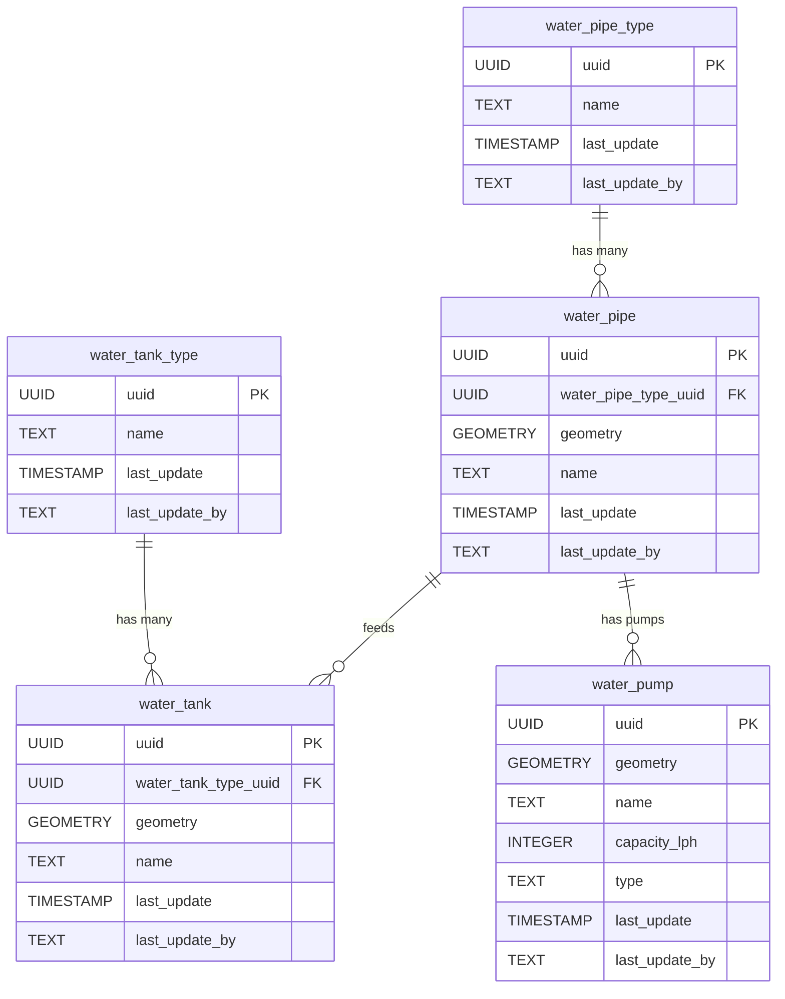

<!-- SPDX-FileCopyrightText: Tim Sutton -->
<!-- SPDX-License-Identifier: MIT -->
# 💧 Water

{ .kz-domain-hero }

The **Water** component models water-related infrastructure, such as pipelines, tanks, and pumps. This schema enables the representation of the spatial layout and relationships of water distribution and storage elements.

**Entities from `sql/3-water.sql`:**

- `water_pipe_type`: Lookup table for types of water pipes (e.g., main, branch).
- `water_pipe`: Represents individual water pipes, with geometry and a reference to `water_pipe_type`.
- `water_tank_type`: Lookup table for types of water tanks.
- `water_tank`: Represents individual water tanks, with geometry and a reference to `water_tank_type`.
- `water_pump`: Represents pumps, with geometry and attributes for capacity and type.

<!-- SCHEMA-REFERENCE-START - auto-generated, do not edit by hand -->
## Schema Reference

_Materialized at **v0.2.0** - baseline plus every applied PG migration._

_Source: `3-water.sql`. 7 table(s)._

### `water_source`

Water source refers to the geolocated water bodies that provide drinking water, e.g. Aquifer.

| Column | Type | Nullable | Default | Description |
|---|---|---|---|---|
| `id` | `integer` | no | `nextval('water_source_id_seq'::regclass)` | The unique water source ID. This is the Primary Key. |
| `uuid` | `uuid` | no | `gen_random_uuid()` | The unique user ID. |
| `last_update` | `timestamp without time zone` | no | `now()` | The date that the last update was made (yyyy-mm-dd hh:mm:ss). |
| `last_update_by` | `text` | no |  | The name of the user responsible for the latest update. |
| `name` | `text` | no |  | The name of the water source. |
| `notes` | `text` | yes |  | Additional information of the water body. |
| `image` | `text` | yes |  | Image of the water body. |

**Constraints:**

- PRIMARY KEY `water_source_pkey`: `PRIMARY KEY (id)`
- UNIQUE `water_source_name_key`: `UNIQUE (name)`
- UNIQUE `water_source_uuid_key`: `UNIQUE (uuid)`

### `water_polygon_type`

Lookup table of the type of water polygon, e.g. Lake.

| Column | Type | Nullable | Default | Description |
|---|---|---|---|---|
| `id` | `integer` | no | `nextval('water_polygon_type_id_seq'::regclass)` | The unique water polygon ID. Primary Key. |
| `uuid` | `uuid` | no | `gen_random_uuid()` | The unique user ID. |
| `last_update` | `timestamp without time zone` | no | `now()` | The date that the last update was made (yyyy-mm-dd hh:mm:ss). |
| `last_update_by` | `text` | no |  | The name of the user responsible for the latest update. |
| `name` | `text` | no |  | The name of the water polygon type. |
| `notes` | `text` | yes |  | Additional information of the water polygon type. |
| `image` | `text` | yes |  | Image of the water polygon type. |

**Constraints:**

- PRIMARY KEY `water_polygon_type_pkey`: `PRIMARY KEY (id)`
- UNIQUE `water_polygon_type_name_key`: `UNIQUE (name)`
- UNIQUE `water_polygon_type_uuid_key`: `UNIQUE (uuid)`

### `water_polygon`

Water polygon refers to the geolocated land areas that are covered in water, either intermittently or constantly, e.g. River.

| Column | Type | Nullable | Default | Description |
|---|---|---|---|---|
| `id` | `integer` | no | `nextval('water_polygon_id_seq'::regclass)` | The unique water polygon ID. Primary Key. |
| `uuid` | `uuid` | no | `gen_random_uuid()` | The unique user ID. |
| `last_update` | `timestamp without time zone` | no | `now()` | The date that the last update was made (yyyy-mm-dd hh:mm:ss). |
| `last_update_by` | `text` | no |  | The name of the user responsible for the latest update. |
| `name` | `text` | no |  | The name of the water polygon. |
| `notes` | `text` | yes |  | Additional information of the water polygon. |
| `image` | `text` | yes |  | Image of the water polygon. |
| `estimated_depth_m` | `double precision` | yes |  | The approximate depth of the water polygon measured in meters. |
| `geometry` | `USER-DEFINED` | yes |  | The location of the water polygon. Follows EPSG: 4326. |
| `water_source_uuid` | `uuid` | no |  |  |
| `water_polygon_type_uuid` | `uuid` | no |  |  |

**Constraints:**

- PRIMARY KEY `water_polygon_pkey`: `PRIMARY KEY (id)`
- UNIQUE `water_polygon_name_key`: `UNIQUE (name)`
- UNIQUE `water_polygon_uuid_key`: `UNIQUE (uuid)`
- FOREIGN KEY `water_polygon_water_polygon_type_uuid_fkey`: `FOREIGN KEY (water_polygon_type_uuid) REFERENCES water_polygon_type(uuid)`
- FOREIGN KEY `water_polygon_water_source_uuid_fkey`: `FOREIGN KEY (water_source_uuid) REFERENCES water_source(uuid)`
- CHECK `depth_check`: `CHECK (((estimated_depth_m >= (0)::double precision) AND (estimated_depth_m <= (20)::double precision)))`

### `water_point_type`

Lookup table on the types of water points, e.g. Drinking trough.

| Column | Type | Nullable | Default | Description |
|---|---|---|---|---|
| `id` | `integer` | no | `nextval('water_point_type_id_seq'::regclass)` | The unique water point type ID. Primary Key. |
| `uuid` | `uuid` | no | `gen_random_uuid()` | The unique user ID. |
| `last_update` | `timestamp without time zone` | no | `now()` | The date that the last update was made (yyyy-mm-dd hh:mm:ss). |
| `last_update_by` | `text` | no |  | The name of the user responsible for the latest update. |
| `name` | `text` | no |  | The name of the water point type. |
| `notes` | `text` | yes |  | Additional information of the water point type. |
| `image` | `text` | yes |  | Image of the water point type. |

**Constraints:**

- PRIMARY KEY `water_point_type_pkey`: `PRIMARY KEY (id)`
- UNIQUE `water_point_type_name_key`: `UNIQUE (name)`
- UNIQUE `water_point_type_uuid_key`: `UNIQUE (uuid)`

### `water_point`

Water point refers to the geolocated water site that is available for use, e.g. Tap.

| Column | Type | Nullable | Default | Description |
|---|---|---|---|---|
| `id` | `integer` | no | `nextval('water_point_id_seq'::regclass)` | The unique water point ID. Primary Key. |
| `uuid` | `uuid` | no | `gen_random_uuid()` | The unique user ID. |
| `last_update` | `timestamp without time zone` | no | `now()` | The date that the last update was made (yyyy-mm-dd hh:mm:ss). |
| `last_update_by` | `text` | no |  | The name of the user responsible for the latest update. |
| `notes` | `text` | yes |  | Additional information of the water point. |
| `image` | `text` | yes |  | Image of the water point. |
| `geometry` | `USER-DEFINED` | yes |  | The coordinates of the water point. Follows EPSG: 4326. |
| `water_source_uuid` | `uuid` | no |  |  |
| `water_point_type_uuid` | `uuid` | no |  |  |

**Constraints:**

- PRIMARY KEY `water_point_pkey`: `PRIMARY KEY (id)`
- UNIQUE `water_point_uuid_key`: `UNIQUE (uuid)`
- FOREIGN KEY `water_point_water_point_type_uuid_fkey`: `FOREIGN KEY (water_point_type_uuid) REFERENCES water_point_type(uuid)`
- FOREIGN KEY `water_point_water_source_uuid_fkey`: `FOREIGN KEY (water_source_uuid) REFERENCES water_source(uuid)`

### `water_line_type`

Description of the type of line through which water flows, e.g. Water pipe.

| Column | Type | Nullable | Default | Description |
|---|---|---|---|---|
| `id` | `integer` | no | `nextval('water_line_type_id_seq'::regclass)` | The unique water line type ID. Primary Key. |
| `uuid` | `uuid` | no | `gen_random_uuid()` | The unique user ID. |
| `last_update` | `timestamp without time zone` | no | `now()` | The date that the last update was made (yyyy-mm-dd hh:mm:ss). |
| `last_update_by` | `text` | no |  | The name of the user responsible for the latest update. |
| `name` | `text` | no |  | The name of the water line type. |
| `notes` | `text` | yes |  | Additional information of the water line type. |
| `image` | `text` | yes |  | Image of the water line type. |
| `sort_order` | `integer` | yes |  | Defines the pattern of how water line types are to be sorted. |
| `pipe_length_m` | `double precision` | yes |  | The water line length measured in meters. |
| `pipe_diameter_m` | `double precision` | yes |  | The water line diameter measured in meters. |

**Constraints:**

- PRIMARY KEY `water_line_type_pkey`: `PRIMARY KEY (id)`
- UNIQUE `water_line_type_name_key`: `UNIQUE (name)`
- UNIQUE `water_line_type_pipe_length_m_pipe_diameter_m_key`: `UNIQUE (pipe_length_m, pipe_diameter_m)`
- UNIQUE `water_line_type_sort_order_key`: `UNIQUE (sort_order)`
- UNIQUE `water_line_type_uuid_key`: `UNIQUE (uuid)`
- CHECK `pipe_length_and_diameter_check`: `CHECK (((pipe_length_m >= (0)::double precision) AND (pipe_diameter_m >= (0)::double precision)))`

### `water_line`

This is the geolocated path the water lines follow.

| Column | Type | Nullable | Default | Description |
|---|---|---|---|---|
| `id` | `integer` | no | `nextval('water_line_id_seq'::regclass)` | The unique water line ID. Primary Key. |
| `uuid` | `uuid` | no | `gen_random_uuid()` | The unique user ID. |
| `last_update` | `timestamp without time zone` | no | `now()` | The date that the last update was made (yyyy-mm-dd hh:mm:ss). |
| `last_update_by` | `text` | no |  | The name of the user responsible for the latest update. |
| `notes` | `text` | yes |  | Additional information of the water line path. |
| `image` | `text` | yes |  | Image of the water line path. |
| `estimated_depth_m` | `double precision` | yes |  | The approximate depth of the water line measured in meters. |
| `geometry` | `USER-DEFINED` | yes |  | The location of the water line. Follows EPSG: 4326 |
| `water_source_uuid` | `uuid` | no |  |  |
| `water_line_type_uuid` | `uuid` | no |  |  |

**Constraints:**

- PRIMARY KEY `water_line_pkey`: `PRIMARY KEY (id)`
- UNIQUE `water_line_uuid_key`: `UNIQUE (uuid)`
- FOREIGN KEY `water_line_water_line_type_uuid_fkey`: `FOREIGN KEY (water_line_type_uuid) REFERENCES water_line_type(uuid)`
- FOREIGN KEY `water_line_water_source_uuid_fkey`: `FOREIGN KEY (water_source_uuid) REFERENCES water_source(uuid)`
- CHECK `estimated_depth_m`: `CHECK ((estimated_depth_m >= (0)::double precision))`
<!-- SCHEMA-REFERENCE-END -->
