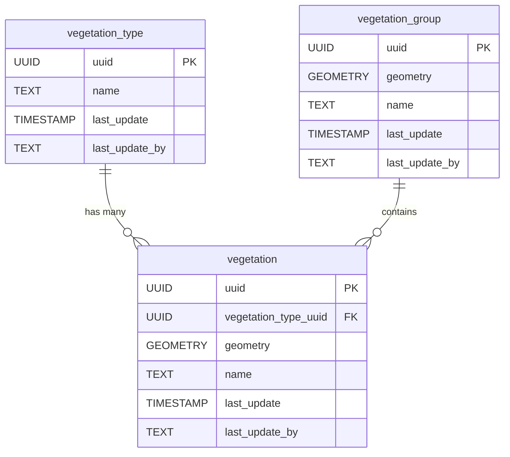

<!-- SPDX-FileCopyrightText: Tim Sutton -->
<!-- SPDX-License-Identifier: MIT -->
# 🌱 Vegetation

{ .kz-domain-hero }

The **Vegetation** component models natural and managed vegetation features, such as trees, hedges, and planted areas. This schema supports the representation of individual plants and grouped vegetation, along with their types and spatial characteristics.

**Entities from `sql/4-vegetation.sql`:**

- `vegetation_type`: Lookup table for types of vegetation (e.g., tree, shrub, hedge).
- `vegetation`: Represents individual vegetation features, with geometry and a reference to `vegetation_type`.
- `vegetation_group`: Represents groups or areas of vegetation, such as groves or planted beds.

<!-- SCHEMA-REFERENCE-START - auto-generated, do not edit by hand -->
## Schema Reference

_Materialized at **v0.1.1** - baseline plus every applied PG migration._

_Source: `4-vegetation.sql`. 9 table(s)._

### `plant_growth_activity_type`

Plant growth activity type refers to the different growth stages of plants, e.g. Sprouting, Seeding etc.

| Column | Type | Nullable | Default | Description |
|---|---|---|---|---|
| `id` | `integer` | no | `nextval('plant_growth_activity_type_id_seq'::regclass)` | The unique plant growth activity ID. This is the Primary Key. |
| `uuid` | `uuid` | no | `gen_random_uuid()` | The unique user ID. |
| `last_update` | `timestamp without time zone` | no | `now()` | The date that the last update was made (yyyy-mm-dd hh:mm:ss). |
| `last_update_by` | `text` | no |  | The name of the user responsible for the latest update. |
| `name` | `text` | no |  | The name of the plant growth activity type. |
| `notes` | `text` | yes |  | Additional information of the plant growth activity type. |
| `image` | `text` | yes |  | Image of the plant growth activity type. |
| `sort_order` | `integer` | yes |  | Defines the pattern of how plant growth activity type records are to be sorted. |

**Constraints:**

- PRIMARY KEY `plant_growth_activity_type_pkey`: `PRIMARY KEY (id)`
- UNIQUE `plant_growth_activity_type_name_key`: `UNIQUE (name)`
- UNIQUE `plant_growth_activity_type_sort_order_key`: `UNIQUE (sort_order)`
- UNIQUE `plant_growth_activity_type_uuid_key`: `UNIQUE (uuid)`

### `plant_type`

Look up table of different types of plants, e.g. Oaktree.

| Column | Type | Nullable | Default | Description |
|---|---|---|---|---|
| `id` | `integer` | no | `nextval('plant_type_id_seq'::regclass)` | The unique plant type ID. This is the Primary Key. |
| `uuid` | `uuid` | no | `gen_random_uuid()` | The unique user ID. |
| `last_update` | `timestamp without time zone` | no | `now()` | The date that the last update was made (yyyy-mm-dd hh:mm:ss). |
| `last_update_by` | `text` | no |  | The name of the user responsible for the latest update. |
| `name` | `text` | no |  | The name of the plant type. |
| `notes` | `text` | yes |  | Additional information of the plant type. |
| `image` | `text` | yes |  | Image of the plant type. |
| `scientific_name` | `text` | yes |  | Scientific name of the plant type e.g. Quercus. |
| `plant_image` | `text` | yes |  | Path to image of plant. |
| `flower_image` | `text` | yes |  | Path to image of flower. |
| `fruit_image` | `text` | yes |  | Path to image of fruit. |
| `variety` | `text` | yes |  | Other variety of this plant type. |
| `info_url` | `text` | yes |  | URL link to more information about this specific plant type. |

**Constraints:**

- PRIMARY KEY `plant_type_pkey`: `PRIMARY KEY (id)`
- UNIQUE `plant_type_name_key`: `UNIQUE (name)`
- UNIQUE `plant_type_scientific_name_key`: `UNIQUE (scientific_name)`
- UNIQUE `plant_type_uuid_key`: `UNIQUE (uuid)`

### `month`

Look up table for different months of the year, e.g. January, February etc.

| Column | Type | Nullable | Default | Description |
|---|---|---|---|---|
| `id` | `integer` | no | `nextval('month_id_seq'::regclass)` | The unique month ID. This is the Primary Key. |
| `uuid` | `uuid` | no | `gen_random_uuid()` | The unique user ID. |
| `last_update` | `timestamp without time zone` | no | `now()` | The date that the last update was made (yyyy-mm-dd hh:mm:ss). |
| `last_update_by` | `text` | no |  | The name of the user responsible for the latest update. |
| `name` | `text` | no |  | Name of the different months in the year e.g. January |
| `notes` | `text` | yes |  | Additional information of the month. |
| `image` | `text` | yes |  | Image of the object stored. |
| `sort_order` | `integer` | yes |  | Defines the pattern of how month records are to be sorted. |

**Constraints:**

- PRIMARY KEY `month_pkey`: `PRIMARY KEY (id)`
- UNIQUE `month_name_key`: `UNIQUE (name)`
- UNIQUE `month_sort_order_key`: `UNIQUE (sort_order)`
- UNIQUE `month_uuid_key`: `UNIQUE (uuid)`

### `plant_usage`

Look up table for different usages of the plants e.g. Food plant, Commercial plant etc.

| Column | Type | Nullable | Default | Description |
|---|---|---|---|---|
| `id` | `integer` | no | `nextval('plant_usage_id_seq'::regclass)` | The unique plant usage ID. This is the Primary Key. |
| `uuid` | `uuid` | no | `gen_random_uuid()` | The unique user ID. |
| `last_update` | `timestamp without time zone` | no | `now()` | The date that the last update was made (yyyy-mm-dd hh:mm:ss). |
| `last_update_by` | `text` | no |  | The name of the user responsible for the latest update. |
| `name` | `text` | no |  | The name of the plant usage. |
| `notes` | `text` | yes |  | Additional information of the plant usage. |
| `image` | `text` | yes |  | Image of the plant stored. |

**Constraints:**

- PRIMARY KEY `plant_usage_pkey`: `PRIMARY KEY (id)`
- UNIQUE `plant_usage_name_key`: `UNIQUE (name)`
- UNIQUE `plant_usage_uuid_key`: `UNIQUE (uuid)`

### `vegetation_point`

Vegetation point refers a geolocated plant. Table stores the individual plant location and the properties.

| Column | Type | Nullable | Default | Description |
|---|---|---|---|---|
| `id` | `integer` | no | `nextval('vegetation_point_id_seq'::regclass)` | The unique vegetation point ID. This is the Primary Key. |
| `uuid` | `uuid` | no | `gen_random_uuid()` | The unique user ID. |
| `last_update` | `timestamp without time zone` | no | `now()` | The date that the last update was made (yyyy-mm-dd hh:mm:ss). |
| `last_update_by` | `text` | no |  | The name of the user responsible for the latest update. |
| `notes` | `text` | yes |  | Additional information of the vegetation point. |
| `image` | `text` | yes |  | Image of the vegetation point. |
| `estimated_crown_radius_m` | `double precision` | yes |  | Estimated radius of the plant's crown measured in meters. |
| `estimated_planting_year` | `numeric` | yes |  | The year the plant was planted. The year must be in the range of 0 to current year. |
| `estimated_height_m` | `double precision` | yes |  | Estimated height of plant measured in meters. |
| `geometry` | `USER-DEFINED` | no |  | The coordinates of the vegetation point. Follows EPSG 4326. |
| `plant_type_uuid` | `uuid` | no |  |  |

**Constraints:**

- PRIMARY KEY `vegetation_point_pkey`: `PRIMARY KEY (id)`
- UNIQUE `vegetation_point_uuid_key`: `UNIQUE (uuid)`
- FOREIGN KEY `vegetation_point_plant_type_uuid_fkey`: `FOREIGN KEY (plant_type_uuid) REFERENCES plant_type(uuid)`
- CHECK `height_check`: `CHECK ((estimated_height_m >= (0)::double precision))`
- CHECK `radius_check`: `CHECK ((estimated_crown_radius_m >= (0)::double precision))`
- CHECK `year_check`: `CHECK ((estimated_planting_year >= (0)::numeric))`
- CHECK `year_check2`: `CHECK (((estimated_planting_year)::double precision <= date_part('Year'::text, now())))`

### `pruning_activity`

Pruning activity refers to the trimming of unwanted parts of a plant.

| Column | Type | Nullable | Default | Description |
|---|---|---|---|---|
| `id` | `integer` | no | `nextval('pruning_activity_id_seq'::regclass)` | The unique pruning activity ID. This is the Primary Key. |
| `uuid` | `uuid` | no | `gen_random_uuid()` | The unique user ID. |
| `last_update` | `timestamp without time zone` | no | `now()` | The date that the last update was made (yyyy-mm-dd hh:mm:ss). |
| `last_update_by` | `text` | no |  | The name of the user responsible for the latest update. |
| `name` | `text` | no |  | The name of the pruning activity. |
| `notes` | `text` | yes |  | Additional information of the  pruning activity. |
| `image` | `text` | yes |  | Image of the  pruning activity. |
| `date` | `date` | no |  | The date of the pruning activity (yyyy:mm:dd). |
| `before_image` | `text` | yes |  | Path to image before the pruning activity was done. |
| `after_image` | `text` | yes |  | Path to image after the pruning activity was done. |
| `vegetation_point_uuid` | `uuid` | no |  |  |

**Constraints:**

- PRIMARY KEY `pruning_activity_pkey`: `PRIMARY KEY (id)`
- UNIQUE `pruning_activity_name_key`: `UNIQUE (name)`
- UNIQUE `pruning_activity_uuid_key`: `UNIQUE (uuid)`
- FOREIGN KEY `pruning_activity_vegetation_point_uuid_fkey`: `FOREIGN KEY (vegetation_point_uuid) REFERENCES vegetation_point(uuid)`

### `harvest_activity`

Harvest activity refers to the gathering of ripe crop or fruits.

| Column | Type | Nullable | Default | Description |
|---|---|---|---|---|
| `id` | `integer` | no | `nextval('harvest_activity_id_seq'::regclass)` | The unique harvest activity ID. This is the Primary Key. |
| `uuid` | `uuid` | no | `gen_random_uuid()` | The unique user ID. |
| `last_update` | `timestamp without time zone` | no | `now()` | The date that the last update was made (yyyy-mm-dd hh:mm:ss). |
| `last_update_by` | `text` | no |  | The name of the user responsible for the latest update. |
| `name` | `text` | no |  | The name of the harvest activity. |
| `notes` | `text` | yes |  | Additional information of the harvest activity. |
| `image` | `text` | yes |  | Image of the harvest activity. |
| `date` | `date` | no |  | The date of the harvest activity (yyyy:mm:dd). |
| `quantity_kg` | `double precision` | yes |  | The quantity of harvest measured in kilograms. |
| `vegetation_point_uuid` | `uuid` | no |  |  |

**Constraints:**

- PRIMARY KEY `harvest_activity_pkey`: `PRIMARY KEY (id)`
- UNIQUE `harvest_activity_name_key`: `UNIQUE (name)`
- UNIQUE `harvest_activity_uuid_key`: `UNIQUE (uuid)`
- FOREIGN KEY `harvest_activity_vegetation_point_uuid_fkey`: `FOREIGN KEY (vegetation_point_uuid) REFERENCES vegetation_point(uuid)`

### `plant_growth_activities`

Associative table to store the plant growth activities and plant types at different months in the year e.g. January_activity.

| Column | Type | Nullable | Default | Description |
|---|---|---|---|---|
| `fk_plant_activity_uuid` | `uuid` | no |  | The foreign key linking to plant growth activity type table's UUID. |
| `fk_plant_type_uuid` | `uuid` | no |  | The foreign key linking to plant type table's UUID. |
| `fk_month_uuid` | `uuid` | no |  | The foreign key linking to month table's UUID. |

**Constraints:**

- PRIMARY KEY `plant_growth_activities_pkey`: `PRIMARY KEY (fk_plant_activity_uuid, fk_plant_type_uuid, fk_month_uuid)`
- FOREIGN KEY `plant_growth_activities_fk_month_uuid_fkey`: `FOREIGN KEY (fk_month_uuid) REFERENCES month(uuid)`
- FOREIGN KEY `plant_growth_activities_fk_plant_activity_uuid_fkey`: `FOREIGN KEY (fk_plant_activity_uuid) REFERENCES plant_growth_activity_type(uuid)`
- FOREIGN KEY `plant_growth_activities_fk_plant_type_uuid_fkey`: `FOREIGN KEY (fk_plant_type_uuid) REFERENCES plant_type(uuid)`

### `plant_type_usages`

Associative table to store the different plant usages and plant types

| Column | Type | Nullable | Default | Description |
|---|---|---|---|---|
| `fk_plant_usage_uuid` | `uuid` | no |  | The foreign key linking to plant usage table's UUID. |
| `fk_plant_type_uuid` | `uuid` | no |  | The foreign key linking to plant type table's UUID. |

**Constraints:**

- PRIMARY KEY `plant_type_usages_pkey`: `PRIMARY KEY (fk_plant_usage_uuid, fk_plant_type_uuid)`
- FOREIGN KEY `plant_type_usages_fk_plant_type_uuid_fkey`: `FOREIGN KEY (fk_plant_type_uuid) REFERENCES plant_type(uuid)`
- FOREIGN KEY `plant_type_usages_fk_plant_usage_uuid_fkey`: `FOREIGN KEY (fk_plant_usage_uuid) REFERENCES plant_usage(uuid)`
<!-- SCHEMA-REFERENCE-END -->
