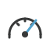
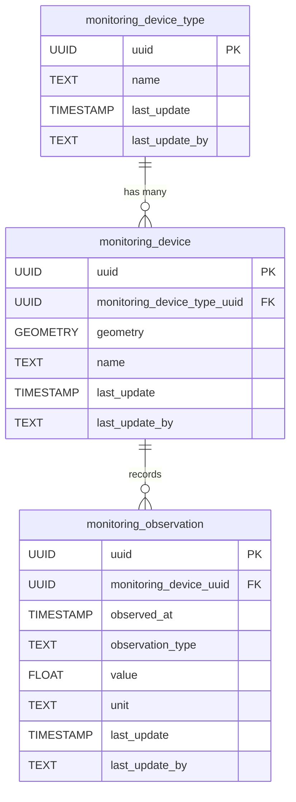

<!-- SPDX-FileCopyrightText: Tim Sutton -->
<!-- SPDX-License-Identifier: MIT -->
# 📡 Monitoring

{ .kz-domain-hero }

The **Monitoring** component captures infrastructure monitoring devices and their observations. This schema allows for the representation of sensors (such as weather stations, cameras, or environmental monitors), their types, and the data they collect over time.

**Entities from `sql/5-monitoring.sql`:**

- `monitoring_device_type`: Lookup table for types of monitoring devices (e.g., weather station, camera, sensor).
- `monitoring_device`: Represents individual monitoring devices, with geometry and a reference to `monitoring_device_type`.
- `monitoring_observation`: Stores observations or measurements recorded by monitoring devices, including timestamp, value, and type.

<!-- SCHEMA-REFERENCE-START - auto-generated, do not edit by hand -->
## Schema Reference

_Materialized at **v0.1.0** - baseline plus every applied PG migration._

_Source: `5-monitoring.sql`. 5 table(s)._

### `reading_unit`

Look up table for monitoring station reading unit

| Column | Type | Nullable | Default | Description |
|---|---|---|---|---|
| `id` | `integer` | no | `nextval('reading_unit_id_seq'::regclass)` | The equipment type ID. This is the Primary Key. |
| `uuid` | `uuid` | no | `gen_random_uuid()` | Global Unique Identifier. |
| `last_update` | `timestamp without time zone` | no | `now()` | The date that the last update was made (yyyy-mm-dd hh:mm:ss). |
| `last_update_by` | `text` | no |  | The name of the person who updated the table last. |
| `name` | `text` | no |  | Where we make comments and a description about the reading_unit. |
| `abbreviation` | `text` | no |  | Where we make comments and a description about the reading_unit. |

**Constraints:**

- PRIMARY KEY `reading_unit_pkey`: `PRIMARY KEY (id)`
- UNIQUE `reading_unit_uuid_key`: `UNIQUE (uuid)`

### `equipment_type`

Look up table for equipment type, e.g. moisture tester, penetrometers.

| Column | Type | Nullable | Default | Description |
|---|---|---|---|---|
| `id` | `integer` | no | `nextval('equipment_type_id_seq'::regclass)` | The equipment type ID. This is the Primary Key. |
| `uuid` | `uuid` | no | `gen_random_uuid()` | Global Unique Identifier. |
| `last_update` | `timestamp without time zone` | no | `now()` | The date that the last update was made (yyyy-mm-dd hh:mm:ss). |
| `last_update_by` | `text` | no |  | The name of the person who updated the table last. |
| `name` | `text` | no |  | Where we make comments and a description about the equipment type. |
| `url` | `text` | yes |  | The URL is unique to the equipment type. |
| `notes` | `text` | yes |  | Additional information of the equipment type |
| `model` | `text` | yes |  | Where we make comments and a description about the equipment type. |
| `manufacturer` | `text` | yes |  | Information about the manufacturer that manufactured the equipment. |
| `calibration_date` | `timestamp without time zone` | no | `now()` | The last date the equipment was calibrated. |

**Constraints:**

- PRIMARY KEY `equipment_type_pkey`: `PRIMARY KEY (id)`
- UNIQUE `equipment_type_uuid_key`: `UNIQUE (uuid)`

### `monitoring_station`

Look up table for monitoring station, e.g. station 1, station 2.

| Column | Type | Nullable | Default | Description |
|---|---|---|---|---|
| `id` | `integer` | no | `nextval('monitoring_station_id_seq'::regclass)` | The monitoring station ID. This is the Primary Key. |
| `uuid` | `uuid` | no | `gen_random_uuid()` | Global Unique Identifier. |
| `last_update` | `timestamp without time zone` | no | `now()` | The date that the last update was made (yyyy-mm-dd hh:mm:ss). |
| `last_update_by` | `text` | no |  | The name of the person who updated the table last. |
| `name` | `text` | no |  | Where we make comments and a description about the equipment name. |
| `image` | `text` | yes |  | The image link associated with the monitoring station image. |
| `equipment` | `text` | no |  |  |
| `geometry` | `USER-DEFINED` | no |  | The location of the monitoring station. Follows EPSG: 4326. |
| `equipment_type_uuid` | `uuid` | no |  | Globally Unique Identifier. |

**Constraints:**

- PRIMARY KEY `monitoring_station_pkey`: `PRIMARY KEY (id)`
- UNIQUE `monitoring_station_uuid_key`: `UNIQUE (uuid)`
- FOREIGN KEY `monitoring_station_equipment_type_uuid_fkey`: `FOREIGN KEY (equipment_type_uuid) REFERENCES equipment_type(uuid)`

### `readings`

Look up table for readings, e.g. reading at station 1, station 2.

| Column | Type | Nullable | Default | Description |
|---|---|---|---|---|
| `id` | `integer` | no | `nextval('readings_id_seq'::regclass)` | The monitoring station ID. This is the Primary Key. |
| `uuid` | `uuid` | no | `gen_random_uuid()` | Global Unique Identifier. |
| `last_update` | `timestamp without time zone` | no | `now()` | The date that the last update was made (yyyy-mm-dd hh:mm:ss). |
| `last_update_by` | `text` | no |  | The name of the person who updated the table last. |
| `name` | `text` | no |  | Where we make comments and a description about the readings name. |
| `notes` | `text` | yes |  | Additional information of the readings. |
| `equipment` | `text` | no |  | Equipment name used for the readings.  e.g. moisture_testers, penetrometers |
| `geometry` | `USER-DEFINED` | no |  | The location of the monitoring station. Follows EPSG: 4326. |
| `soil_ph` | `double precision` | no |  | The soil ph measured in pH scale is from 0 (most acid) to 14 (most alkaline) and a pH of 7 is neutral. |
| `soil_temperature` | `double precision` | no |  | The soil temperature measured in degrees celcius. |
| `estimated_depth_m` | `double precision` | no |  | The estimated_depth length measured in meters. |
| `monitoring_station_uuid` | `uuid` | no |  |  |
| `reading_unit_uuid` | `uuid` | no |  |  |

**Constraints:**

- PRIMARY KEY `readings_pkey`: `PRIMARY KEY (id)`
- UNIQUE `readings_uuid_key`: `UNIQUE (uuid)`
- FOREIGN KEY `readings_monitoring_station_uuid_fkey`: `FOREIGN KEY (monitoring_station_uuid) REFERENCES monitoring_station(uuid)`
- FOREIGN KEY `readings_reading_unit_uuid_fkey`: `FOREIGN KEY (reading_unit_uuid) REFERENCES reading_unit(uuid)`

### `condition`

Look up table for condition, e.g. good, bad.

| Column | Type | Nullable | Default | Description |
|---|---|---|---|---|
| `id` | `integer` | no | `nextval('condition_id_seq'::regclass)` | The unique condition item id. Primary key. |
| `uuid` | `uuid` | no | `gen_random_uuid()` | Global Unique Identifier. |
| `last_update` | `timestamp without time zone` | no | `now()` | The date that the last update was made (yyyy-mm-dd hh:mm:ss). |
| `last_update_by` | `text` | no |  | The name of the user responsible for the latest update. |
| `name` | `text` | no |  | The name of the condition item. |
| `notes` | `text` | yes |  | Additional information of the condition item. |
| `image` | `text` | yes |  | Image of the condition item. |

**Constraints:**

- PRIMARY KEY `condition_pkey`: `PRIMARY KEY (id)`
- UNIQUE `condition_name_key`: `UNIQUE (name)`
- UNIQUE `condition_uuid_key`: `UNIQUE (uuid)`
<!-- SCHEMA-REFERENCE-END -->
