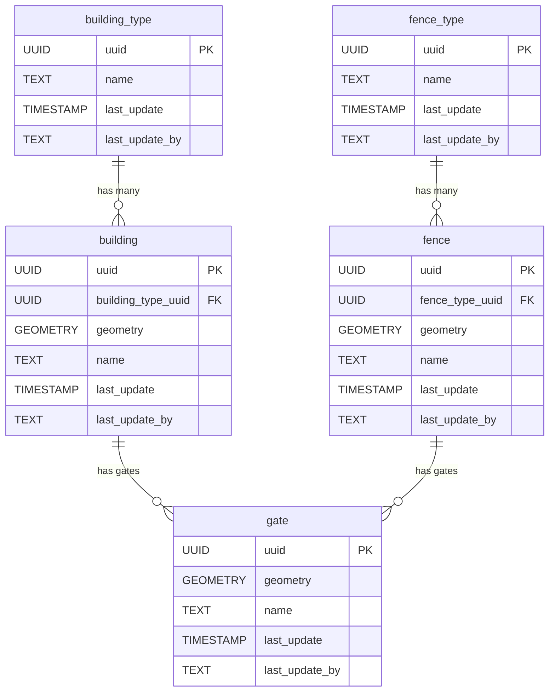

<!-- SPDX-FileCopyrightText: Tim Sutton -->
<!-- SPDX-License-Identifier: MIT -->
# 🏠 Buildings

{ .kz-domain-hero }

The **Buildings** component models structures and their related entities. The schema supports different building types, fences, and gates, allowing for detailed representation of built infrastructure and their spatial relationships.

**Entities from `sql/6-buildings.sql`:**

- `building_type`: Lookup table for types of buildings (e.g., residential, commercial).
- `building`: Represents individual buildings, with geometry and a reference to `building_type`.
- `fence_type`: Lookup table for types of fences.
- `fence`: Represents individual fences, with geometry and a reference to `fence_type`.
- `gate`: Represents gates, which may be associated with buildings or fences.

<!-- SCHEMA-REFERENCE-START - auto-generated, do not edit by hand -->
## Schema Reference

_Materialized at **v0.1.0** - baseline plus every applied PG migration._

_Source: `6-buildings.sql`. 5 table(s)._

### `building_type`

Look up table for the types of buildings available, e.g barns, cottages, etc.

| Column | Type | Nullable | Default | Description |
|---|---|---|---|---|
| `id` | `integer` | no | `nextval('building_type_id_seq'::regclass)` | The unique building type ID. This is the Primary Key. |
| `name` | `character varying` | no |  | The name is unique to the buildings table. |
| `notes` | `text` | yes |  | Where we make comments and a description about the building_type. |
| `image` | `text` | yes |  | The image link associated with the building type. |
| `last_update` | `timestamp without time zone` | no | `now()` | The timestamp shown for when the building type table has been updated. |
| `last_update_by` | `text` | no |  | The name of the person who updated the table last. |
| `uuid` | `uuid` | no | `gen_random_uuid()` | Global Unique Identifier. |

**Constraints:**

- PRIMARY KEY `building_type_pkey`: `PRIMARY KEY (id)`
- UNIQUE `building_type_name_key`: `UNIQUE (name)`
- UNIQUE `building_type_uuid_key`: `UNIQUE (uuid)`

### `building`

Look up table for the types of buildings available, e.g residential

| Column | Type | Nullable | Default | Description |
|---|---|---|---|---|
| `id` | `integer` | no | `nextval('building_id_seq'::regclass)` | The unique building type ID. This is the Primary Key. |
| `name` | `character varying` | no |  | The name is unique for the building table. |
| `notes` | `text` | no |  | Where we make comments and a description about the building_type. |
| `address` | `text` | no |  | The address of the building to locate it in space. |
| `image` | `text` | yes |  | The image link associated with the building_type. |
| `geometry` | `USER-DEFINED` | yes |  | The geometry of building (point, line or polygon) and the projection system used. |
| `area_square_meter` | `double precision` | no |  | The area covered by the building on the ground in m^2. |
| `height_meter` | `double precision` | no |  | The height of building which can be influenced by the shadow it casts over the nearby area depending on the position of the sun. |
| `last_update` | `timestamp without time zone` | no | `now()` | The timestamp shown for when the table has been updated. |
| `last_update_by` | `text` | no |  | The name of the person who upated the table last. |
| `uuid` | `uuid` | no | `gen_random_uuid()` | Global Unique Identifier. |
| `building_type_uuid` | `uuid` | no |  | The foreign key which references the uuid from the building type table. |

**Constraints:**

- PRIMARY KEY `building_pkey`: `PRIMARY KEY (id)`
- UNIQUE `building_uuid_key`: `UNIQUE (uuid)`
- FOREIGN KEY `building_building_type_uuid_fkey`: `FOREIGN KEY (building_type_uuid) REFERENCES building_type(uuid)`

### `building_material`

Look up table for the types of building materials e.g. wood, concrete, aluminuim sheets etc.

| Column | Type | Nullable | Default | Description |
|---|---|---|---|---|
| `id` | `integer` | no | `nextval('building_material_id_seq'::regclass)` | The unique building material type ID. This is the Primary Key. |
| `name` | `character varying` | no |  | The name is unique to the buildings table since it is a look up table. |
| `notes` | `text` | yes |  | Where we make comments and a description about the building material. |
| `image` | `text` | yes |  | The image link associated with the building material. |
| `last_update` | `timestamp without time zone` | no | `now()` | The timestamp shown for when the building material table has been updated. |
| `last_update_by` | `text` | no |  | The name of the person who upated the table last. |
| `uuid` | `uuid` | no | `gen_random_uuid()` | Globally Unique Identifier. |

**Constraints:**

- PRIMARY KEY `building_material_pkey`: `PRIMARY KEY (id)`
- UNIQUE `building_material_name_key`: `UNIQUE (name)`
- UNIQUE `building_material_uuid_key`: `UNIQUE (uuid)`

### `building_materials`

An association table between building and building material.

| Column | Type | Nullable | Default | Description |
|---|---|---|---|---|
| `uuid` | `uuid` | no | `gen_random_uuid()` | Global Unique Identifier. |
| `last_update` | `timestamp without time zone` | no | `now()` | The timestamp shown for when the table has been updated. |
| `last_update_by` | `text` | no |  | The name of the person who upated the table last. |
| `notes` | `text` | yes |  | Where we make comments and a description about the building materials. |
| `image` | `text` | yes |  | The image link associated with the building materials. |
| `date` | `date` | no |  | The datetime alteration of the conditions. This is the Primary and Composite Key |
| `building_uuid` | `uuid` | no |  | The composite key referenced from the building table. |
| `building_material_uuid` | `uuid` | no |  | The composite key referenced from the building material table. |

**Constraints:**

- PRIMARY KEY `building_materials_pkey`: `PRIMARY KEY (building_uuid, building_material_uuid, date)`
- UNIQUE `building_materials_uuid_key`: `UNIQUE (uuid)`
- FOREIGN KEY `building_materials_building_material_uuid_fkey`: `FOREIGN KEY (building_material_uuid) REFERENCES building_material(uuid)`
- FOREIGN KEY `building_materials_building_uuid_fkey`: `FOREIGN KEY (building_uuid) REFERENCES building(uuid)`

### `building_conditions`

An association table between building and building conditions type.

| Column | Type | Nullable | Default | Description |
|---|---|---|---|---|
| `uuid` | `uuid` | no | `gen_random_uuid()` | Global Unique Identifier. |
| `last_update` | `timestamp without time zone` | no | `now()` | The timestamp shown for when the table has been updated. |
| `last_update_by` | `text` | no |  | The name of the person who upated the table last. |
| `notes` | `text` | yes |  | Where we make comments and a description about the building conditions. |
| `image` | `text` | yes |  | The image link associated with the building conditions. |
| `date` | `date` | no |  | The datetime alteration of the conditions. This is the Primary and Composite Key |
| `building_uuid` | `uuid` | no |  | The composite key referenced from the building table. |
| `condition_uuid` | `uuid` | no |  | The composite key referenced from the building table. |

**Constraints:**

- PRIMARY KEY `building_conditions_pkey`: `PRIMARY KEY (building_uuid, condition_uuid, date)`
- UNIQUE `building_conditions_uuid_key`: `UNIQUE (uuid)`
- FOREIGN KEY `building_conditions_building_uuid_fkey`: `FOREIGN KEY (building_uuid) REFERENCES building(uuid)`
- FOREIGN KEY `building_conditions_condition_uuid_fkey`: `FOREIGN KEY (condition_uuid) REFERENCES condition(uuid)`
<!-- SCHEMA-REFERENCE-END -->
