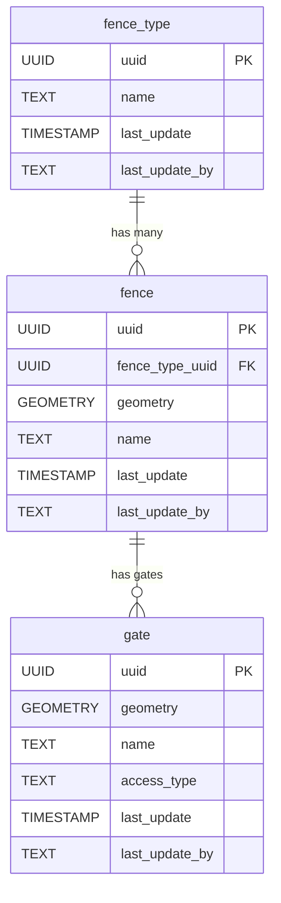

<!-- SPDX-FileCopyrightText: Tim Sutton -->
<!-- SPDX-License-Identifier: MIT -->
# 🚧 Fencing

{ .kz-domain-hero }

The **Fencing** component models boundary and enclosure features, such as fences and gates, that are not directly associated with buildings. This schema allows for the representation of different fence types, individual fence segments, and standalone gates, supporting detailed mapping of property boundaries and access points.

**Entities from `sql/7-fencing.sql`:**

- `fence_type`: Lookup table for types of fences (e.g., wire, wall, hedge).
- `fence`: Represents individual fence segments, with geometry and a reference to `fence_type`.
- `gate`: Represents gates, with geometry and attributes for name and access type.

<!-- SCHEMA-REFERENCE-START - auto-generated, do not edit by hand -->
## Schema Reference

_Materialized at **v0.1.1** - baseline plus every applied PG migration._

_Source: `7-fencing.sql`. 3 table(s)._

### `fence_type`

Look up table for fence types, e.g. electric, chain_link.

| Column | Type | Nullable | Default | Description |
|---|---|---|---|---|
| `id` | `integer` | no | `nextval('fence_type_id_seq'::regclass)` | The unique fence type item id. Primary key. |
| `uuid` | `uuid` | no | `gen_random_uuid()` | Global Unique Identifier. |
| `last_update` | `timestamp without time zone` | no | `now()` | The date that the last update was made (yyyy-mm-dd hh:mm:ss). |
| `last_update_by` | `text` | no |  | The name of the user responsible for the latest update. |
| `name` | `text` | no |  | The name of the fence type item. |
| `notes` | `text` | yes |  | Additional information of the fence type item. |
| `image` | `text` | yes |  | Image of the fence type item. |
| `sort_order` | `integer` | yes |  |  |

**Constraints:**

- PRIMARY KEY `fence_type_pkey`: `PRIMARY KEY (id)`
- UNIQUE `fence_type_name_key`: `UNIQUE (name)`
- UNIQUE `fence_type_sort_order_key`: `UNIQUE (sort_order)`
- UNIQUE `fence_type_uuid_key`: `UNIQUE (uuid)`

### `fence`

The fence item refers to any geolocated line acting as boundary in the area, e.g. fence lines

| Column | Type | Nullable | Default | Description |
|---|---|---|---|---|
| `id` | `integer` | no | `nextval('fence_id_seq'::regclass)` | The unique fence item id. Primary key. |
| `uuid` | `uuid` | no | `gen_random_uuid()` | Global Unique Identifier. |
| `last_update` | `timestamp without time zone` | no | `now()` | The date that the last update was made (yyyy-mm-dd hh:mm:ss). |
| `last_update_by` | `text` | no |  | The name of the user responsible for the latest update. |
| `notes` | `text` | yes |  | Additional information of the fence item. |
| `image` | `text` | yes |  | Image of the fence item. |
| `height_m` | `double precision` | yes |  | Height of the fence in meters |
| `installation_date` | `date` | no |  | The date the fence was installed. |
| `is_date_estimated` | `boolean` | yes |  | Is the fence item date of construction estimated? |
| `geometry` | `USER-DEFINED` | no |  | The location of the fence line. Follows EPSG: 4326. |
| `fence_type_uuid` | `uuid` | no |  |  |

**Constraints:**

- PRIMARY KEY `fence_pkey`: `PRIMARY KEY (id)`
- UNIQUE `fence_uuid_key`: `UNIQUE (uuid)`
- FOREIGN KEY `fence_fence_type_uuid_fkey`: `FOREIGN KEY (fence_type_uuid) REFERENCES fence_type(uuid)`

### `fence_conditions`

An Association table showing the fence conditions, e.g. good, bad.

| Column | Type | Nullable | Default | Description |
|---|---|---|---|---|
| `uuid` | `uuid` | no | `gen_random_uuid()` | Global Unique Identifier. |
| `last_update` | `timestamp without time zone` | no | `now()` | The date that the last update was made (yyyy-mm-dd hh:mm:ss). |
| `last_update_by` | `text` | no |  | The name of the user responsible for the latest update. |
| `notes` | `text` | yes |  | Additional information of the fence conditions item. |
| `image` | `text` | yes |  | Image of the fence conditions item. |
| `date` | `date` | no |  | The date of the current conditions are marked as changed |
| `fence_uuid` | `uuid` | no |  |  |
| `condition_uuid` | `uuid` | no |  |  |

**Constraints:**

- PRIMARY KEY `fence_conditions_pkey`: `PRIMARY KEY (fence_uuid, condition_uuid, date)`
- UNIQUE `fence_conditions_uuid_key`: `UNIQUE (uuid)`
- FOREIGN KEY `fence_conditions_condition_uuid_fkey`: `FOREIGN KEY (condition_uuid) REFERENCES condition(uuid)`
- FOREIGN KEY `fence_conditions_fence_uuid_fkey`: `FOREIGN KEY (fence_uuid) REFERENCES fence(uuid)`
<!-- SCHEMA-REFERENCE-END -->
