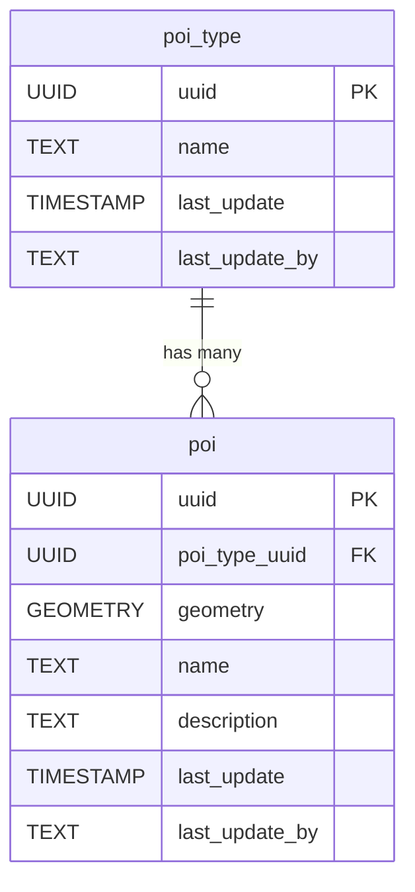

<!-- SPDX-FileCopyrightText: Tim Sutton -->
<!-- SPDX-License-Identifier: MIT -->

# 📍 Points Of Interest

The **Points Of Interest (POI)** component models notable locations or features that are relevant for mapping and analysis but do not fit into other infrastructure categories. This schema supports categorizing POIs, storing their spatial locations, and associating descriptive information.

**Entities from `sql/8-poi.sql`:**

- `poi_type`: Lookup table for different types of points of interest (e.g., landmark, facility, service).
- `poi`: Represents individual points of interest, with geometry, a reference to `poi_type`, and descriptive attributes.

<!-- SCHEMA-REFERENCE-START - auto-generated, do not edit by hand -->
## Schema Reference

_Materialized at **v0.1.0** - baseline plus every applied PG migration._

_Source: `8-poi.sql`. 3 table(s)._

### `point_of_interest_type`

Look up tables for point of interest types, e.g. types of gates

| Column | Type | Nullable | Default | Description |
|---|---|---|---|---|
| `id` | `integer` | no | `nextval('point_of_interest_type_id_seq'::regclass)` | The unique point of interest type item id. Primary key. |
| `uuid` | `uuid` | no | `gen_random_uuid()` | Global Unique Identifier. |
| `last_update` | `timestamp without time zone` | no | `now()` | The date that the last update was made (yyyy-mm-dd hh:mm:ss). |
| `last_update_by` | `text` | no |  | The name of the user responsible for the latest update. |
| `name` | `text` | no |  | The name of the point of interest type. |
| `notes` | `text` | yes |  | Additional information of the point of interest type. |
| `image` | `text` | yes |  | Image of the point of interest type. |
| `sort_order` | `integer` | yes |  | The pattern of how point of interest types are to be sorted. |

**Constraints:**

- PRIMARY KEY `point_of_interest_type_pkey`: `PRIMARY KEY (id)`
- UNIQUE `point_of_interest_type_name_key`: `UNIQUE (name)`
- UNIQUE `point_of_interest_type_sort_order_key`: `UNIQUE (sort_order)`
- UNIQUE `point_of_interest_type_uuid_key`: `UNIQUE (uuid)`

### `point_of_interest`

The point of interest item refers to any geolocated point features found in the area, e.g. gate, ruin.

| Column | Type | Nullable | Default | Description |
|---|---|---|---|---|
| `id` | `integer` | no | `nextval('point_of_interest_id_seq'::regclass)` | The unique point of interest item id. Primary key. |
| `uuid` | `uuid` | no | `gen_random_uuid()` | Global Unique Identifier. |
| `last_update` | `timestamp without time zone` | no | `now()` | The date that the last update was made (yyyy-mm-dd hh:mm:ss). |
| `last_update_by` | `text` | no |  | The name of the user responsible for the latest update. |
| `name` | `text` | yes |  | The name of the point of interest item. |
| `notes` | `text` | yes |  | Additional information of the point of interest item. |
| `image` | `text` | yes |  | Image of the point of interest item. |
| `height_m` | `double precision` | yes |  | The height in meters of the point of interest. |
| `installation_date` | `date` | yes |  | The date the point of interest feature was installed/constructed. |
| `is_date_estimated` | `boolean` | yes |  | Is the point of interest date of construction estimated? |
| `geometry` | `USER-DEFINED` | no |  | The centroid location of the point of interest item. Follows EPSG: 4326. |
| `point_of_interest_type_uuid` | `uuid` | no |  |  |

**Constraints:**

- PRIMARY KEY `point_of_interest_pkey`: `PRIMARY KEY (id)`
- UNIQUE `point_of_interest_uuid_key`: `UNIQUE (uuid)`
- FOREIGN KEY `point_of_interest_point_of_interest_type_uuid_fkey`: `FOREIGN KEY (point_of_interest_type_uuid) REFERENCES point_of_interest_type(uuid)`

### `point_of_interest_conditions`

An Association table for point of interest conditions, e.g. good, bad.

| Column | Type | Nullable | Default | Description |
|---|---|---|---|---|
| `uuid` | `uuid` | no | `gen_random_uuid()` | Global Unique Identifier. |
| `last_update` | `timestamp without time zone` | no | `now()` | The date that the last update was made (yyyy-mm-dd hh:mm:ss). |
| `last_update_by` | `text` | no |  | The name of the user responsible for the latest update. |
| `notes` | `text` | yes |  | Additional information of the point of interest conditions item. |
| `image` | `text` | yes |  | Image of the point of interest conditions item. |
| `date` | `date` | no |  | The points of interest inspection date. |
| `point_of_interest_uuid` | `uuid` | no |  |  |
| `condition_uuid` | `uuid` | no |  |  |

**Constraints:**

- PRIMARY KEY `point_of_interest_conditions_pkey`: `PRIMARY KEY (point_of_interest_uuid, condition_uuid, date)`
- UNIQUE `point_of_interest_conditions_uuid_key`: `UNIQUE (uuid)`
- FOREIGN KEY `point_of_interest_conditions_condition_uuid_fkey`: `FOREIGN KEY (condition_uuid) REFERENCES condition(uuid)`
- FOREIGN KEY `point_of_interest_conditions_point_of_interest_uuid_fkey`: `FOREIGN KEY (point_of_interest_uuid) REFERENCES point_of_interest(uuid)`
<!-- SCHEMA-REFERENCE-END -->
