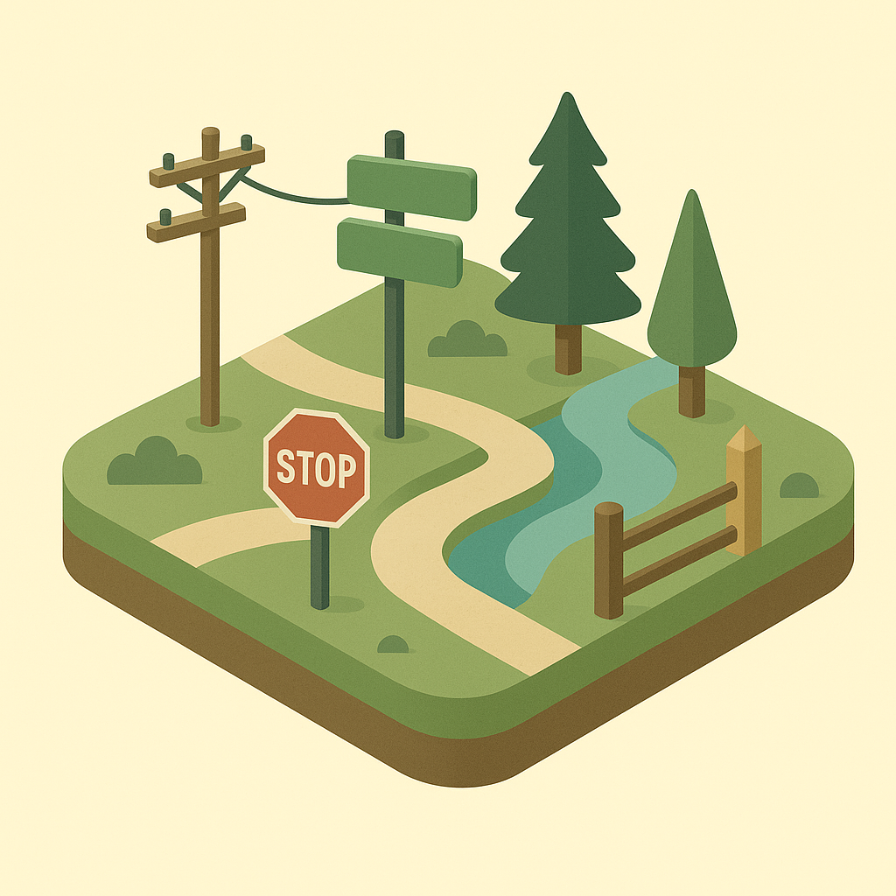
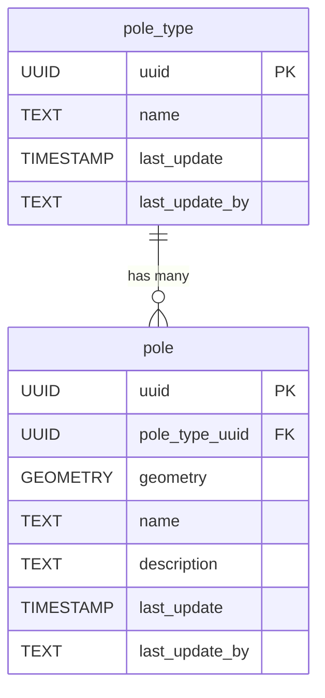

<!-- SPDX-FileCopyrightText: Tim Sutton -->
<!-- SPDX-License-Identifier: MIT -->
# 🪧 Poles

The **Poles** component models standalone poles used for various infrastructure purposes, such as lighting, signage, or utility support. This schema allows for categorizing pole types and recording individual pole features with their spatial locations and relevant attributes.

**Entities from `sql/11-poles.sql`:**

- `pole_type`: Lookup table for different types of poles (e.g., lighting, signage, utility).
- `pole`: Represents individual poles, with geometry, a reference to `pole_type`, and descriptive attributes.

<!-- SCHEMA-REFERENCE-START - auto-generated, do not edit by hand -->
## Schema Reference

_Materialized at **v0.1.0** - baseline plus every applied PG migration._

_Source: `11-poles.sql`. 4 table(s)._

### `pole_material`

Lookup table for the different pole materials available e.g. steel, concrete.

| Column | Type | Nullable | Default | Description |
|---|---|---|---|---|
| `id` | `integer` | no | `nextval('pole_material_id_seq'::regclass)` | The unique pole materials id, this is a primary key. |
| `name` | `text` | no |  | The name of the pole material. |
| `notes` | `text` | yes |  | Any additional notes of the name of the pole material. |
| `image` | `text` | yes |  | Any visual representation of the material. |
| `last_update` | `timestamp without time zone` | no | `now()` | The date that the last update was made (yyyy-mm-dd hh:mm:ss). |
| `last_update_by` | `text` | no |  | The name of the user responsible for the latest update. |
| `uuid` | `uuid` | no | `gen_random_uuid()` | Global unique identifier. |

**Constraints:**

- PRIMARY KEY `pole_material_pkey`: `PRIMARY KEY (id)`
- UNIQUE `pole_material_name_key`: `UNIQUE (name)`
- UNIQUE `pole_material_uuid_key`: `UNIQUE (uuid)`

### `pole_function`

Lookup table for the different pole functions e.g. telecommunication pole.

| Column | Type | Nullable | Default | Description |
|---|---|---|---|---|
| `id` | `integer` | no | `nextval('pole_function_id_seq'::regclass)` | The unique pole function id, this is a primary key. |
| `pole_function_name` | `text` | no |  | The name of the function of a pole e.g. street lighting pole or telecommunications pole. |
| `notes` | `text` | yes |  | Any additional information on the pole functionality. |
| `image` | `text` | yes |  | Any visual representation of the pole function. |
| `last_update` | `timestamp without time zone` | no | `now()` | The date that the last update was made (yyyy-mm-dd hh:mm:ss). |
| `last_update_by` | `text` | no |  | The name of the user responsible for the latest update. |
| `uuid` | `uuid` | yes | `gen_random_uuid()` | Global unique identifier. |

**Constraints:**

- PRIMARY KEY `pole_function_pkey`: `PRIMARY KEY (id)`

### `pole`

Pole table records any point entered as a pole e.g. street pole.

| Column | Type | Nullable | Default | Description |
|---|---|---|---|---|
| `id` | `integer` | no | `nextval('pole_id_seq'::regclass)` |  |
| `notes` | `character varying` | yes |  | Anything unique or additional information about the pole. |
| `installation_date` | `date` | no | `now()` | The date and time when the pole was installed. |
| `geometry` | `USER-DEFINED` | no |  |  |
| `height` | `double precision` | no |  | The height for the pole created. |
| `last_update` | `timestamp without time zone` | no | `now()` | The date that the last update was made (yyyy-mm-dd hh:mm:ss). |
| `last_update_by` | `text` | no |  | The name of the user responsible for the latest update. |
| `uuid` | `uuid` | no | `gen_random_uuid()` | Global unique identifier. |
| `pole_material_id` | `integer` | no |  | Foreign key for pole material. |
| `pole_function_id` | `integer` | no |  | Foreign key for pole function. |

**Constraints:**

- PRIMARY KEY `pole_pkey`: `PRIMARY KEY (id)`
- UNIQUE `pole_uuid_key`: `UNIQUE (uuid)`
- FOREIGN KEY `pole_pole_function_id_fkey`: `FOREIGN KEY (pole_function_id) REFERENCES pole_function(id)`
- FOREIGN KEY `pole_pole_material_id_fkey`: `FOREIGN KEY (pole_material_id) REFERENCES pole_material(id)`

### `pole_conditions`

The table that records the state of a pole.

| Column | Type | Nullable | Default | Description |
|---|---|---|---|---|
| `pole_uuid` | `uuid` | no |  | A foreign key which is used as composite primary key. |
| `condition_uuid` | `uuid` | no |  | A foreign key which is used as composite primary key. |
| `date` | `date` | no |  | Stores the date that is used in the composite key. |
| `notes` | `text` | no |  | Any additional information on the condition of the pole. |
| `image` | `text` | yes |  |  |
| `last_update` | `timestamp without time zone` | no | `now()` | The date that the last update was made (yyyy-mm-dd hh:mm:ss). |
| `last_update_by` | `text` | no |  | The name of the user responsible for the latest update. |
| `uuid` | `uuid` | yes | `gen_random_uuid()` |  Global unique identifier. |

**Constraints:**

- PRIMARY KEY `pole_conditions_pkey`: `PRIMARY KEY (pole_uuid, condition_uuid, date)`
- FOREIGN KEY `pole_conditions_condition_uuid_fkey`: `FOREIGN KEY (condition_uuid) REFERENCES condition(uuid)`
- FOREIGN KEY `pole_conditions_pole_uuid_fkey`: `FOREIGN KEY (pole_uuid) REFERENCES pole(uuid)`
<!-- SCHEMA-REFERENCE-END -->
