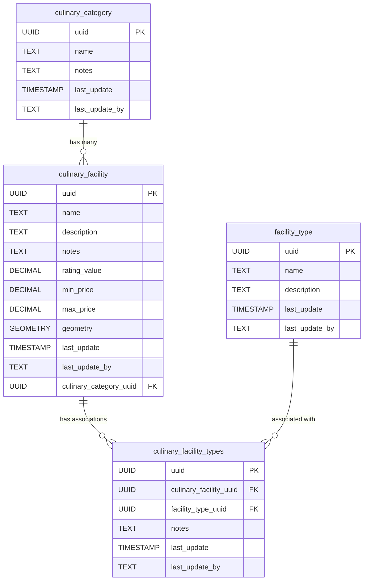

<!-- SPDX-FileCopyrightText: Tim Sutton -->
<!-- SPDX-License-Identifier: MIT -->
# 🍽️ Culinary

{ .kz-domain-hero }

The **Culinary** component models food service infrastructure, such as kitchens, dining areas, and food storage facilities. This schema enables the representation of culinary-related spaces, their types, and their spatial relationships within the infrastructure.

**Entities from `sql/12-culinary.sql`:**

- `culinary_category`: Lookup table for culinary categories (e.g., traditional, fast food). Includes attributes such as name, notes, and metadata for updates.

- `culinary_facility`: Represents individual culinary facilities, including attributes like name, description, rating, price range, and location (geometry). Also references `culinary_category` to indicate the category of the facility.

- `facility_type`: Lookup table for types of facilities associated with culinary spots (e.g., parking lot, restroom, playground). Includes descriptive attributes and metadata for updates.

- `culinary_facility_types`: Association table linking `culinary_facility` with `facility_type`. Represents a many-to-many relationship between facilities and their associated types, with additional metadata and optional notes for the association.

<!-- SCHEMA-REFERENCE-START - auto-generated, do not edit by hand -->
## Schema Reference

_Materialized at **v0.1.1** - baseline plus every applied PG migration._

_Source: `12-culinary.sql`. 4 table(s)._

### `culinary_category`

Lookup table for culinary categories, e.g. traditional, fast food.

| Column | Type | Nullable | Default | Description |
|---|---|---|---|---|
| `id` | `integer` | no | `nextval('culinary_category_id_seq'::regclass)` | The unique ID for the culinary category. This is the Primary Key. |
| `uuid` | `uuid` | no | `gen_random_uuid()` | The unique UUID. |
| `last_update` | `timestamp without time zone` | no | `now()` | The date the record was last updated. |
| `last_update_by` | `text` | no |  | The user who last updated the record. |
| `name` | `text` | no |  | The name of the culinary category. |
| `notes` | `text` | yes |  | Additional information about the culinary category. |

**Constraints:**

- PRIMARY KEY `culinary_category_pkey`: `PRIMARY KEY (id)`
- UNIQUE `culinary_category_name_key`: `UNIQUE (name)`
- UNIQUE `culinary_category_uuid_key`: `UNIQUE (uuid)`

### `culinary_facility`

Stores information about culinary facilities, including name, rating, price range, and geographical location.

| Column | Type | Nullable | Default | Description |
|---|---|---|---|---|
| `id` | `integer` | no | `nextval('culinary_facility_id_seq'::regclass)` | The unique ID for the culinary facility. This is the Primary Key. |
| `name` | `text` | no |  | The name of the culinary facility. |
| `description` | `text` | yes |  | A description of the culinary facility. |
| `notes` | `text` | yes |  | Additional notes about the culinary facility. |
| `rating_value` | `numeric` | yes |  | The rating value of the culinary facility, ranging from 0 to 5. |
| `min_price` | `numeric` | no |  | The minimum price of offerings at the facility. |
| `max_price` | `numeric` | no |  | The maximum price of offerings at the facility. |
| `geometry` | `USER-DEFINED` | yes |  | Geographical location of the facility, stored as a Point (longitude and latitude). |
| `last_update` | `timestamp without time zone` | no | `now()` | The date the record was last updated. |
| `last_update_by` | `text` | no |  | The user who last updated the record. |
| `uuid` | `uuid` | no | `gen_random_uuid()` | A globally unique identifier for the culinary facility. |
| `culinary_category_uuid` | `uuid` | no |  | The UUID of the culinary category, referencing the culinary_category table. |

**Constraints:**

- PRIMARY KEY `culinary_facility_pkey`: `PRIMARY KEY (id)`
- UNIQUE `culinary_facility_uuid_key`: `UNIQUE (uuid)`
- FOREIGN KEY `culinary_facility_culinary_category_uuid_fkey`: `FOREIGN KEY (culinary_category_uuid) REFERENCES culinary_category(uuid)`
- CHECK `culinary_facility_rating_value_check`: `CHECK (((rating_value >= (0)::numeric) AND (rating_value <= (5)::numeric)))`

### `facility_type`

Lookup table for types of facilities associated with culinary spots.

| Column | Type | Nullable | Default | Description |
|---|---|---|---|---|
| `id` | `integer` | no | `nextval('facility_type_id_seq'::regclass)` | The unique ID for the facility type. This is the Primary Key. |
| `name` | `text` | no |  | The name of the facility type. |
| `description` | `text` | yes |  | A description of the facility type. |
| `last_update` | `timestamp without time zone` | no | `now()` | The date the record was last updated. |
| `last_update_by` | `text` | no |  | The user who last updated the record. |
| `uuid` | `uuid` | no | `gen_random_uuid()` | A globally unique identifier for the facility type. |

**Constraints:**

- PRIMARY KEY `facility_type_pkey`: `PRIMARY KEY (id)`
- UNIQUE `facility_type_name_key`: `UNIQUE (name)`
- UNIQUE `facility_type_uuid_key`: `UNIQUE (uuid)`

### `culinary_facility_types`

Association table linking culinary facilities and their associated facility types.

| Column | Type | Nullable | Default | Description |
|---|---|---|---|---|
| `culinary_facility_uuid` | `uuid` | no |  | Foreign key referencing the UUID of the culinary facility. |
| `facility_type_uuid` | `uuid` | no |  | Foreign key referencing the UUID of the facility type. |
| `notes` | `text` | yes |  | Additional information or remarks about the association. |
| `last_update` | `timestamp without time zone` | no | `now()` | The date the record was last updated. |
| `last_update_by` | `text` | no |  | The user who last updated the record. |
| `uuid` | `uuid` | no | `gen_random_uuid()` | A globally unique identifier for the association record. |

**Constraints:**

- PRIMARY KEY `culinary_facility_types_pkey`: `PRIMARY KEY (culinary_facility_uuid, facility_type_uuid)`
- UNIQUE `culinary_facility_types_uuid_key`: `UNIQUE (uuid)`
- FOREIGN KEY `culinary_facility_types_culinary_facility_uuid_fkey`: `FOREIGN KEY (culinary_facility_uuid) REFERENCES culinary_facility(uuid)`
- FOREIGN KEY `culinary_facility_types_facility_type_uuid_fkey`: `FOREIGN KEY (facility_type_uuid) REFERENCES facility_type(uuid)`
<!-- SCHEMA-REFERENCE-END -->
