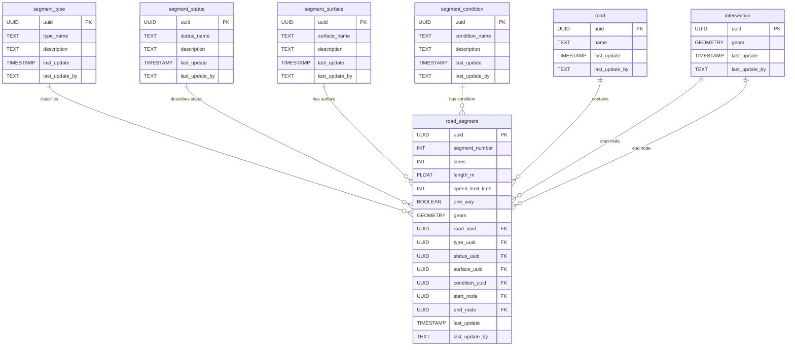

<!-- SPDX-FileCopyrightText: Tim Sutton -->
<!-- SPDX-License-Identifier: MIT -->
# 🛣️ Roads

{ .kz-domain-hero }

The **Roads** component models transportation infrastructure, including roads, tracks, and paths within the mapped area. This schema enables the representation of different road types, individual road segments, and their spatial characteristics, supporting navigation, planning, and analysis.

**Entities from `sql/13-roads.sql`:**

- `segment_type`: Road classification (e.g. National, Main Road).
- `segment_status`: Road segment status (e.g. In Use, Planned).
- `segment_surface`: Surface material (e.g. Asphalt, Dirt).
- `segment_condition`: Physical condition (e.g. Good, Flooded).
- `road`: Logical grouping of road segments (has a name).
- `intersection`: Physical nodes (start/end points for road segments).
- `road_segment`: Actual line features with geometry and references to all lookup tables, the road it belongs to, and intersections.

---

<!-- SCHEMA-REFERENCE-START - auto-generated, do not edit by hand -->
## Schema Reference

_Materialized at **v0.2.0** - baseline plus every applied PG migration._

_Source: `13-roads.sql`. 7 table(s)._

### `segment_type`

Lookup table for road type classification, e.g. "National", "Main Road"

| Column | Type | Nullable | Default | Description |
|---|---|---|---|---|
| `id` | `integer` | no | `nextval('segment_type_id_seq'::regclass)` | The unique segment type ID. This is the Primary Key. |
| `uuid` | `uuid` | no | `gen_random_uuid()` | Global Unique Identifier. |
| `last_update` | `timestamp without time zone` | no | `now()` | The date that the last update was made (yyyy-mm-dd hh:mm:ss). |
| `last_update_by` | `text` | no |  | The name of the user responsible for the latest update. |
| `type_name` | `character varying` | no |  | The segment type field name. This is unique. |
| `description` | `text` | yes |  | Additional information of the segment type. |

**Constraints:**

- PRIMARY KEY `segment_type_pkey`: `PRIMARY KEY (id)`
- UNIQUE `segment_type_type_name_key`: `UNIQUE (type_name)`
- UNIQUE `segment_type_uuid_key`: `UNIQUE (uuid)`

### `segment_status`

Lookup table for construction and usage status, e.g. "In Use", "Planned"

| Column | Type | Nullable | Default | Description |
|---|---|---|---|---|
| `id` | `integer` | no | `nextval('segment_status_id_seq'::regclass)` | The unique segment status ID. This is the Primary Key. |
| `uuid` | `uuid` | no | `gen_random_uuid()` | Global Unique Identifier. |
| `last_update` | `timestamp without time zone` | no | `now()` | The date that the last update was made (yyyy-mm-dd hh:mm:ss). |
| `last_update_by` | `text` | no |  | The name of the user responsible for the latest update. |
| `status_name` | `character varying` | no |  | The segment status field name. This is unique. |
| `description` | `text` | yes |  | Additional information of the segment status. |

**Constraints:**

- PRIMARY KEY `segment_status_pkey`: `PRIMARY KEY (id)`
- UNIQUE `segment_status_status_name_key`: `UNIQUE (status_name)`
- UNIQUE `segment_status_uuid_key`: `UNIQUE (uuid)`

### `segment_surface`

Lookup table for segment surface material, e.g. "Asphalt", "Dirt"

| Column | Type | Nullable | Default | Description |
|---|---|---|---|---|
| `id` | `integer` | no | `nextval('segment_surface_id_seq'::regclass)` | The unique segment surface ID. This is the Primary Key. |
| `uuid` | `uuid` | no | `gen_random_uuid()` | Global Unique Identifier. |
| `last_update` | `timestamp without time zone` | no | `now()` | The date that the last update was made (yyyy-mm-dd hh:mm:ss). |
| `last_update_by` | `text` | no |  | The name of the user responsible for the latest update. |
| `surface_name` | `character varying` | no |  | The segment surface field name. This is unique. |
| `description` | `text` | yes |  | Additional information of the segment surface. |

**Constraints:**

- PRIMARY KEY `segment_surface_pkey`: `PRIMARY KEY (id)`
- UNIQUE `segment_surface_surface_name_key`: `UNIQUE (surface_name)`
- UNIQUE `segment_surface_uuid_key`: `UNIQUE (uuid)`

### `segment_condition`

Lookup table for segment condition, e.g. "Good", "Flooded"

| Column | Type | Nullable | Default | Description |
|---|---|---|---|---|
| `id` | `integer` | no | `nextval('segment_condition_id_seq'::regclass)` | The unique segment condition ID. This is the Primary Key. |
| `uuid` | `uuid` | no | `gen_random_uuid()` | Global Unique Identifier. |
| `last_update` | `timestamp without time zone` | no | `now()` | The date that the last update was made (yyyy-mm-dd hh:mm:ss). |
| `last_update_by` | `text` | no |  | The name of the user responsible for the latest update. |
| `condition_name` | `character varying` | no |  | The segment condition field name. This is unique. |
| `description` | `text` | yes |  | Additional information of the segment condition. |

**Constraints:**

- PRIMARY KEY `segment_condition_pkey`: `PRIMARY KEY (id)`
- UNIQUE `segment_condition_condition_name_key`: `UNIQUE (condition_name)`
- UNIQUE `segment_condition_uuid_key`: `UNIQUE (uuid)`

### `intersection`

Points between road segments.

| Column | Type | Nullable | Default | Description |
|---|---|---|---|---|
| `id` | `integer` | no | `nextval('intersection_id_seq'::regclass)` | The unique intersection ID. This is the Primary Key. |
| `uuid` | `uuid` | no | `gen_random_uuid()` | Global Unique Identifier. |
| `last_update` | `timestamp without time zone` | no | `now()` | The date that the last update was made (yyyy-mm-dd hh:mm:ss). |
| `last_update_by` | `text` | no |  | The name of the user responsible for the latest update. |
| `geom` | `USER-DEFINED` | no |  | The location of the nodes between road segments. EPSG: 32734 (WGS 84/UTM Zone 34S) |

**Constraints:**

- PRIMARY KEY `intersection_pkey`: `PRIMARY KEY (id)`
- UNIQUE `intersection_uuid_key`: `UNIQUE (uuid)`

### `road`

Logical road entities, composed of road segments.

| Column | Type | Nullable | Default | Description |
|---|---|---|---|---|
| `id` | `integer` | no | `nextval('road_id_seq'::regclass)` | The unique road ID. This is the Primary Key. |
| `uuid` | `uuid` | no | `gen_random_uuid()` | Global Unique Identifier. |
| `last_update` | `timestamp without time zone` | no | `now()` | The date that the last update was made (yyyy-mm-dd hh:mm:ss). |
| `last_update_by` | `text` | no |  | The name of the user responsible for the latest update. |
| `name` | `text` | yes |  | Road name information. |

**Constraints:**

- PRIMARY KEY `road_pkey`: `PRIMARY KEY (id)`
- UNIQUE `road_uuid_key`: `UNIQUE (uuid)`

### `road_segment`

Represents physical segments of a road between two nodes.

| Column | Type | Nullable | Default | Description |
|---|---|---|---|---|
| `id` | `integer` | no | `nextval('road_segment_id_seq'::regclass)` | The unique road segment ID. This is the Primary Key. |
| `uuid` | `uuid` | no | `gen_random_uuid()` | Global Unique Identifier. |
| `last_update` | `timestamp without time zone` | no | `now()` | The date that the last update was made (yyyy-mm-dd hh:mm:ss). |
| `last_update_by` | `text` | no |  | The name of the user responsible for the latest update. |
| `segment_number` | `integer` | no |  | The order of road segments. |
| `lanes` | `integer` | yes |  | The total amount of lanes, including both sides. |
| `length_m` | `double precision` | yes |  | The length of the road segment in meters. |
| `speed_limit_kmh` | `integer` | yes |  | The speed limit of the road segment. |
| `one_way` | `boolean` | yes |  | True if the segment is a one-way road. |
| `geom` | `USER-DEFINED` | no |  | Centreline location of the road segment. PCR for distance measurements, EPSG: 32734 (WGS 84/UTM Zone 34S) |
| `road_uuid` | `uuid` | yes |  | The foreign key which references the uuid from the roads table. |
| `type_uuid` | `uuid` | no |  | The foreign key which references the uuid from the road segment types table. |
| `status_uuid` | `uuid` | no |  | The foreign key which references the uuid from the road segment status table. |
| `surface_uuid` | `uuid` | no |  | The foreign key which references the uuid from the road segment surface table. |
| `condition_uuid` | `uuid` | no |  | The foreign key which references the uuid from the road segment condition table. |
| `start_node` | `uuid` | yes |  | The foreign key which references the uuid from the intersections table. |
| `end_node` | `uuid` | yes |  | The foreign key which references the uuid from the intersections table. |

**Constraints:**

- PRIMARY KEY `road_segment_pkey`: `PRIMARY KEY (id)`
- UNIQUE `road_segment_segment_number_key`: `UNIQUE (segment_number)`
- UNIQUE `road_segment_uuid_key`: `UNIQUE (uuid)`
- FOREIGN KEY `road_segment_condition_uuid_fkey`: `FOREIGN KEY (condition_uuid) REFERENCES segment_condition(uuid)`
- FOREIGN KEY `road_segment_end_node_fkey`: `FOREIGN KEY (end_node) REFERENCES intersection(uuid)`
- FOREIGN KEY `road_segment_road_uuid_fkey`: `FOREIGN KEY (road_uuid) REFERENCES road(uuid)`
- FOREIGN KEY `road_segment_start_node_fkey`: `FOREIGN KEY (start_node) REFERENCES intersection(uuid)`
- FOREIGN KEY `road_segment_status_uuid_fkey`: `FOREIGN KEY (status_uuid) REFERENCES segment_status(uuid)`
- FOREIGN KEY `road_segment_surface_uuid_fkey`: `FOREIGN KEY (surface_uuid) REFERENCES segment_surface(uuid)`
- FOREIGN KEY `road_segment_type_uuid_fkey`: `FOREIGN KEY (type_uuid) REFERENCES segment_type(uuid)`
- CHECK `road_segment_lanes_check`: `CHECK ((lanes > 0))`
- CHECK `road_segment_length_m_check`: `CHECK ((length_m > (0)::double precision))`
- CHECK `road_segment_speed_limit_kmh_check`: `CHECK ((speed_limit_kmh > 0))`
<!-- SCHEMA-REFERENCE-END -->
