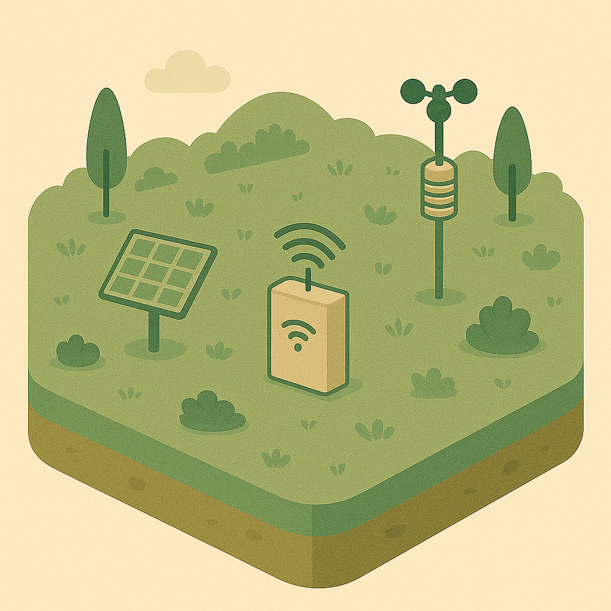

<!-- cspell:ignore landuse -->
# Infrastructure Mapper

A spatial database for managing infrastructure-related data.

---

## What is it?

1. a [SQL Schema](sql/schema.README.md) for PostgreSQL,
2. a set of fixtures to load that schema with default values (particularly for lookup tables)
3. a set of QGIS forms and layer styles for visualising the data

---

## Models 1

|  |  |
|------|-------------|
|  | [Electricity](../sql/2-electricity.md) infrastructure such as power lines, transformers, and substations. |
|  | General [infrastructure](../sql/1-infrastructure.md) elements like bridges, dams, and towers. |
|  | [Water](../sql/3-water.md)-related infrastructure including pipes, tanks, and pumps. |
|  | [Vegetation](../sql/4-vegetation.md) features such as trees, hedges, and planted areas. |
|  | [Monitoring](../sql/5-monitoring.md) devices and their observations (e.g., sensors, cameras). |
|  | [Buildings](../sql/6-buildings.md) and associated structures. |

---

## Models 2 (ctd.)

|  |  |
|------|-------------|
|  | [Fencing](../sql/7-fencing.md) and enclosure features, including standalone gates. |
|  | [Points of Interest](./sql/8-poi.md) (POI) for notable locations or features. |
|  | [Land use areas](../sql/9-landuse.md) such as agricultural, residential, or conservation zones. |
|  | [Gates](../sql/10-gates.md) as access points for properties or enclosures. |
|  | [Poles](../sql/11-poles.md) for lighting, signage, or utility support. |
|  | [Culinary facilities](./sql/12-culinary.md) like kitchens, canteens, and food storage. |

---

## Models 3 (ctd.)

|  |  |
|------|-------------|
|  | [Roads](../sql/13-roads.md), tracks, and paths for transportation infrastructure. |
