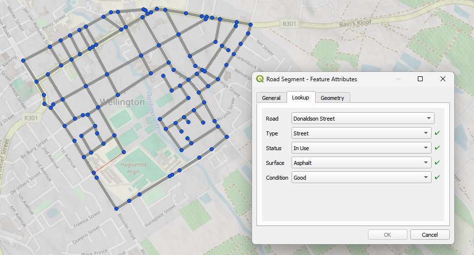
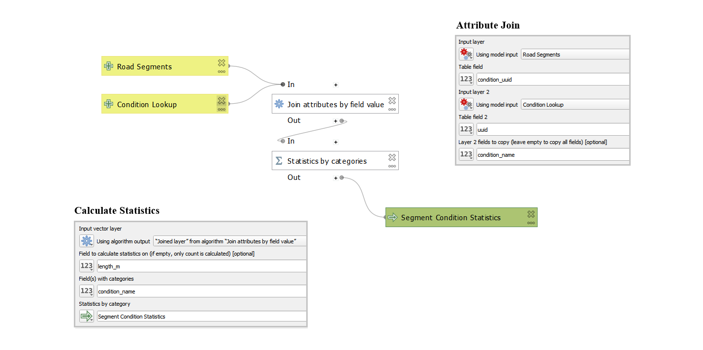

## Infrastructure Mapper - Roads

Lindie Strijdom

📅 July 2025

---

## About Me

* Intern at **Kartoza**
* Background in spatial analysis
* Passionate about data-driven decision making and map design

---

## Analysis Problem

* What’s the shortest route between two points?
* Which roads need repair?

---

## Why These Problems?

Poor road conditions near my home inspired me to analyze routes and identify problem areas.

---

## The Workflow

  

---

## The Tools

|        |     |
|-------------------|---------------------|
| QGIS              | PostgreSQL/PostGIS  |
| QFieldCloud       | pgAdmin             |
| QNEAT3            | VS Code             |
| Git and GitHub    | Marp                |

---

## The Model

---

---

## The Forms

  

---

---

---

## Field Collection

Data collected in the field using the QFieldCloud mobile app

---

## Collection Results

* 108 points
* 139 lines
* 1,9 km² study area

---

## Methodology

---

---

---

## Results - 1

### Shortest distance analysis

* ~1,2 km travel distance
* ~2 min travel time

---

## Results - 2

### Road condition

* 24% in need of repair

---

## Insights

* 30 segments need repair (~2,6 km total)
* 3 segments critical (~639 m total)

---

## Recommendation

* Fully reconstruct Burg Street
* Partially repair Berg Street

---

## Further Research

If I had more time, I would:

* Use more advanced networking tools (pgRouting)
* Digitize bridge and speed bump features
* Increase the study area

---

## My Internship Experience

### Highlights

* ✅ Learned to use QGIS and multiple other software/tools
* 🤝 Collaborated on a real project and gained experience
* 🎯 Gained confidence in presenting and communication
* 💬 Learned effective time management

---

## Other Projects

---

### Bob Ross in QGIS

Recreated a Bob Ross scene using only QGIS symbology and tools.

---

### OpenStreetMap

Mapped local features by capturing geometry and key attributes.

---

## Contact Me

<!-- _class: contact-table -->

|      |  |
|-----------|-------|
| 👤 Lindie Strijdom      |    📨 [lindiestrijdom@gmail.com](mailto:lindiestrijdom@gmail.com)   |
| 🔗 [instagram.com/sickly_hippie](https://www.instagram.com/sickly_hippie/)     |   💼 [github.com/linstrijdom](https://github.com/linstrijdom)    |
