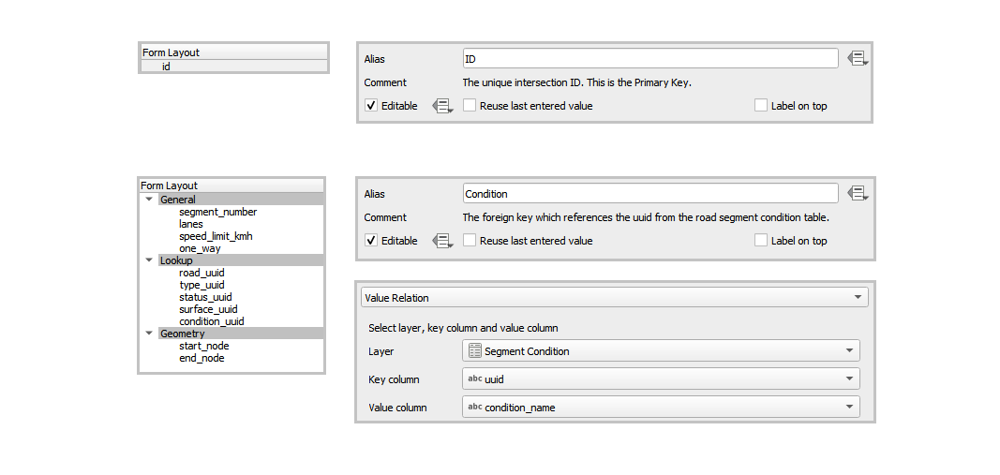
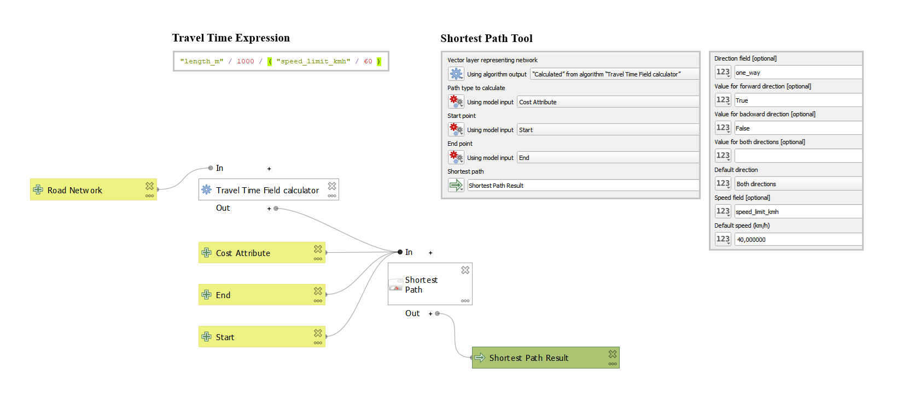
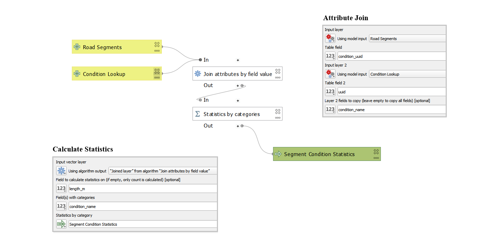

## Infrastructure Mapper - Roads

Lindie Strijdom

📅 July 2025

---

## About Me

* Intern at **Kartoza**
* Background in spatial analysis
* Passionate about data-driven decision making, sustainable development, and map design

---

## The Tools

* QGIS
* QFieldCloud
* PostgreSQL
* pgAdmin
* VS Code
* Marp
* GitHub

---

## The Model

  

---

## The Forms

  

---

---

## Field Collection

Data collected in the field using mobile GIS apps and GPS-enabled devices.

---

## Collection Results

* **Total features collected:**
  * Points: 108
  * Lines: 139
* **Area covered:** 1,9 km²

---

## Analysis Problem

* Routing analysis
* Road condition assessment

---

## Methodology

---

---

---

## Results - 1

Shortest distance analysis

---

## Results - 2

Road condition

---

## Insights

* 30 segments need repair (~2,6 km total)
* 3 segments critical (~639 m total)

🔧 Recommendation:
  * Redo entire Burg Street

---

## Further Research

If I had more time, I would:

* Use more advanced networking tools (pgRouting)
* Digitize bridge and speed bump features
* Increase the study area

---

## My Internship Experience

### Highlights

* ✅ Learned to use QGIS and multiple other software/tools
* 🤝 Collaborated on a real project and gained practical experience
* 🎯 Gained confidence in presenting and communication
* 💬 Learned effective time management

---

## Contact Me

<!-- _class: contact-table -->

|      |  |
|-----------|-------|
| 👤 Lindie Strijdom      |    📨 [lindiestrijdom@gmail.com](mailto:lindiestrijdom@gmail.com)   |
| 🔗 [instagram.com/sickly_hippie](https://www.instagram.com/sickly_hippie/)     |   💼 [github.com/linstrijdom](https://github.com/linstrijdom)    |

---
