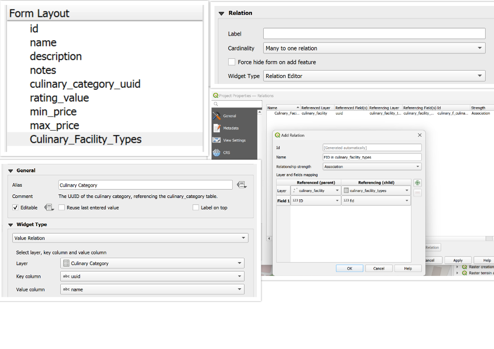
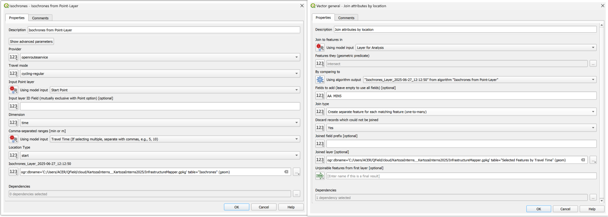
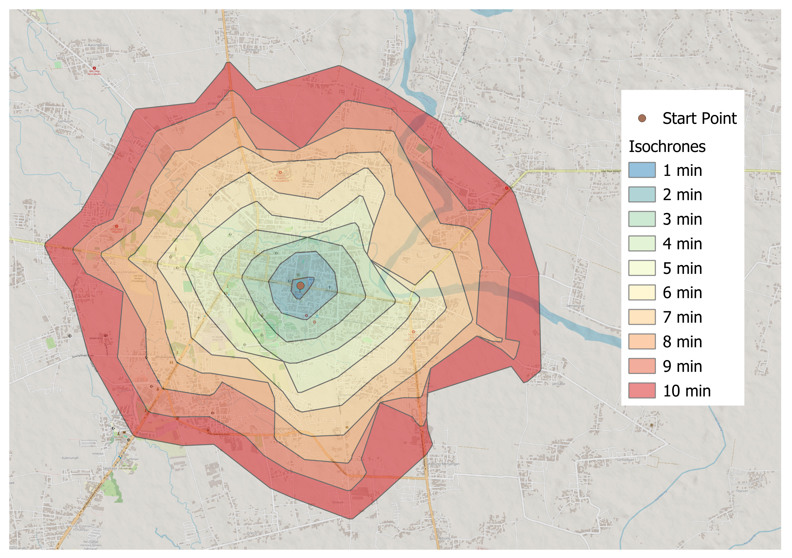
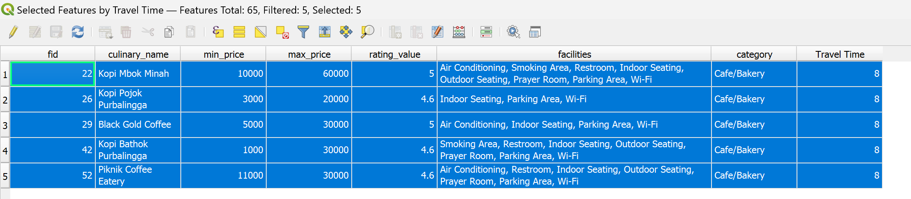

## Infrastructure Mapper - Culinary Spots

Hefni Rae R. A.

📅 July 2025

---

## 👩‍💻 About Me

* Intern at **Kartoza**
* Bachelor of Engineering, majored in Geodetic Engineering
* Currently exploring GIS with a growing interest in open-source GIS. Passionate about GIS and map styling.
  
---

## ⚙️ Tools Used

|        |     |
|-------------------|---------------------|
| QGIS              | pgAdmin             |
| QFieldCloud       | VS Code             |
| PostgreSQL/PostGIS| Marp                |
|                   | Git and GitHub      |

---

## 🧱 The Model

---

---

## 📋 The Forms

---

---

---

## 🏞️ Field Collection

> Data collected in the field using mobile GIS apps and GPS-enabled devices.

---

## 🗺️ Collection Results

* **Total features collected:**
  * Points: 80
* **Area covered:** 15 km²

---

## ❓ Analysis Problem

* How can we determine culinary facilities that are reachable within a specific travel time from a starting point?
* Which culinary facilities that can be reached within 8 minutes and offer the best combination of **low price**, **high ratings**, specific **facilities** like Wi-Fi and indoor seating, and specific **category** like Cafe/Bakery?

---

## ⚙️ Methodology

---

---

---

## 📊 Results - 1

Isochrones showing location of culinary spots relative to travel time from the center.

---

## 📊 Results - 2

* **Price Range:** 1.000–50.000  
* **Rating:** above 4.5  
* **Facilities:** Indoor Seating, Wi-Fi  
* **Category:** Cafe/Bakery  
* **Travel Time:** 8 minutes

---

## 📊 Results - 3

---

## 💡 Insights

* Top categories with high ratings

| fid | category name           | average rating        |
|-----|-------------------------|-------------------|
| 1   | Desserts/Sweets         | 4.61   / 5           |
| 2   | International Cuisine   | 4.58      / 5        |
| 3   | Buffet                  | 4.55         / 5     |

* Most common facility: Parking Area (69)
* Most common category: Traditional (27)

---

## 🔬 Further Research

If I had more time, I would:

* Develop a specific travel mode for motorcycles to better represent real conditions, possibly using custom routing technology.
* Improve the model so users can select facilities and categories using dropdowns connected to the lookup table, ensuring updates are reflected automatically.
* Increase the study area and collect more data to improve the analysis.

---

## 🧳 My Internship Experience

### Highlights

* ✅ Mastered QGIS and explored various GIS tools and workflows  
* 🔍 Contributed to impactful projects
* 🌟 Improved problem-solving, adaptability, and critical thinking  
* ⏰ Enhanced time management while balancing multiple tasks and responsibilities
* 🌍 Improved English communication skills through professional and collaborative engagements

---

## 📧 Contact Me
<!-- _class: contact-table -->
|        |                                  |
|--------|----------------------------------|
| 👤   Hefni Rae R. A.       |    💼     [github.com/hefniraera](https://github.com/hefniraera)           |
| 📧  [hefniraera17@gmail.com](mailto:hefniraera17@gmail.com)    |  🔗 LinkedIn  [linkedin.com/in/hefniraera](https://www.linkedin.com/in/hefniraera/) |
