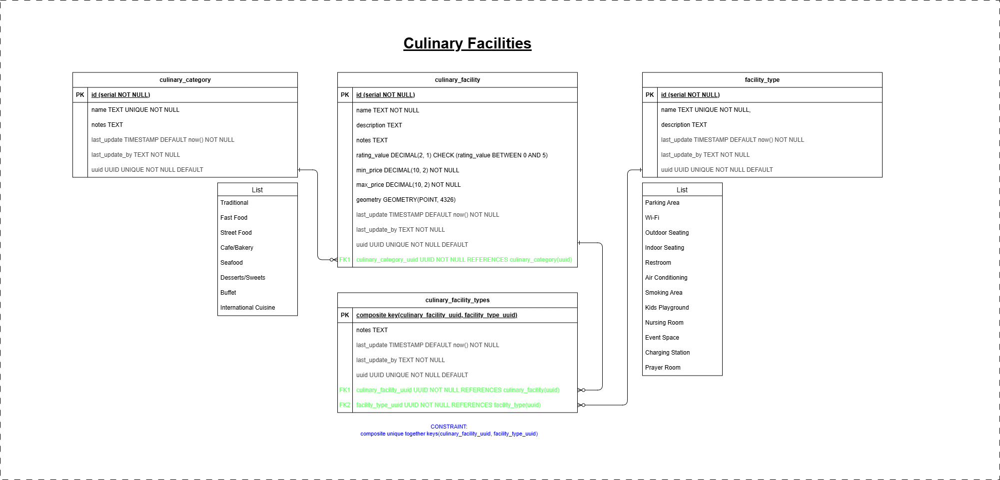
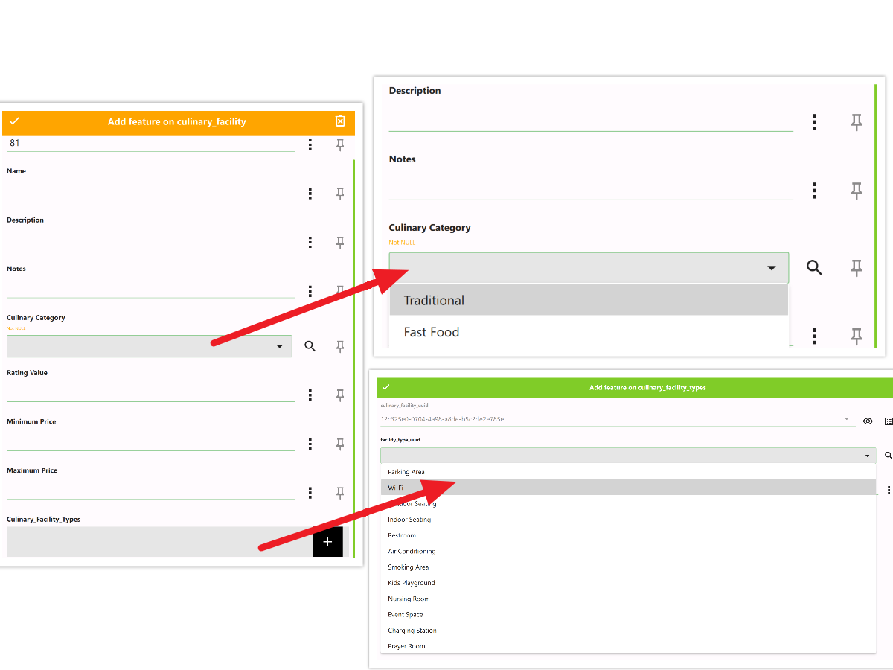
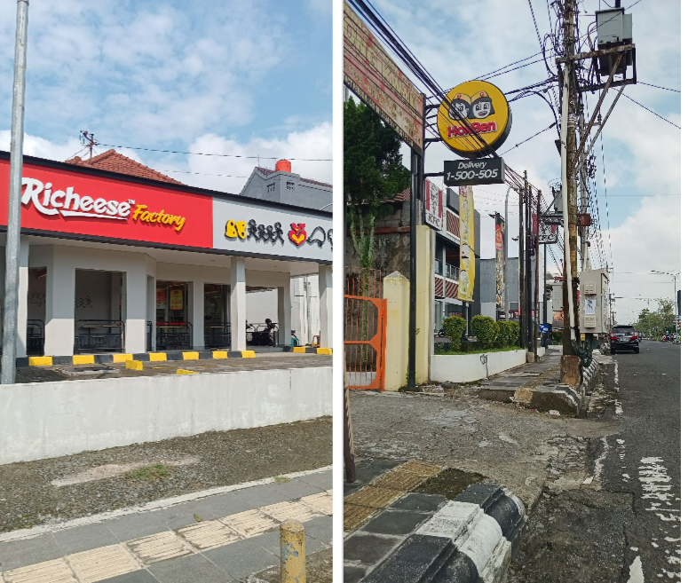
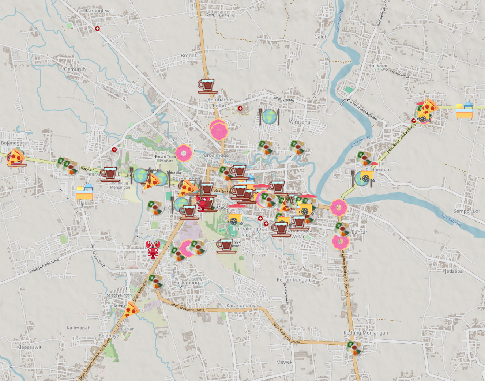
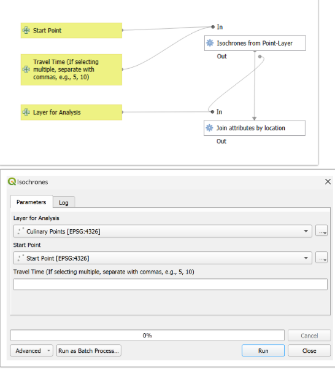
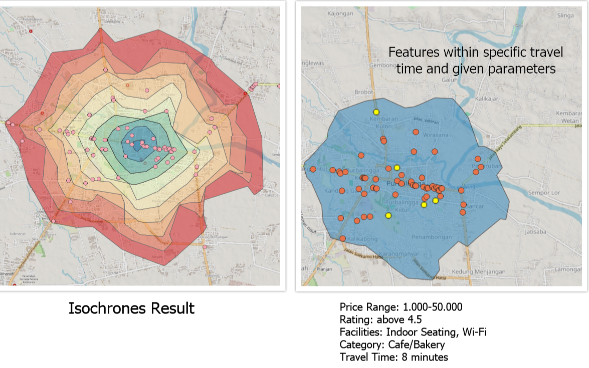

<!-- Title Slide -->

# 🌍 *Infrastructure Mapper - Culinary Facilities*  
## *Hefni Rae R. A.*  
📅 *04/07/2025*

---

## 👩‍💻 About Me

- Intern at **Kartoza**
- Bachelor of Engineering, majored in Geodetic Engineering
- Currently exploring GIS with a growing interest in open-source GIS. Passionate about GIS and map styling.
- Tools used: QGIS, QFieldCloud, PostgreSQL, pgAdmin, VS Code, Marp, GitHub, etc.

---

## 🧱 The Model

- The project uses a custom PostgreSQL/PostGIS schema  
- Diagram below shows the culinary facilities ERD: 

---

## 📋 The Forms

QGIS smart forms created to collect and validate field data efficiently.

---
## 🏞️ Field Collection

> Data collected in the field using mobile GIS apps and GPS-enabled devices.

---

## 🗺️ Collection Results

- **Total features collected:** 
    - `Points`: 80
- **Main types:** culinary spots.  
- **Area covered:** 15 km²  

---

## ❓ Analysis Problem

- How can we determine culinary facilities that are reachable within a specific travel time from a central point?
- Which culinary facilities that can be reached within 8 minutes and offer the best combination of **low price**, **high ratings**, specific **facilities** like Wi-Fi and indoor seating, and specific **category** like Cafe/Bakery? 

---

## ⚙️ Methodology

- A custom QGIS Model Designer diagram used for repeatable spatial processing.

---

## 📊 Results

- Isochrones analysis output 
- Features within specific travel time and given parameters.

---

## 💡 Insights

- Average Price Range by Category
- Rating Distribution
- Top Categories with High Ratings
- Most common facility
- Most common category
- Facilities Coverage
- Facilities by Category

---

## 🔬 Further Research

If I had more time, I would:

- Develop a specific travel mode for motorcycles to better represent real conditions, possibly using custom routing technology.
- Improve the model so users can select facilities and categories using dropdowns connected to the lookup table, ensuring updates are reflected automatically.
- Increase the study area and collect more data to improve the analysis

---

## 🧳 My Internship Experience

### Highlights:

- ✅ Mastered QGIS and explored various GIS tools and workflows  
- 🔍 Contributed to impactful projects
- 🌟 Improved problem-solving, adaptability, and critical thinking  
- ⏰ Enhanced time management while balancing multiple tasks and responsibilities 
- 🌍 Improved English communication skills through professional and collaborative engagements
 
---

## 📧 Contact Me

👤 Hefni Rae R. A.   
📨 hefniraera17@gmail.com  
🔗 [linkedin.com/in/hefniraera](https://www.linkedin.com/in/hefniraera/)  
💼 [github.com/hefniraera](https://github.com/hefniraera)

---

> 🤖 **Prompt:** Create a GIS related image for the Analysis Problem slide