<!-- SPDX-FileCopyrightText: Tim Sutton -->
<!-- SPDX-License-Identifier: MIT -->
---
marp: true
theme: infrastructure
class: _lead
header: 'Infrastructure Mapper'
footer: 'Kartoza ❤️ 2025'
title: Infrastructure Mapper - Culinary Spots
---
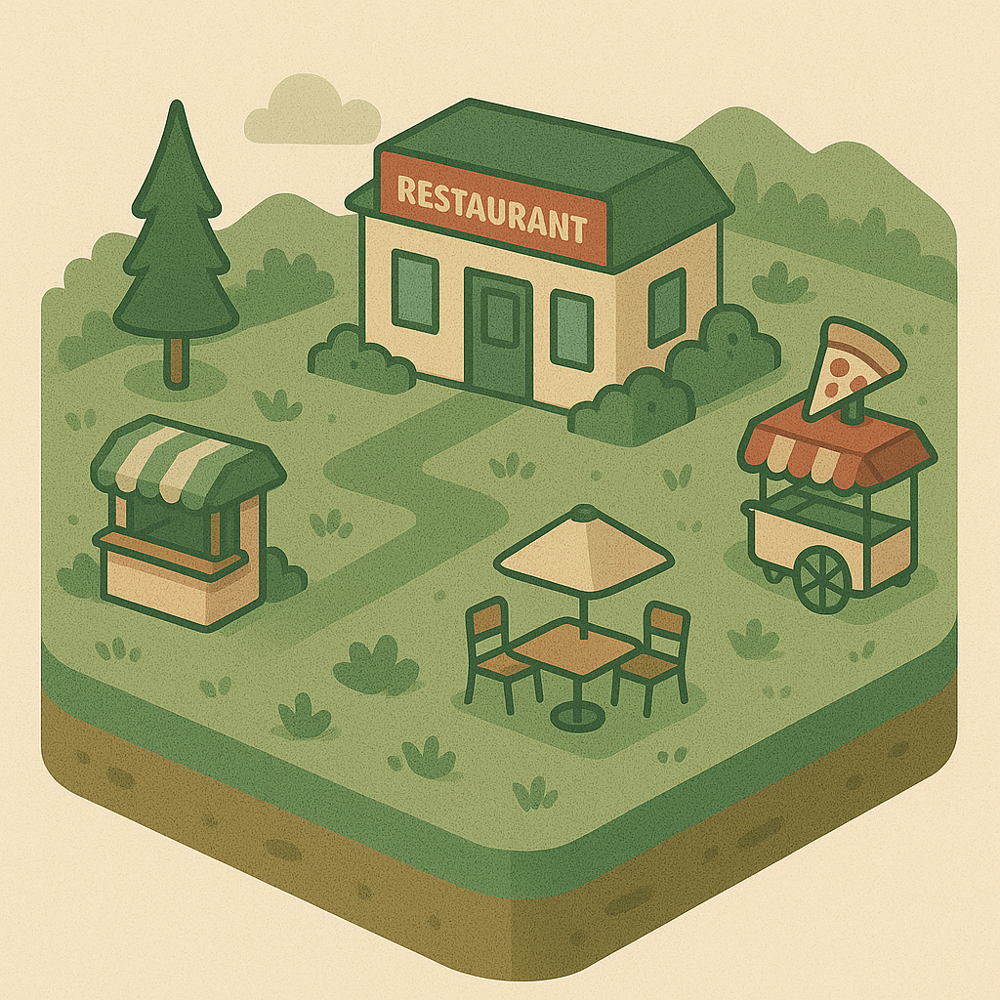

## Infrastructure Mapper - Culinary Spots

Hefni Rae R. A.

📅 July 2025

---

## 👩‍💻 About Me

* Intern at **Kartoza**
* B. Eng (Geodetic Engineering)
* Exploring (open source) GIS

---

## 🍽️ Why Culinary Mapping?

* Food = lifestyle
* Many spots still unmapped
* GIS shows access with isochrones
* Support better choices

---

## ❓ Analysis Problem

* Which places can be reached within 1 to 10 mins?
* Which ones have low price, high rating, Wi-Fi, indoor seating, are Cafes/Bakeries, reachable within 8 mins?

---

## 🧭 Project Workflow

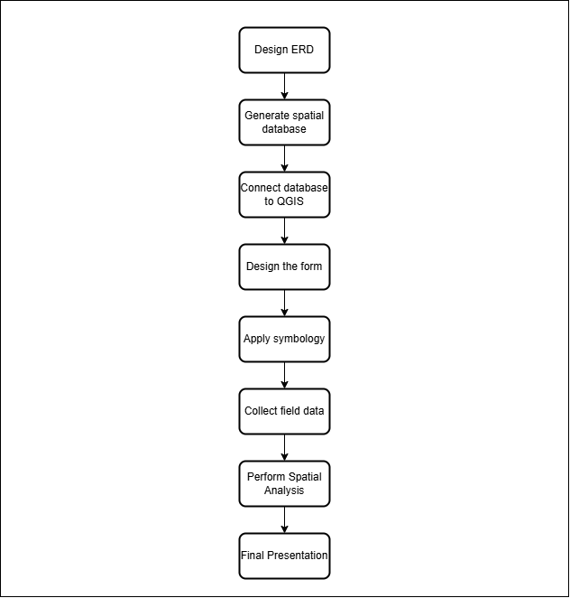

---

## 🧱 The Model

---

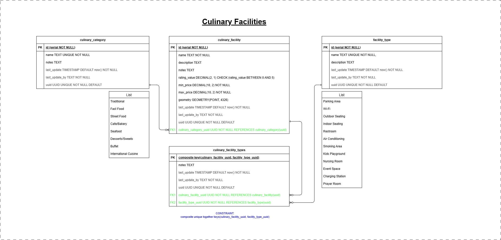

---

## ⚙️ Tools Used

|        |     |
|-------------------|---------------------|
| QGIS              | pgAdmin             |
| QFieldCloud       | VS Code             |
| PostgreSQL/PostGIS (SQL)| Marp (Markdown)                |
|                   | Git and GitHub      |

---

## 📋 The Forms

---

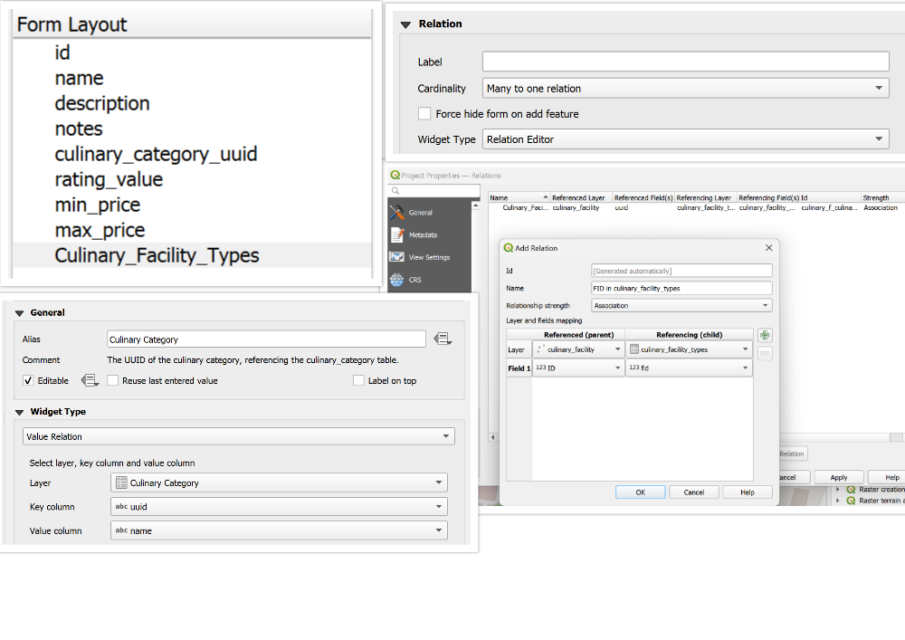

---

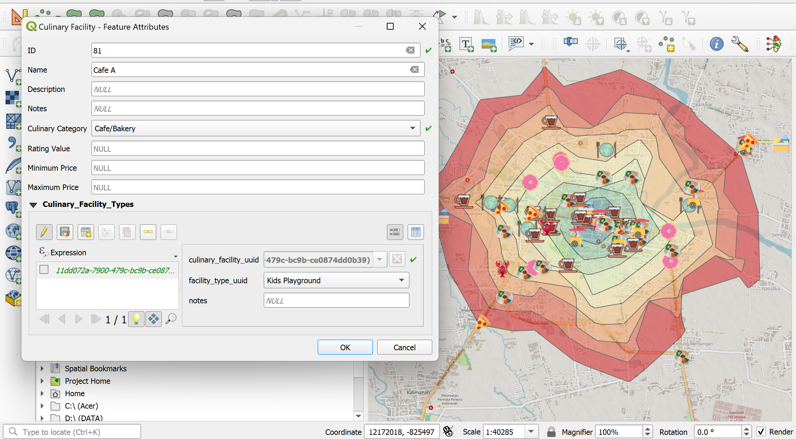

---

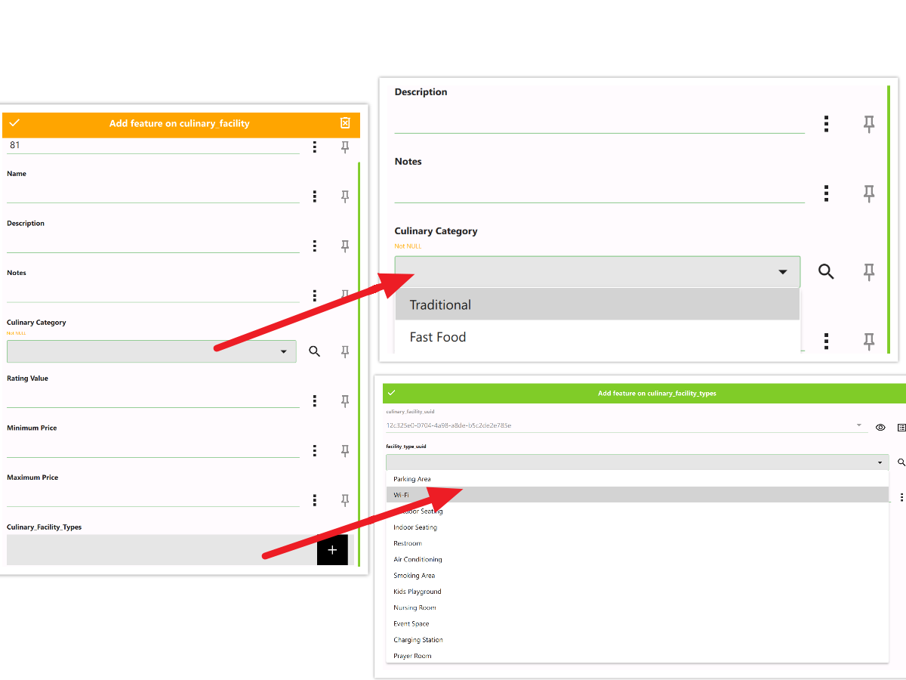

---

## 🏞️ Field Collection

> Collected using QField on a Samsung phone with GPS.

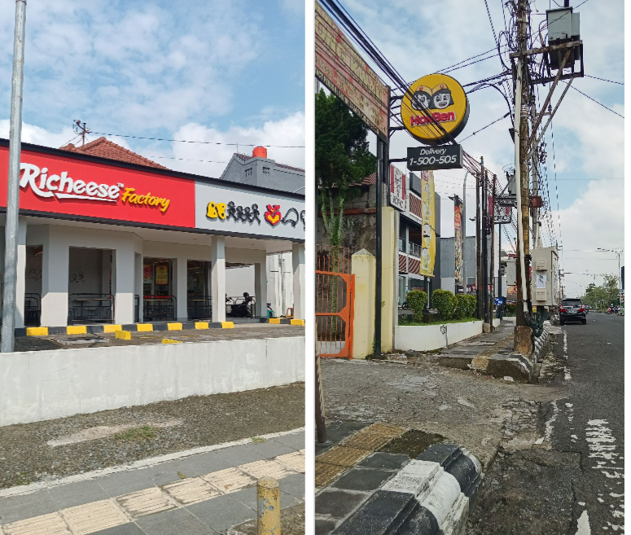

---

## 🗺️ Collection Results

* **Features collected:** 80 points
* **Area covered:** 15 km²

---

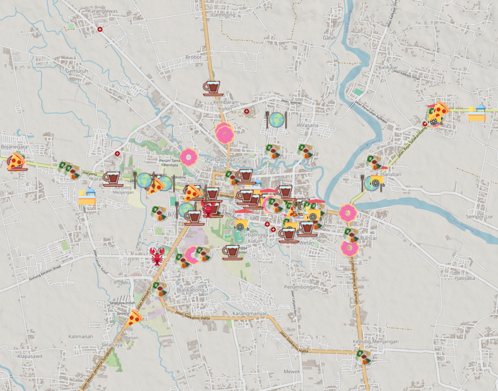

---

## ⚙️ Methodology

---

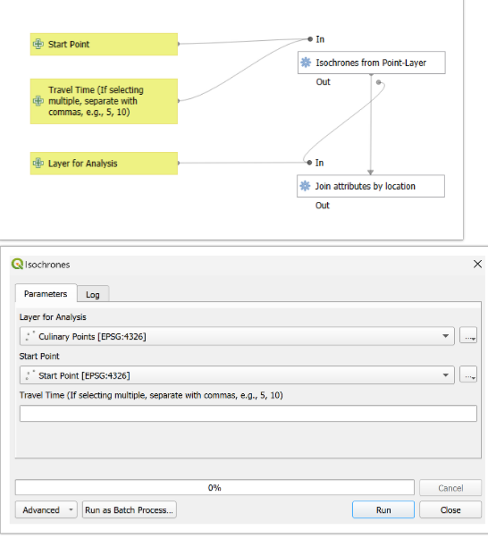

---

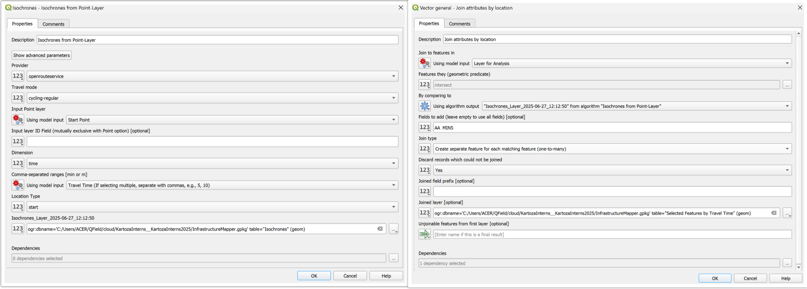

---

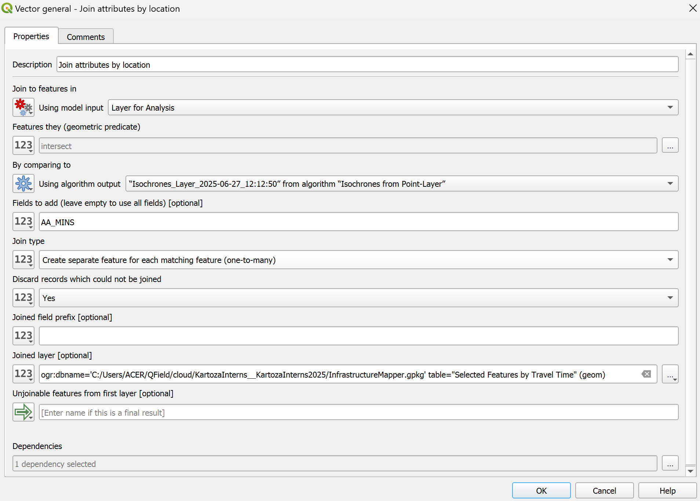

---

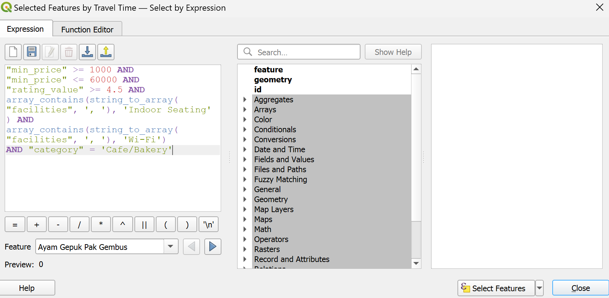

---

## 📊 Results - 1

Isochrones show culinary spots that can be reached within 1 to 10 minutes from the starting point.

---

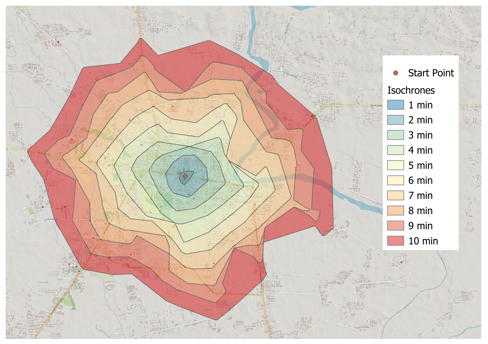

---

## 📊 Results - 2

* **Price Range:** 1.000–60.000  
* **Rating:** above 4.5  
* **Facilities:** Indoor Seating, Wi-Fi  
* **Category:** Cafe/Bakery  
* **Travel Time:** 8 mins

---

---

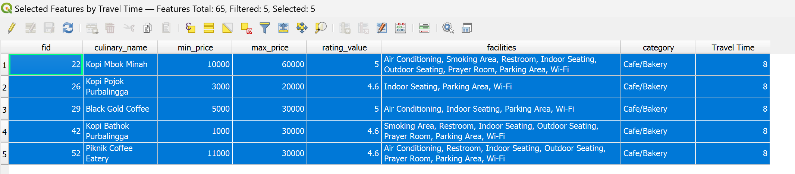

## 📊 Results - 3

---

## 💡 Insights

* Top categories with high ratings
  * Desserts/Sweets
  * International Cuisine
  * Buffet
* Most common facility: Parking Area (69)
* Most common category: Traditional (27)

---

## 🔬 Further Research

If I had more time, I would:

* Develop a specific travel mode for motorcycles
* Improve the QGIS processing model
* Increase the study area and collect more data

---

## 🧳 My Internship Experience

### Highlights

* ✅ Learned QGIS and GIS tools
* 🔍 Impactful projects
* 🌟 Problem-solving, adaptability, and critical thinking  
* ⏰ Time management

---

## 🌟 Bonus Creations: What Else I Made

---

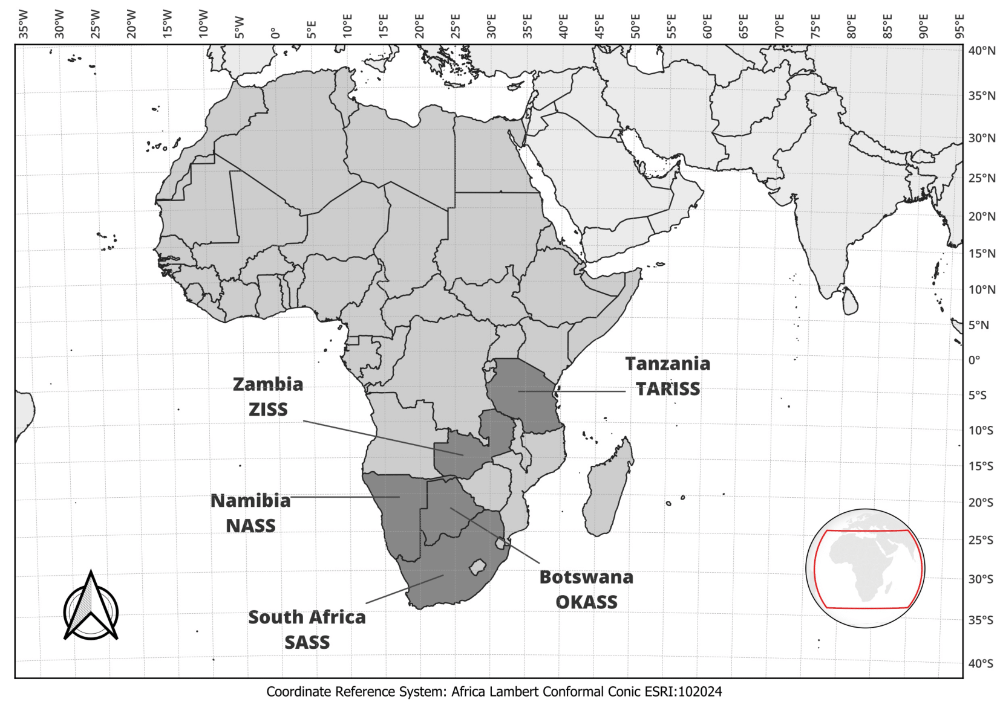

---

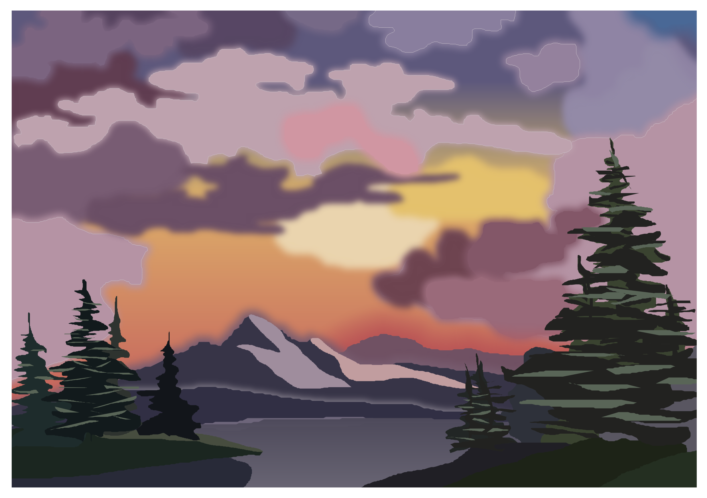

---

## 📧 Contact Me
<!-- _class: contact-table -->
|        |                                  |
|--------|----------------------------------|
| 👤   Hefni Rae R. A.       |    💼     [github.com/hefniraera](https://github.com/hefniraera)           |
| 📧  [hefniraera17@gmail.com](mailto:hefniraera17@gmail.com)    |  🔗   [linkedin.com/in/hefniraera](https://www.linkedin.com/in/hefniraera/)|
