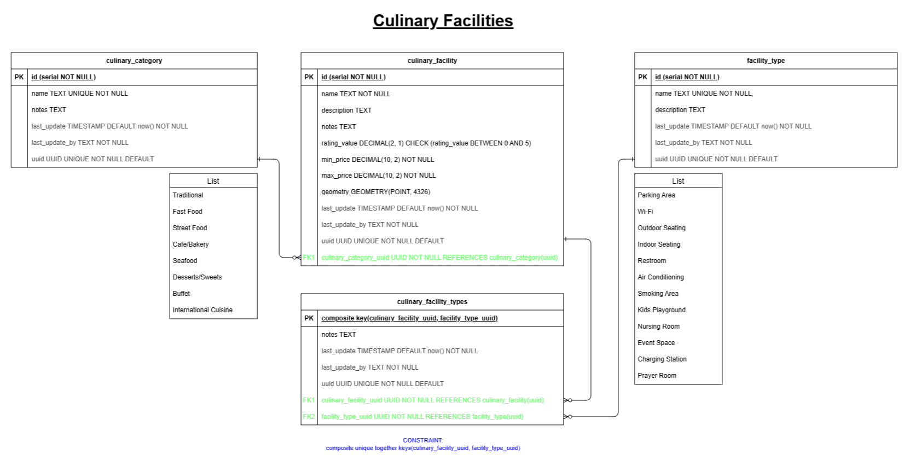
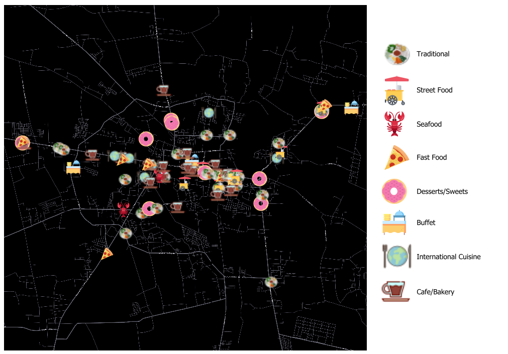

<!-- Title Slide -->
<!-- _class: lead -->

# 🌍 *Infrastructure Mapper - Culinary Facilities*

## *Hefni Rae R. A.*

📅 *04/07/2025*

---

## 👩‍💻 About Me

- Intern at **Kartoza**
- Bachelor of Engineering, majored in Geodetic Engineering
- Currently exploring GIS with a growing interest in open-source GIS. Passionate about GIS and map styling.
  
---

## ⚙️ Tools Used

- QGIS
- QFieldCloud
- PostgreSQL and PostGIS
- pgAdmin
- VS Code
- Marp
- Git and GitHub

---

## 🧱 The Model

---

## 📋 The Forms

---

---

## 🏞️ Field Collection

> Data collected in the field using mobile GIS apps and GPS-enabled devices.

---

## 🗺️ Collection Results

- **Total features collected:**
  - Points: 80
- **Area covered:** 15 km²

---

## ❓ Analysis Problem

- How can we determine culinary facilities that are reachable within a specific travel time from a central point?
- Which culinary facilities that can be reached within 8 minutes and offer the best combination of **low price**, **high ratings**, specific **facilities** like Wi-Fi and indoor seating, and specific **category** like Cafe/Bakery?

---

## ⚙️ Methodology

---

---

## 📊 Results

---

## 💡 Insights

- Top categories with high ratings

| fid | category name           | average rating        |
|-----|-------------------------|-------------------|
| 1   | Desserts/Sweets         | 4.61              |
| 2   | International Cuisine   | 4.58              |
| 3   | Buffet                  | 4.55              |

- Most common facility: Parking Area (69)
- Most common category: Traditional (27)

---

## 🔬 Further Research

If I had more time, I would:

- Develop a specific travel mode for motorcycles to better represent real conditions, possibly using custom routing technology.
- Improve the model so users can select facilities and categories using dropdowns connected to the lookup table, ensuring updates are reflected automatically.
- Increase the study area and collect more data to improve the analysis

---

## 🧳 My Internship Experience

### Highlights

- ✅ Mastered QGIS and explored various GIS tools and workflows  
- 🔍 Contributed to impactful projects
- 🌟 Improved problem-solving, adaptability, and critical thinking  
- ⏰ Enhanced time management while balancing multiple tasks and responsibilities
- 🌍 Improved English communication skills through professional and collaborative engagements

---

## 📧 Contact Me

👤 Hefni Rae R. A.
📨 [hefniraera17@gmail.com](mailto:hefniraera17@gmail.com)
🔗 [linkedin.com/in/hefniraera](https://www.linkedin.com/in/hefniraera/)  
💼 [github.com/hefniraera](https://github.com/hefniraera)

---

> 🤖 **Prompt:** Create a GIS related image for the Analysis Problem slide
>