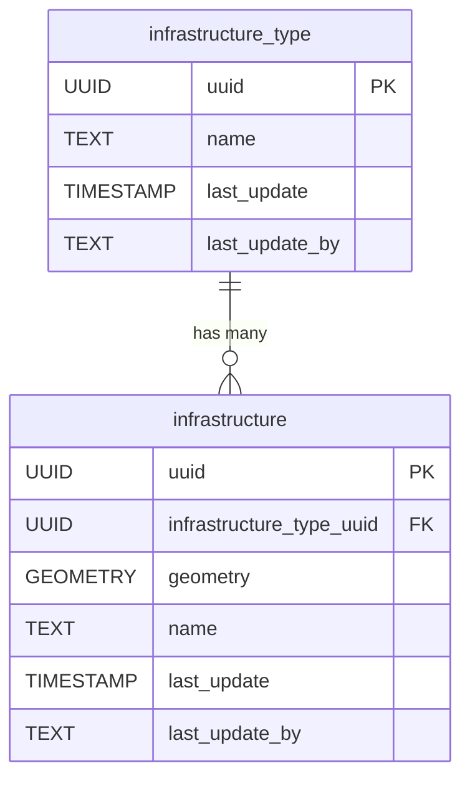

# 🏗️ Infrastructure

The **Infrastructure** component defines the core entities for representing general infrastructure elements and their types. It provides a flexible structure for categorizing and storing spatial features that do not fit into more specific categories like buildings or roads.

**Entities from `sql/1-infrastructure.sql`:**

- `infrastructure_type`: Lookup table for different types of infrastructure (e.g., bridge, dam, tower).
- `infrastructure`: Represents individual infrastructure elements, with geometry and a reference to `infrastructure_type`.

> 🤖 **Prompt:** Add a subsection to ## Components which provides
>
> 1. SubHeading: Electricity
> 2. Image: img/electricity.png
> 3. Text: Summary of the entities in sql/2-electricity.sql
> 4. Mermaid: Diagram of the entities in sql/2-electricity.sql
