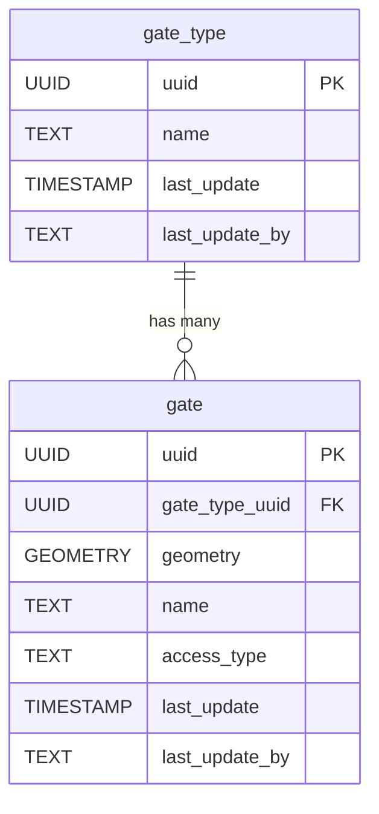

# 🚪 Gates

The **Gates** component models access points within the infrastructure, such as entry or exit gates for properties, facilities, or enclosures. This schema supports different gate types, their spatial locations, and attributes like access control or association with fences or buildings.

**Entities from `sql/10-gates.sql`:**

- `gate_type`: Lookup table for types of gates (e.g., pedestrian, vehicle, automated).
- `gate`: Represents individual gates, with geometry, a reference to `gate_type`, and attributes such as name and access type.

> 🤖 **Prompt:** Add a subsection to ## Components which provides
>
>SubHeading: Gates
>Image: img/gates.png
>Text: Summary of the entities in sql/10-gates.sql
>Mermaid: Diagram of the entities in sql/10-gates.sql
>