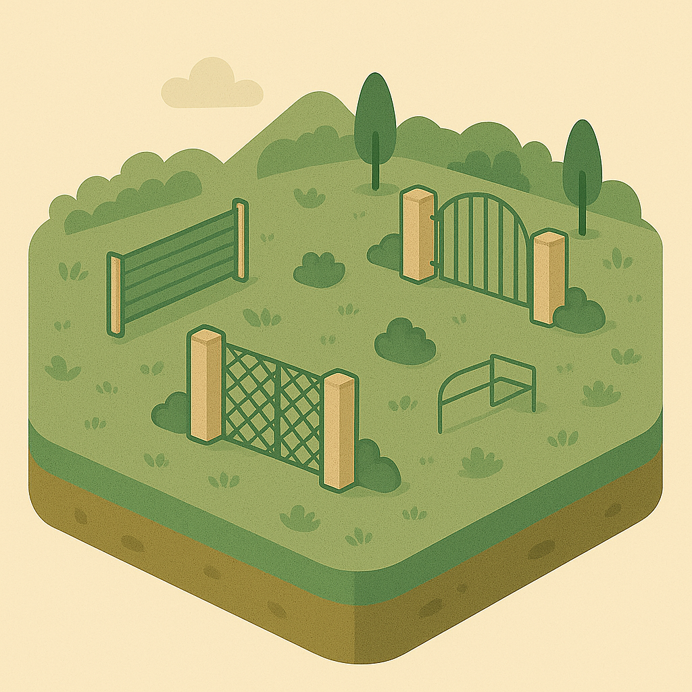
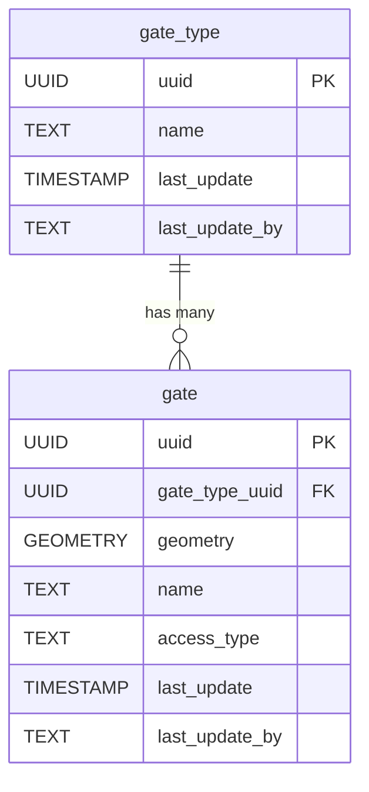

<!-- SPDX-FileCopyrightText: Tim Sutton -->
<!-- SPDX-License-Identifier: MIT -->
# 🚪 Gates

The **Gates** component models access points within the infrastructure, such as entry or exit gates for properties, facilities, or enclosures. This schema supports different gate types, their spatial locations, and attributes like access control or association with fences or buildings.

**Entities from `sql/10-gates.sql`:**

- `gate_type`: Lookup table for types of gates (e.g., pedestrian, vehicle, automated).
- `gate`: Represents individual gates, with geometry, a reference to `gate_type`, and attributes such as name and access type.

```mermaid
erDiagram
  gate_type {
    UUID uuid PK
    TEXT name
    TIMESTAMP last_update
    TEXT last_update_by
  }
  gate {
    UUID uuid PK
    UUID gate_type_uuid FK
    GEOMETRY geometry
    TEXT name
    TEXT access_type
    TIMESTAMP last_update
    TEXT last_update_by
  }

  gate_type ||--o{ gate : "has many"
```

> 🤖 **Prompt:** Add a subsection to ## Components which provides
>
>SubHeading: Gates
>Image: img/gates.png
>Text: Summary of the entities in sql/10-gates.sql
>Mermaid: Diagram of the entities in sql/10-gates.sql
>

<!-- SCHEMA-REFERENCE-START - auto-generated, do not edit by hand -->
## Schema Reference

_Materialized at **v0.1.0** - baseline plus every applied PG migration._

_Source: `10-gates.sql`. 8 table(s)._

### `gate_type`

Describes the type of gate.

| Column | Type | Nullable | Default | Description |
|---|---|---|---|---|
| `id` | `integer` | no | `nextval('gate_type_id_seq'::regclass)` | The unique management log ID. Primary Key. |
| `uuid` | `uuid` | no | `gen_random_uuid()` | Universal Unique Identifier. |
| `last_update` | `timestamp without time zone` | no | `now()` | The date that the last update was made (yyyy-mm-dd hh:mm:ss). |
| `last_update_by` | `text` | yes |  | The name of the user responsible for the latest update. |
| `name` | `text` | no |  | The type of gate. |
| `notes` | `text` | yes |  | Additional information about the gate type. |
| `image` | `text` | yes |  | Path to the image file of a picture representing the gate type. |

**Constraints:**

- PRIMARY KEY `gate_type_pkey`: `PRIMARY KEY (id)`
- UNIQUE `gate_type_name_key`: `UNIQUE (name)`
- UNIQUE `gate_type_uuid_key`: `UNIQUE (uuid)`

### `gate_function`

This table lists the functions that a gate can perform.

| Column | Type | Nullable | Default | Description |
|---|---|---|---|---|
| `id` | `integer` | no | `nextval('gate_function_id_seq'::regclass)` | The unique management log ID. Primary Key. |
| `uuid` | `uuid` | no | `gen_random_uuid()` | Universal Unique Identifier. |
| `last_update` | `timestamp without time zone` | no | `now()` | The date that the last update was made (yyyy-mm-dd hh:mm:ss). |
| `last_update_by` | `text` | yes |  | The name of the user responsible for the latest update. |
| `name` | `text` | no |  | Name of the gate function. |
| `notes` | `text` | yes |  | Additional information about the gate function. |
| `image` | `text` | yes |  | Path to the image file of a picture representing the gate function. |

**Constraints:**

- PRIMARY KEY `gate_function_pkey`: `PRIMARY KEY (id)`
- UNIQUE `gate_function_name_key`: `UNIQUE (name)`
- UNIQUE `gate_function_uuid_key`: `UNIQUE (uuid)`

### `gate_material`

This table lists the materials that a gate can consist of.

| Column | Type | Nullable | Default | Description |
|---|---|---|---|---|
| `id` | `integer` | no | `nextval('gate_material_id_seq'::regclass)` | The unique management log ID. Primary Key. |
| `uuid` | `uuid` | no | `gen_random_uuid()` | Universal Unique Identifier. |
| `last_update` | `timestamp without time zone` | no | `now()` | The date that the last update was made (yyyy-mm-dd hh:mm:ss). |
| `last_update_by` | `text` | yes |  | The name of the user responsible for the latest update. |
| `name` | `text` | no |  | Name of the gate material. |
| `notes` | `text` | yes |  | Additional information about the gate material. |
| `image` | `text` | yes |  | Path to the image file of a picture representing the gate material. |

**Constraints:**

- PRIMARY KEY `gate_material_pkey`: `PRIMARY KEY (id)`
- UNIQUE `gate_material_name_key`: `UNIQUE (name)`
- UNIQUE `gate_material_uuid_key`: `UNIQUE (uuid)`

### `gate`

Items in the gate table can stand alone or be referenced from other entities like buildings and fences.

| Column | Type | Nullable | Default | Description |
|---|---|---|---|---|
| `id` | `integer` | no | `nextval('gate_id_seq'::regclass)` | The unique management log ID. Primary Key. |
| `uuid` | `uuid` | no | `gen_random_uuid()` | Universal Unique Identifier. |
| `last_update` | `timestamp without time zone` | no | `now()` | The date that the last update was made (yyyy-mm-dd hh:mm:ss). |
| `last_update_by` | `text` | no |  | The name of the user responsible for the latest update. |
| `name` | `text` | no |  | The name of the gate. |
| `notes` | `text` | yes |  | Additional notes about the gate. |
| `pic` | `text` | yes |  | Path to the image file of the gate. |
| `geometry` | `USER-DEFINED` | no |  | This is the point where the gate is mounted (i.e. the hinge side). |
| `height_m` | `double precision` | yes |  | Enter the height of the gate in meters. |
| `width_m` | `double precision` | yes |  | Enter the width of the gate in meters. |
| `installation_date` | `date` | no |  | Enter the date the gate was installed. This can be an approximate date. |
| `is_date_estimated` | `boolean` | yes |  | Was the gate installation date estimated? |
| `gate_direction_from_hinge_when_closed` | `double precision` | no |  | What direction does the gate go from the hinge? North = 0, East = 90, South = 180, West = 270, Maximum 360 (back to North). |
| `gate_open_maximum_degrees` | `double precision` | yes |  | Positive clockwise degrees the gate will open (zero if the gate only opens counterclockwise). |
| `gate_open_minimum_degrees` | `double precision` | yes |  | Negative counter-clockwise degrees that the gate opens (zero if the gate only opens clockwise). |
| `gate_type_uuid` | `uuid` | yes |  | The foreign key which references the uuid from the gate_type table. |
| `gate_function_uuid` | `uuid` | yes |  | The foreign key which references the uuid from the gate_function table. |

**Constraints:**

- PRIMARY KEY `gate_pkey`: `PRIMARY KEY (id)`
- UNIQUE `gate_uuid_key`: `UNIQUE (uuid)`
- FOREIGN KEY `gate_gate_function_uuid_fkey`: `FOREIGN KEY (gate_function_uuid) REFERENCES gate_function(uuid)`
- FOREIGN KEY `gate_gate_type_uuid_fkey`: `FOREIGN KEY (gate_type_uuid) REFERENCES gate_type(uuid)`

### `gate_materials`

A gate can be comprised of various and multiple materials that are selected from the material list.

| Column | Type | Nullable | Default | Description |
|---|---|---|---|---|
| `uuid` | `uuid` | no | `gen_random_uuid()` | Universal Unique Identifier. |
| `last_update` | `timestamp without time zone` | no | `now()` | The date that the last update was made (yyyy-mm-dd hh:mm:ss). |
| `last_update_by` | `text` | yes |  | The name of the user responsible for the latest update. |
| `name` | `text` | no |  | Name of the gate material. |
| `notes` | `text` | yes |  | Additional information about the gate material. |
| `image` | `text` | yes |  | Path to the image file of a picture representing the gate material. |
| `gate_uuid` | `uuid` | no |  | The foreign key which references the uuid from the gate table. |
| `gate_material_uuid` | `uuid` | no |  | The foreign key which references the uuid from the gate_material table. |

**Constraints:**

- PRIMARY KEY `gate_materials_pkey`: `PRIMARY KEY (gate_uuid, gate_material_uuid)`
- UNIQUE `gate_materials_uuid_key`: `UNIQUE (uuid)`
- FOREIGN KEY `gate_materials_gate_material_uuid_fkey`: `FOREIGN KEY (gate_material_uuid) REFERENCES gate_material(uuid)`
- FOREIGN KEY `gate_materials_gate_uuid_fkey`: `FOREIGN KEY (gate_uuid) REFERENCES gate(uuid)`

### `building_gates`

Gates that are attached to buildings.

| Column | Type | Nullable | Default | Description |
|---|---|---|---|---|
| `uuid` | `uuid` | no | `gen_random_uuid()` | Universal Unique Identifier. |
| `last_update` | `timestamp without time zone` | no | `now()` | The date that the last update was made (yyyy-mm-dd hh:mm:ss). |
| `last_update_by` | `text` | yes |  | The name of the user responsible for the latest update. |
| `name` | `text` | no |  | Name of the gate. |
| `notes` | `text` | yes |  | Additional information about the gate. |
| `image` | `text` | yes |  | Path to the image file of a picture representing the gate. |
| `building_uuid` | `uuid` | no |  | The foreign key which references the uuid from the building table. |
| `gate_uuid` | `uuid` | no |  | The foreign key which references the uuid from the gate table. |

**Constraints:**

- PRIMARY KEY `building_gates_pkey`: `PRIMARY KEY (building_uuid, gate_uuid)`
- UNIQUE `building_gates_uuid_key`: `UNIQUE (uuid)`
- FOREIGN KEY `building_gates_building_uuid_fkey`: `FOREIGN KEY (building_uuid) REFERENCES building(uuid)`
- FOREIGN KEY `building_gates_gate_uuid_fkey`: `FOREIGN KEY (gate_uuid) REFERENCES gate(uuid)`

### `fence_gates`

Gates that are attached to fences.

| Column | Type | Nullable | Default | Description |
|---|---|---|---|---|
| `uuid` | `uuid` | no | `gen_random_uuid()` | Universal Unique Identifier. |
| `last_update` | `timestamp without time zone` | no | `now()` | The date that the last update was made (yyyy-mm-dd hh:mm:ss). |
| `last_update_by` | `text` | yes |  | The name of the user responsible for the latest update. |
| `name` | `text` | no |  | Name of the gate. |
| `notes` | `text` | yes |  | Additional information about the gate. |
| `image` | `text` | yes |  | Path to the image file of a picture representing the gate. |
| `fence_uuid` | `uuid` | no |  | The foreign key which references the uuid from the fence table. |
| `gate_uuid` | `uuid` | no |  | The foreign key which references the uuid from the gate table. |

**Constraints:**

- PRIMARY KEY `fence_gates_pkey`: `PRIMARY KEY (fence_uuid, gate_uuid)`
- UNIQUE `fence_gates_uuid_key`: `UNIQUE (uuid)`
- FOREIGN KEY `fence_gates_fence_uuid_fkey`: `FOREIGN KEY (fence_uuid) REFERENCES fence(uuid)`
- FOREIGN KEY `fence_gates_gate_uuid_fkey`: `FOREIGN KEY (gate_uuid) REFERENCES gate(uuid)`

### `gate_conditions`

The gate_conditions table is an association table to record the conditions of gates at certain times.

| Column | Type | Nullable | Default | Description |
|---|---|---|---|---|
| `uuid` | `uuid` | no | `gen_random_uuid()` | Universal Unique Identifier. |
| `last_update` | `timestamp without time zone` | no | `now()` | The date that the last update was made (yyyy-mm-dd hh:mm:ss). |
| `last_update_by` | `text` | yes |  | The name of the user responsible for the latest update. |
| `name` | `text` | no |  | Name of the gate condition. |
| `notes` | `text` | yes |  | Additional information about the gate condition. |
| `image` | `text` | yes |  | Path to the image file of a picture representing the gate condition. |
| `date` | `date` | no |  | The date that the condition was observed. |
| `gate_uuid` | `uuid` | no |  | The foreign key which references the uuid from the gate table. |
| `condition_uuid` | `uuid` | no |  | The foreign key which references the uuid from the condition table. |

**Constraints:**

- PRIMARY KEY `gate_conditions_pkey`: `PRIMARY KEY (gate_uuid, condition_uuid, date)`
- UNIQUE `gate_conditions_uuid_key`: `UNIQUE (uuid)`
- FOREIGN KEY `gate_conditions_condition_uuid_fkey`: `FOREIGN KEY (condition_uuid) REFERENCES condition(uuid)`
- FOREIGN KEY `gate_conditions_gate_uuid_fkey`: `FOREIGN KEY (gate_uuid) REFERENCES gate(uuid)`
<!-- SCHEMA-REFERENCE-END -->
