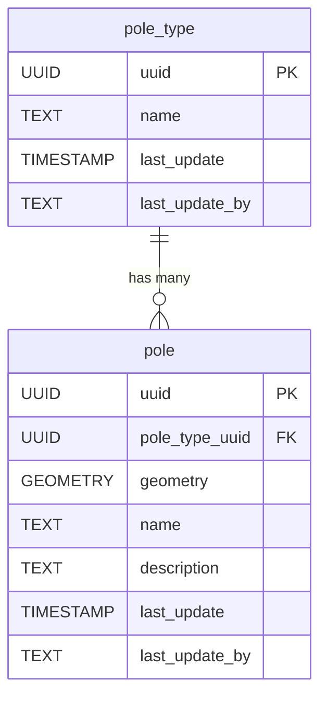

# 🪧 Poles

The **Poles** component models standalone poles used for various infrastructure purposes, such as lighting, signage, or utility support. This schema allows for categorizing pole types and recording individual pole features with their spatial locations and relevant attributes.

**Entities from `sql/11-poles.sql`:**

- `pole_type`: Lookup table for different types of poles (e.g., lighting, signage, utility).
- `pole`: Represents individual poles, with geometry, a reference to `pole_type`, and descriptive attributes.

> 🤖 **Prompt:** Add a subsection to here which has:
>
>1. SubHeading: Poles
>2. Image: img/poles.png
>3. Text: Summary of the entities in sql/11-poles.sql
>4. Mermaid: Diagram of the entities in sql/11-poles.sql
