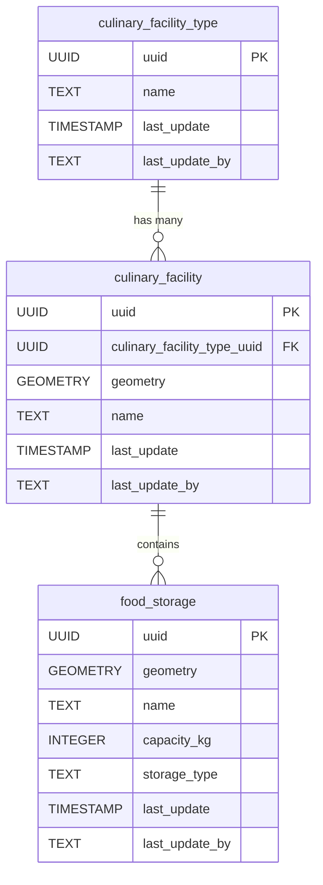

# 🍽️ Culinary

The **Culinary** component models food service infrastructure, such as kitchens, dining areas, and food storage facilities. This schema enables the representation of culinary-related spaces, their types, and their spatial relationships within the infrastructure.

**Entities from `sql/12-culinary.sql`:**

- `culinary_facility_type`: Lookup table for types of culinary facilities (e.g., kitchen, canteen, pantry).
- `culinary_facility`: Represents individual culinary facilities, with geometry and a reference to `culinary_facility_type`.
- `food_storage`: Represents food storage areas, with geometry and attributes for capacity and type.

> 🤖 **Prompt:** Add a subsection to here which has:
>
>1. SubHeading: Culinary
>2. Image: img/food-services.png
>3. Text: Summary of the entities in sql/12-culinary.sql
>4. Mermaid: Diagram of the entities in sql/12-culinary.sql
