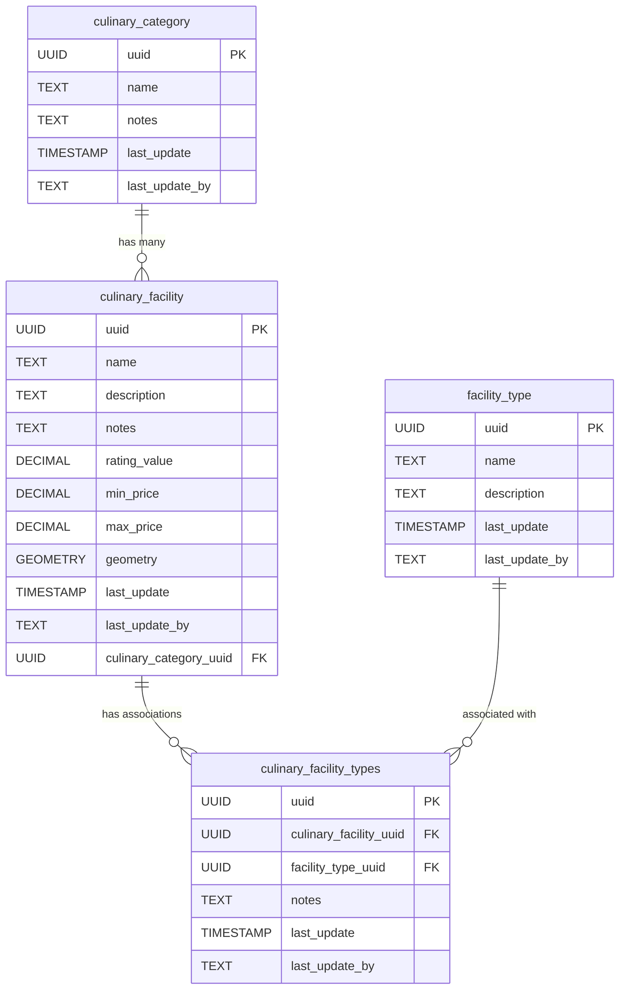

# 🍽️ Culinary

The **Culinary** component models food service infrastructure, such as kitchens, dining areas, and food storage facilities. This schema enables the representation of culinary-related spaces, their types, and their spatial relationships within the infrastructure.

**Entities from `sql/12-culinary.sql`:**

- `culinary_category`: Lookup table for culinary categories (e.g., traditional, fast food). Includes attributes such as name, notes, and metadata for updates.

- `culinary_facility`: Represents individual culinary facilities, including attributes like name, description, rating, price range, and location (geometry). Also references `culinary_category` to indicate the category of the facility.

- `facility_type`: Lookup table for types of facilities associated with culinary spots (e.g., parking lot, restroom, playground). Includes descriptive attributes and metadata for updates.

- `culinary_facility_types`: Association table linking `culinary_facility` with `facility_type`. Represents a many-to-many relationship between facilities and their associated types, with additional metadata and optional notes for the association.

> 🤖 **Prompt:** Add a subsection to here which has:
>
>1. SubHeading: Culinary
>2. Image: img/food-services.png
>3. Text: Summary of the entities in sql/12-culinary.sql
>4. Mermaid: Diagram of the entities in sql/12-culinary.sql
