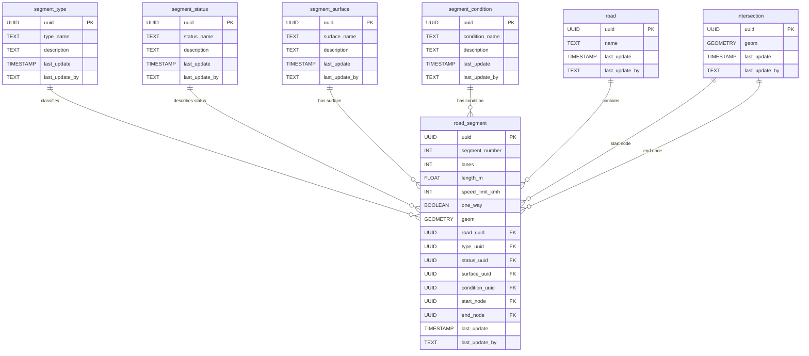

# 🛣️ Roads

The **Roads** component models transportation infrastructure, including roads, tracks, and paths within the mapped area. This schema enables the representation of different road types, individual road segments, and their spatial characteristics, supporting navigation, planning, and analysis.

**Entities from `sql/13-roads.sql`:**

- `segment_type`: Road classification (e.g. National, Main Road).
- `segment_status`: Road segment status (e.g. In Use, Planned).
- `segment_surface`: Surface material (e.g. Asphalt, Dirt).
- `segment_condition`: Physical condition (e.g. Good, Flooded).
- `road`: Logical grouping of road segments (has a name).
- `intersection`: Physical nodes (start/end points for road segments).
- `road_segment`: Actual line features with geometry and references to all lookup tables, the road it belongs to, and intersections.

---

> 🤖 **Prompt:** Add a subsection to ## Components which provides
>
> 1. SubHeading: Roads
> 2. Image: img/roads.png
> 3. Text: Summary of the entities in sql/13-roads.sql
> 4. Mermaid: Diagram of the entities in sql/13-roads.sql
