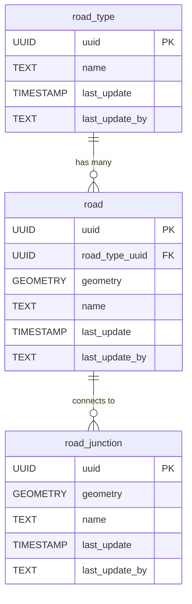

# 🛣️ Roads

The **Roads** component models transportation infrastructure, including roads, tracks, and paths within the mapped area. This schema enables the representation of different road types, individual road segments, and their spatial characteristics, supporting navigation, planning, and analysis.

**Entities from `sql/13-roads.sql`:**

- `road_type`: Lookup table for types of roads (e.g., main road, track, footpath).
- `road`: Represents individual road segments, with geometry and a reference to `road_type`.
- `road_junction`: Represents intersections or junctions between roads, with geometry and descriptive attributes.

---

> Add a subsection to here which has:
>
>1. SubHeading: Roads
>2. Image: img/roads.png
>3. Text: Summary of the entities in sql/13-roads.sql
>4. Mermaid: Diagram of the entities in sql/13-roads.sql
