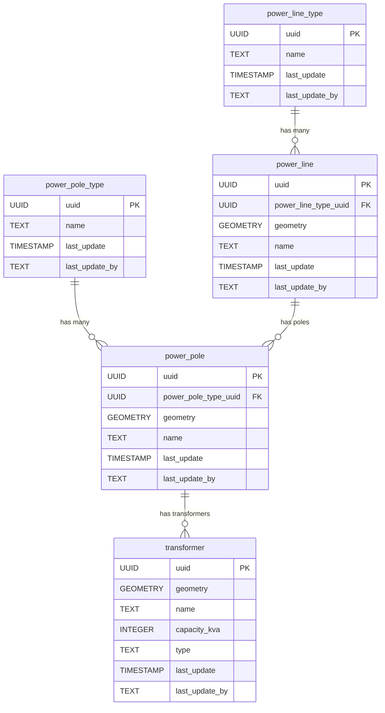

# ⚡ Electricity

The **Electricity** component models electrical infrastructure, including power lines, poles, and transformers. This schema enables the representation of the spatial layout and relationships of electricity distribution elements.

**Entities from `sql/2-electricity.sql`:**

- `power_line_type`: Lookup table for types of power lines (e.g., high voltage, low voltage).
- `power_line`: Represents individual power lines, with geometry and a reference to `power_line_type`.
- `power_pole_type`: Lookup table for types of power poles.
- `power_pole`: Represents individual power poles, with geometry and a reference to `power_pole_type`.
- `transformer`: Represents transformers, with geometry and attributes for capacity and type.

