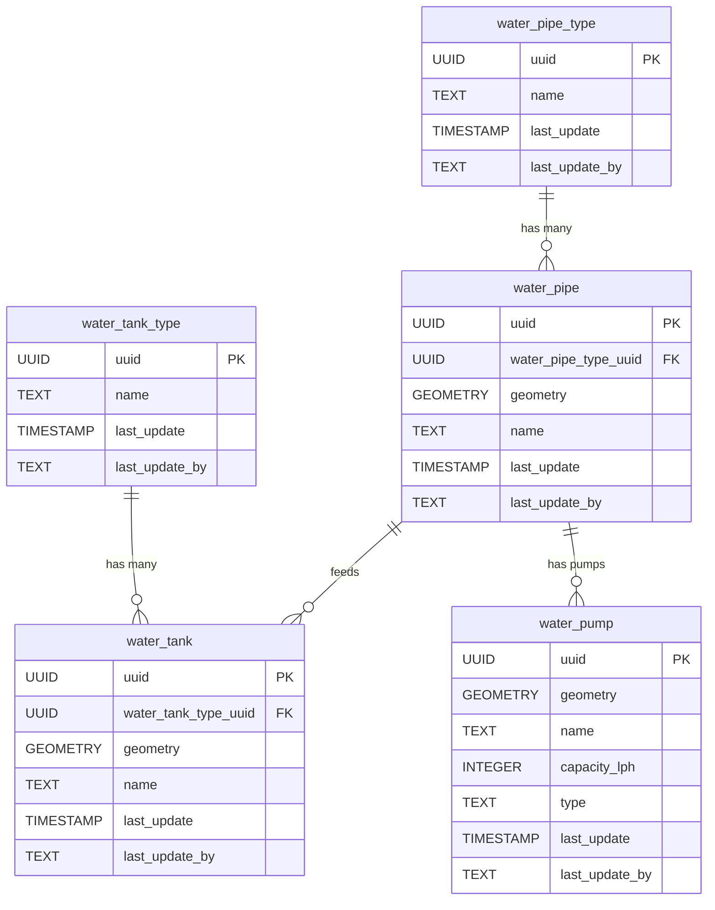

# 💧 Water

The **Water** component models water-related infrastructure, such as pipelines, tanks, and pumps. This schema enables the representation of the spatial layout and relationships of water distribution and storage elements.

**Entities from `sql/3-water.sql`:**

- `water_pipe_type`: Lookup table for types of water pipes (e.g., main, branch).
- `water_pipe`: Represents individual water pipes, with geometry and a reference to `water_pipe_type`.
- `water_tank_type`: Lookup table for types of water tanks.
- `water_tank`: Represents individual water tanks, with geometry and a reference to `water_tank_type`.
- `water_pump`: Represents pumps, with geometry and attributes for capacity and type.

> 🤖 **Prompt:** Add a subsection to ## Components which provides
>
> 1. SubHeading: Water
> 2. Image: img/water.png
> 3. Text: Summary of the entities in sql/3-water.sql
> 4. Mermaid: Diagram of the entities in sql/3-water.sql
