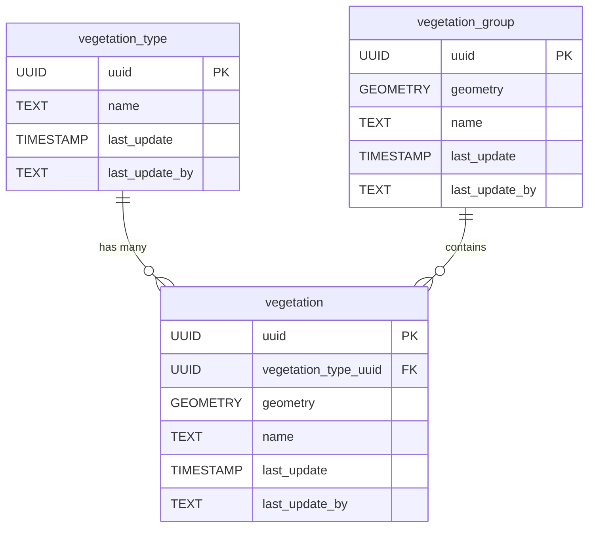

# 🌱 Vegetation

The **Vegetation** component models natural and managed vegetation features, such as trees, hedges, and planted areas. This schema supports the representation of individual plants and grouped vegetation, along with their types and spatial characteristics.

**Entities from `sql/4-vegetation.sql`:**

- `vegetation_type`: Lookup table for types of vegetation (e.g., tree, shrub, hedge).
- `vegetation`: Represents individual vegetation features, with geometry and a reference to `vegetation_type`.
- `vegetation_group`: Represents groups or areas of vegetation, such as groves or planted beds.

> 🤖 **Prompt:** Add a subsection to ## Components which provides
>
>1. SubHeading: Vegetation
>2. Image: img/vegetation.png
>3. Text: Summary of the entities in sql/4-vegetation.sql
>4. Mermaid: Diagram of the entities in sql/>4-vegetation.sql
