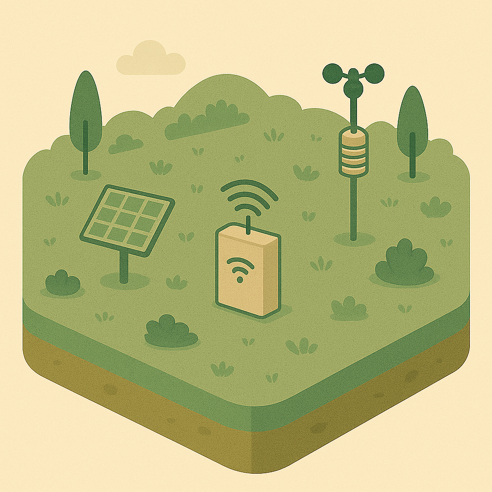
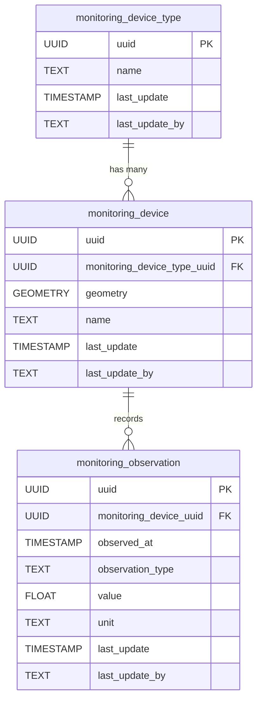

# 📡 Monitoring

The **Monitoring** component captures infrastructure monitoring devices and their observations. This schema allows for the representation of sensors (such as weather stations, cameras, or environmental monitors), their types, and the data they collect over time.

**Entities from `sql/5-monitoring.sql`:**

- `monitoring_device_type`: Lookup table for types of monitoring devices (e.g., weather station, camera, sensor).
- `monitoring_device`: Represents individual monitoring devices, with geometry and a reference to `monitoring_device_type`.
- `monitoring_observation`: Stores observations or measurements recorded by monitoring devices, including timestamp, value, and type.

> 🤖 **Prompt**: Add a subsection to ## Components which provides
>
>SubHeading: Monitoring
>Image: img/monitoring.png
>Text: Summary of the entities in sql/5-monitoring.sql
> Mermaid: Diagram of the entities in sql/5-monitoring.sql
