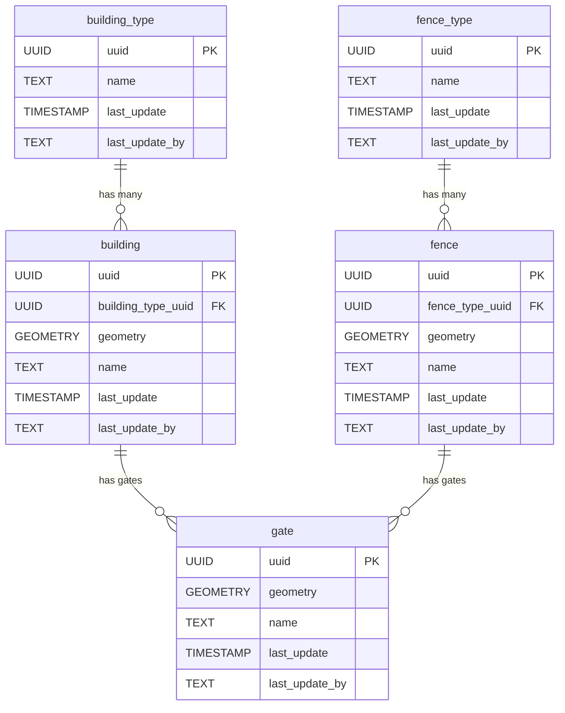

# 🏠 Buildings

The **Buildings** component models structures and their related entities. The schema supports different building types, fences, and gates, allowing for detailed representation of built infrastructure and their spatial relationships.

**Entities from `sql/6-buildings.sql`:**

- `building_type`: Lookup table for types of buildings (e.g., residential, commercial).
- `building`: Represents individual buildings, with geometry and a reference to `building_type`.
- `fence_type`: Lookup table for types of fences.
- `fence`: Represents individual fences, with geometry and a reference to `fence_type`.
- `gate`: Represents gates, which may be associated with buildings or fences.

> 🤖 **Prompt:** Add a subsection to ## Components which provides
>
> 1. SubHeading: Buildings
> 2. Image: img/buildings.png
> 3. Text: Summary of the entities in sql/6-buildings.sql
> 4. Mermaid: Diagram of the entities in sql/6-buildings.sql
