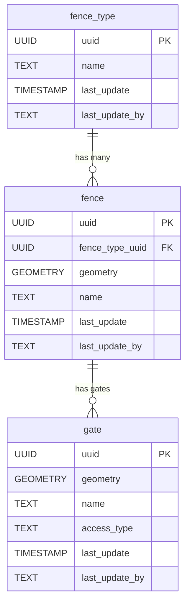

# 🚧 Fencing

The **Fencing** component models boundary and enclosure features, such as fences and gates, that are not directly associated with buildings. This schema allows for the representation of different fence types, individual fence segments, and standalone gates, supporting detailed mapping of property boundaries and access points.

**Entities from `sql/7-fencing.sql`:**

- `fence_type`: Lookup table for types of fences (e.g., wire, wall, hedge).
- `fence`: Represents individual fence segments, with geometry and a reference to `fence_type`.
- `gate`: Represents gates, with geometry and attributes for name and access type.

> 🤖 **Prompt:** Add a subsection to ## Components which provides
>
> SubHeading: Fencing
> Image: img/fencing.png
> Text: Summary of the entities in sql/7-fencing.sql
> Mermaid: Diagram of the entities in sql/7-fences.sql
