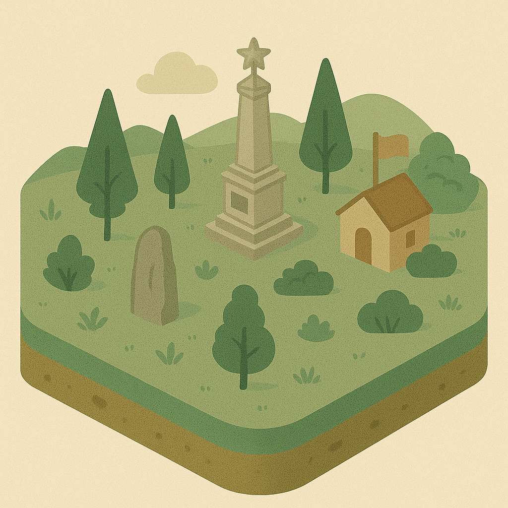
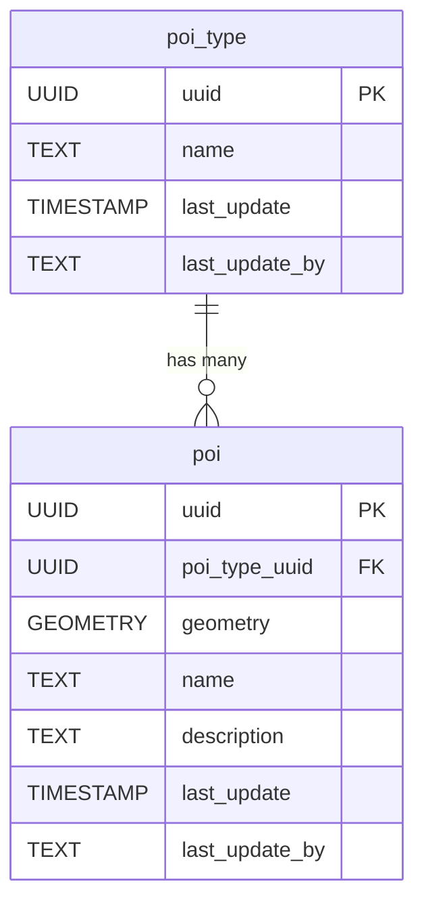

# 📍 Points Of Interest

The **Points Of Interest (POI)** component models notable locations or features that are relevant for mapping and analysis but do not fit into other infrastructure categories. This schema supports categorizing POIs, storing their spatial locations, and associating descriptive information.

**Entities from `sql/8-poi.sql`:**

- `poi_type`: Lookup table for different types of points of interest (e.g., landmark, facility, service).
- `poi`: Represents individual points of interest, with geometry, a reference to `poi_type`, and descriptive attributes.

> 🤖 **Prompt:** Add a subsection to ## Components which provides
>
>1. SubHeading: Points Of Interest
>2. Image: img/point-of-interest.png
>3. Text: Summary of the entities in sql/8-poi.sql
>4. Mermaid: Diagram of the entities in sql/8-poi.sql
>