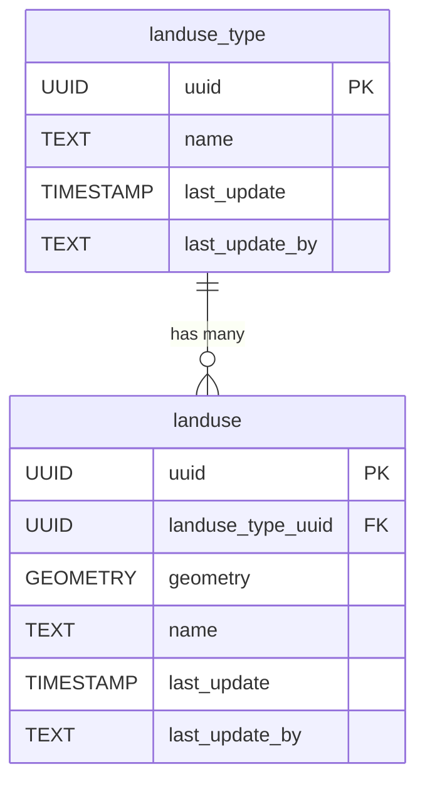

# 🗺️ Landuse

The **Landuse** component models how land parcels are utilized or designated, such as agricultural, residential, commercial, or conservation areas. This schema enables the representation of landuse types and individual landuse polygons, supporting spatial analysis and planning.

**Entities from `sql/9-landuse.sql`:**

- `landuse_type`: Lookup table for different landuse categories (e.g., agricultural, residential, industrial).
- `landuse`: Represents individual landuse areas, with geometry and a reference to `landuse_type`.

> 🤖 **Prompt:** Add a subsection to ## Components which provides
>
>1. SubHeading: Landuse
>2. Image: img/landuse.png
>3. Text: Summary of the entities in sql/9-landuse.sql
>4. Mermaid: Diagram of the entities in sql/9-landuse.sql
