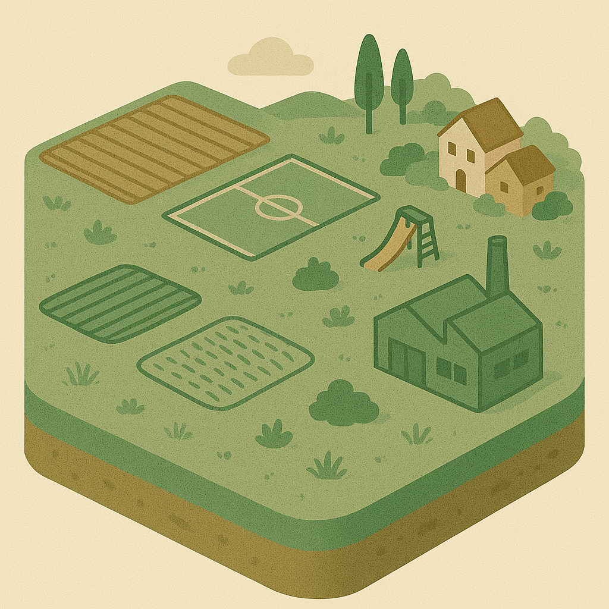
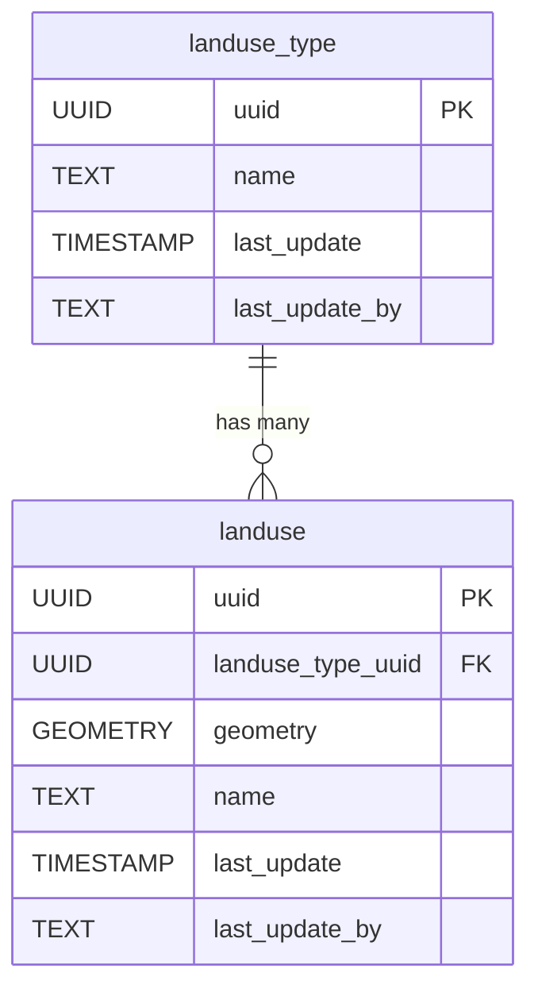

<!-- SPDX-FileCopyrightText: Tim Sutton -->
<!-- SPDX-License-Identifier: MIT -->
# 🗺️ Land use
<!-- cspell:ignore landuse -->

The **Land use** component models how land parcels are utilized or designated, such as agricultural, residential, commercial, or conservation areas. This schema enables the representation of land use types and individual land use polygons, supporting spatial analysis and planning.

**Entities from `sql/9-landuse.sql`:**

- `landuse_type`: Lookup table for different land use categories (e.g., agricultural, residential, industrial).
- `landuse`: Represents individual land use areas, with geometry and a reference to `landuse_type`.

```mermaid
erDiagram
  landuse_type {
    UUID uuid PK
    TEXT name
    TIMESTAMP last_update
    TEXT last_update_by
  }
  landuse {
    UUID uuid PK
    UUID landuse_type_uuid FK
    GEOMETRY geometry
    TEXT name
    TIMESTAMP last_update
    TEXT last_update_by
  }

  landuse_type ||--o{ landuse : "has many"
```

> 🤖 **Prompt:** Add a subsection to ## Components which provides
>
>1. SubHeading: Land use
>2. Image: img/landuse.png
>3. Text: Summary of the entities in sql/9-landuse.sql
>4. Mermaid: Diagram of the entities in sql/9-landuse.sql

<!-- SCHEMA-REFERENCE-START - auto-generated, do not edit by hand -->
## Schema Reference

_Materialized at **v0.1.0** - baseline plus every applied PG migration._

_Source: `9-landuse.sql`. 6 table(s)._

### `landuse_area_type`

Lookup table for the landuse area type. Eg: Agriculture, residential, recreation, commercial, transportation etc

| Column | Type | Nullable | Default | Description |
|---|---|---|---|---|
| `id` | `integer` | no | `nextval('landuse_area_type_id_seq'::regclass)` | The unique landuse area type ID. This is the Primary Key. |
| `uuid` | `uuid` | no | `gen_random_uuid()` | Global Unique Identifier. |
| `last_update` | `timestamp without time zone` | no | `now()` | The date that the last update was made (yyyy-mm-dd hh:mm:ss). |
| `last_update_by` | `text` | no |  | The name of the user responsible for the latest update. |
| `name` | `character varying` | no |  | The landuse area type field name. This is unique. |
| `notes` | `text` | yes |  | Additional information of the landuse area type. |
| `image` | `text` | yes |  | Image of the landuse area type. |

**Constraints:**

- PRIMARY KEY `landuse_area_type_pkey`: `PRIMARY KEY (id)`
- UNIQUE `landuse_area_type_name_key`: `UNIQUE (name)`
- UNIQUE `landuse_area_type_uuid_key`: `UNIQUE (uuid)`

### `landuse_area_ownership_type`

Lookup table for the landuse area ownership type. Eg: Public or private

| Column | Type | Nullable | Default | Description |
|---|---|---|---|---|
| `id` | `integer` | no | `nextval('landuse_area_ownership_type_id_seq'::regclass)` | The unique landuse area ownership type ID. This is the Primary Key. |
| `uuid` | `uuid` | no | `gen_random_uuid()` | Global Unique Identifier. |
| `last_update` | `timestamp without time zone` | no | `now()` | The date that the last update was made (yyyy-mm-dd hh:mm:ss). |
| `last_update_by` | `text` | no |  | The name of the user responsible for the latest update. |
| `name` | `character varying` | no |  | The landuse area ownership type field name. This is unique. |
| `notes` | `text` | yes |  | Additional information of the landuse area ownership type. |
| `image` | `text` | yes |  | Image of the landuse area ownership type. |

**Constraints:**

- PRIMARY KEY `landuse_area_ownership_type_pkey`: `PRIMARY KEY (id)`
- UNIQUE `landuse_area_ownership_type_name_key`: `UNIQUE (name)`
- UNIQUE `landuse_area_ownership_type_uuid_key`: `UNIQUE (uuid)`

### `landuse_area_owner`

Lookup table for the landuse area owner.

| Column | Type | Nullable | Default | Description |
|---|---|---|---|---|
| `id` | `integer` | no | `nextval('landuse_area_owner_id_seq'::regclass)` | The unique landuse area owner ID. This is the Primary Key. |
| `uuid` | `uuid` | no | `gen_random_uuid()` | Global Unique Identifier. |
| `last_update` | `timestamp without time zone` | no | `now()` | The date that the last update was made (yyyy-mm-dd hh:mm:ss). |
| `last_update_by` | `text` | no |  | The name of the user responsible for the latest update. |
| `name` | `character varying` | yes |  | The landuse area ownership field name. This is unique. |
| `notes` | `text` | yes |  | Additional information of the landuse area owner. |
| `image` | `text` | yes |  | Image of the landuse area owner. |
| `address` | `text` | yes |  | Address of the owner of the landuse area. |
| `landuse_area_ownership_type_uuid` | `uuid` | no |  | The foreign key which references the uuid from the landuse area ownership type table. |

**Constraints:**

- PRIMARY KEY `landuse_area_owner_pkey`: `PRIMARY KEY (id)`
- UNIQUE `landuse_area_owner_name_key`: `UNIQUE (name)`
- UNIQUE `landuse_area_owner_uuid_key`: `UNIQUE (uuid)`
- FOREIGN KEY `landuse_area_owner_landuse_area_ownership_type_uuid_fkey`: `FOREIGN KEY (landuse_area_ownership_type_uuid) REFERENCES landuse_area_ownership_type(uuid)`

### `landuse_area`

Lookup table for the landuse area.

| Column | Type | Nullable | Default | Description |
|---|---|---|---|---|
| `id` | `integer` | no | `nextval('landuse_area_id_seq'::regclass)` | The unique landuse area ID. This is the Primary Key. |
| `uuid` | `uuid` | no | `gen_random_uuid()` | Global Unique Identifier. |
| `last_update` | `timestamp without time zone` | no | `now()` | The date that the last update was made (yyyy-mm-dd hh:mm:ss). |
| `last_update_by` | `text` | no |  | The name of the user responsible for the latest update. |
| `name` | `character varying` | yes |  | The landuse area name. This is unique. |
| `notes` | `text` | yes |  | Additional information of the landuse area. |
| `image` | `text` | yes |  | Image of the landuse area. |
| `geometry` | `USER-DEFINED` | yes |  | The geometry of landuse (in this case a polygon) and the projection system used. |
| `landuse_area_type_uuid` | `uuid` | no |  | The foreign key which references the uuid from the landuse area type table. |
| `landuse_area_owner_uuid` | `uuid` | no |  | The foreign key which references the uuid from the landuse area owner table. |

**Constraints:**

- PRIMARY KEY `landuse_area_pkey`: `PRIMARY KEY (id)`
- UNIQUE `landuse_area_name_key`: `UNIQUE (name)`
- UNIQUE `landuse_area_uuid_key`: `UNIQUE (uuid)`
- FOREIGN KEY `landuse_area_landuse_area_owner_uuid_fkey`: `FOREIGN KEY (landuse_area_owner_uuid) REFERENCES landuse_area_owner(uuid)`
- FOREIGN KEY `landuse_area_landuse_area_type_uuid_fkey`: `FOREIGN KEY (landuse_area_type_uuid) REFERENCES landuse_area_type(uuid)`

### `landuse_area_condition_type`

Lookup table for the landuse area condition type. e.g. Bare, Occupied, Work in Progress

| Column | Type | Nullable | Default | Description |
|---|---|---|---|---|
| `id` | `integer` | no | `nextval('landuse_area_condition_type_id_seq'::regclass)` | The unique landuse area condition type ID. This is the Primary Key. |
| `uuid` | `uuid` | no | `gen_random_uuid()` | Global Unique Identifier. |
| `last_update` | `timestamp without time zone` | no | `now()` | The date that the last update was made (yyyy-mm-dd hh:mm:ss). |
| `last_update_by` | `text` | no |  | The name of the user responsible for the latest update. |
| `name` | `character varying` | no |  | The landuse area condition type field name. |
| `notes` | `text` | yes |  | Additional information of the landuse area condition type. |
| `image` | `text` | yes |  | Image of the landuse area condition type. |

**Constraints:**

- PRIMARY KEY `landuse_area_condition_type_pkey`: `PRIMARY KEY (id)`
- UNIQUE `landuse_area_condition_type_name_key`: `UNIQUE (name)`
- UNIQUE `landuse_area_condition_type_uuid_key`: `UNIQUE (uuid)`

### `landuse_area_conditions`

Associative table to store the landuse area of different landuse area condition type.

| Column | Type | Nullable | Default | Description |
|---|---|---|---|---|
| `uuid` | `uuid` | no | `gen_random_uuid()` | Global Unique Identifier. |
| `last_update` | `timestamp without time zone` | no | `now()` | The date that the last update was made (yyyy-mm-dd hh:mm:ss). |
| `last_update_by` | `text` | no |  | The name of the user responsible for the latest update. |
| `name` | `character varying` | yes |  | The landuse area conditions name which is unique. |
| `notes` | `text` | yes |  | Additional information of the landuse area conditions. |
| `image` | `text` | yes |  | Image of the landuse area conditions. |
| `date` | `date` | no |  | The datetime alteration of the conditions. This is the Primary and Composite Key |
| `landuse_area_condition_type_uuid` | `uuid` | no |  | The foreign key linking to the landuse area condition type table's UUID. |
| `landuse_area_uuid` | `uuid` | no |  | The foreign key linking to the landuse area table's UUID. |

**Constraints:**

- PRIMARY KEY `landuse_area_conditions_pkey`: `PRIMARY KEY (landuse_area_condition_type_uuid, landuse_area_uuid, date)`
- UNIQUE `landuse_area_conditions_name_key`: `UNIQUE (name)`
- UNIQUE `landuse_area_conditions_uuid_key`: `UNIQUE (uuid)`
- FOREIGN KEY `landuse_area_conditions_landuse_area_condition_type_uuid_fkey`: `FOREIGN KEY (landuse_area_condition_type_uuid) REFERENCES landuse_area_condition_type(uuid)`
- FOREIGN KEY `landuse_area_conditions_landuse_area_uuid_fkey`: `FOREIGN KEY (landuse_area_uuid) REFERENCES landuse_area(uuid)`
<!-- SCHEMA-REFERENCE-END -->
