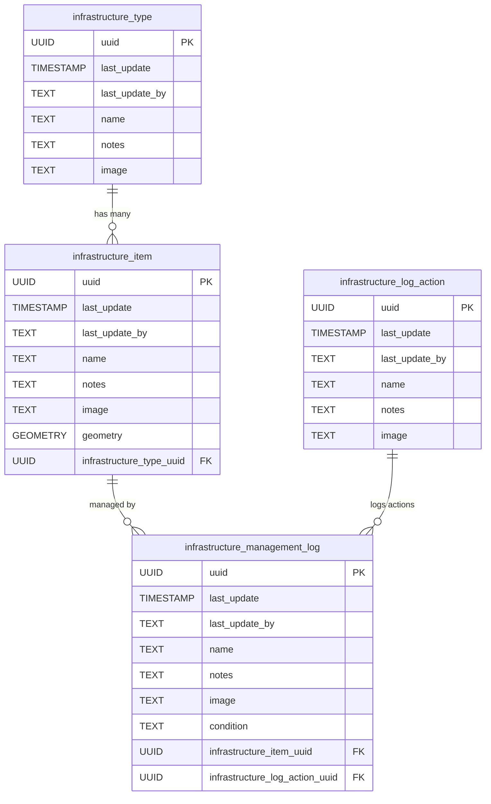
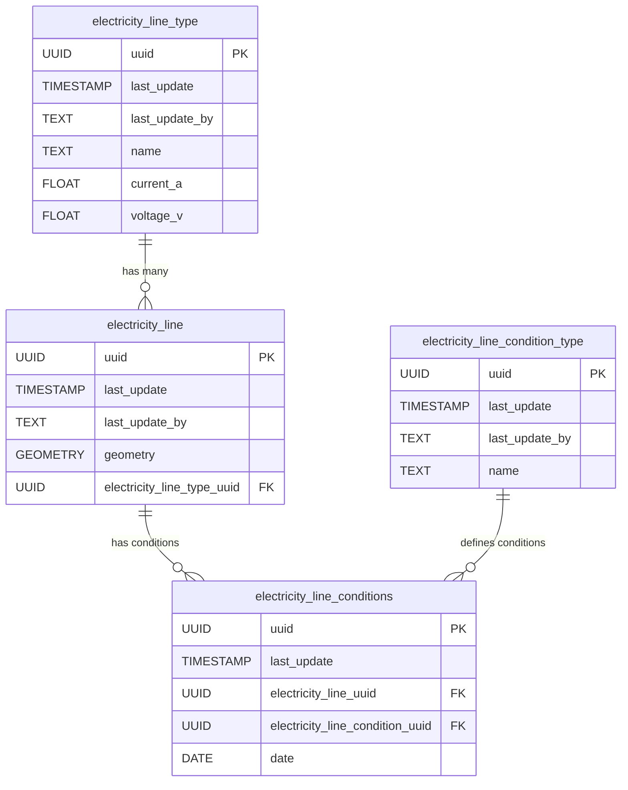
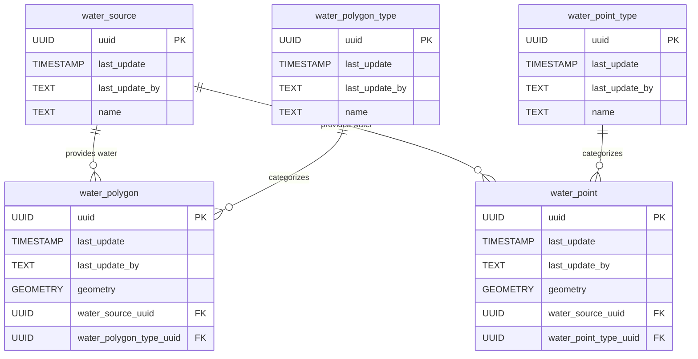
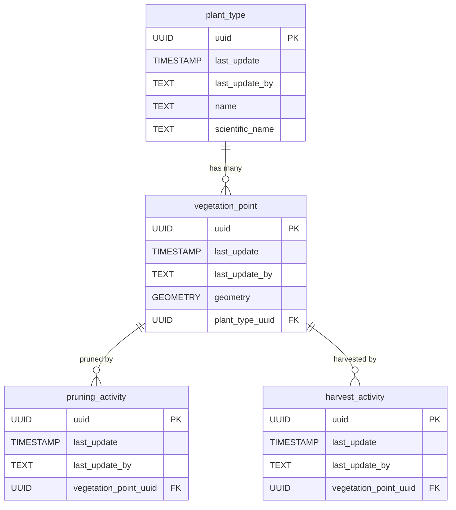
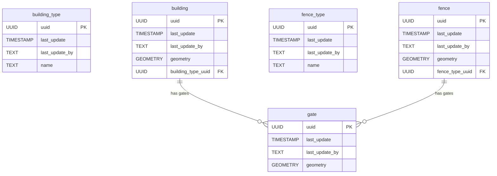
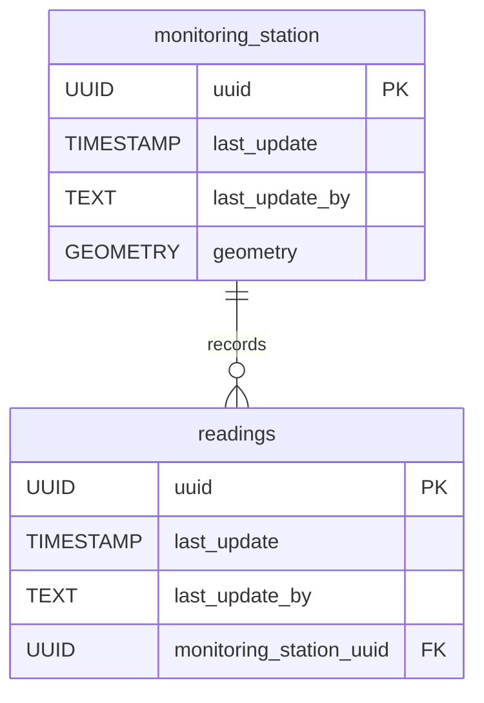
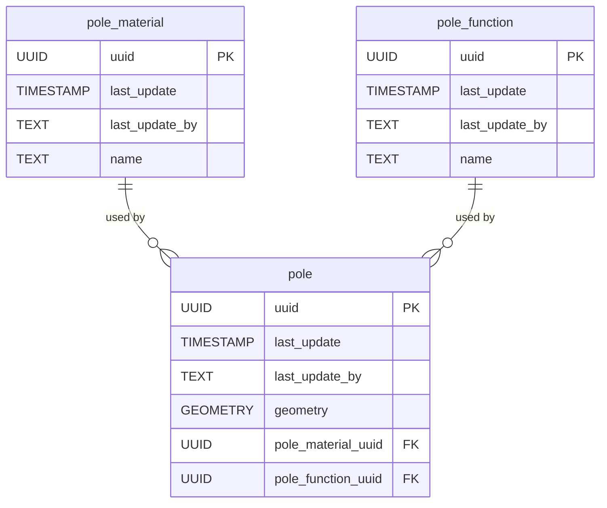

# 📊 Infrastructure Mapper Schema Documentation

This document provides an overview of the database schema for **Infrastructure Mapper** using Mermaid diagrams. The schema is broken into logical units for better understanding.

---

## 📂 Table of Contents

- [📊 Infrastructure Mapper Schema Documentation](#-infrastructure-mapper-schema-documentation)
  - [📂 Table of Contents](#-table-of-contents)
  - [🏗️ Infrastructure](#️-infrastructure)
  - [⚡ Electricity](#-electricity)
  - [💧 Water](#-water)
  - [🌱 Vegetation](#-vegetation)
  - [🏠 Buildings and Fences](#-buildings-and-fences)
  - [📡 Monitoring Stations](#-monitoring-stations)
  - [📍 Poles](#-poles)

---

## 🏗️ Infrastructure

---

## ⚡ Electricity

---

## 💧 Water

---

## 🌱 Vegetation

---

## 🏠 Buildings and Fences

---

## 📡 Monitoring Stations

---

## 📍 Poles

---

Feel free to expand or modify these diagrams as needed. Let me know if you need further assistance! 😊
