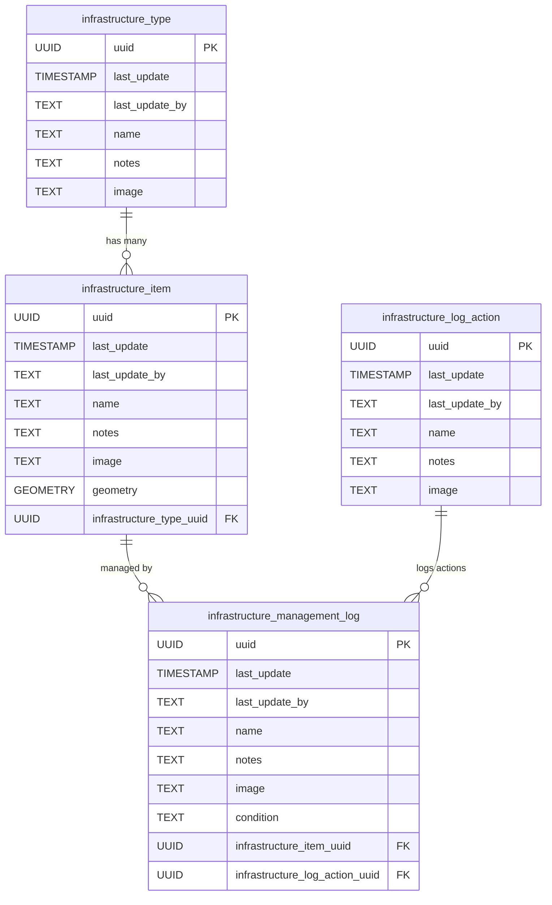
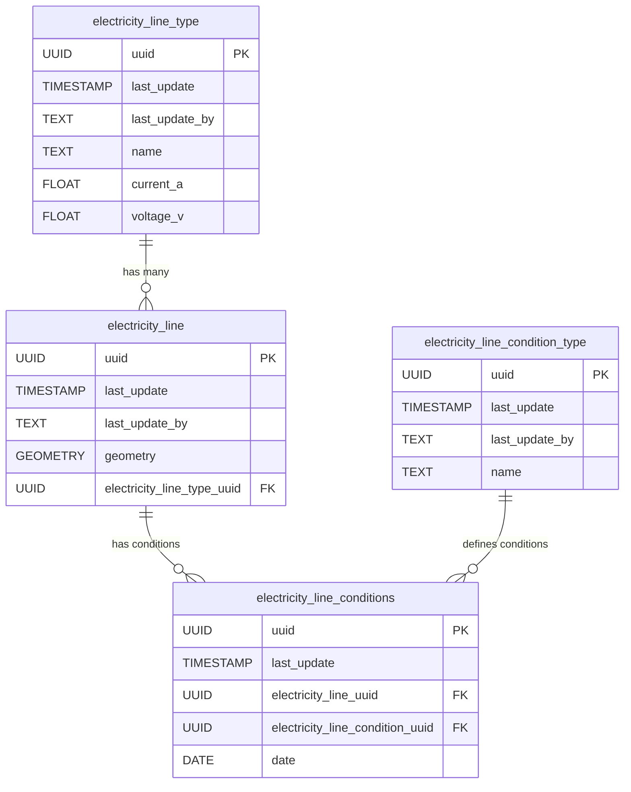
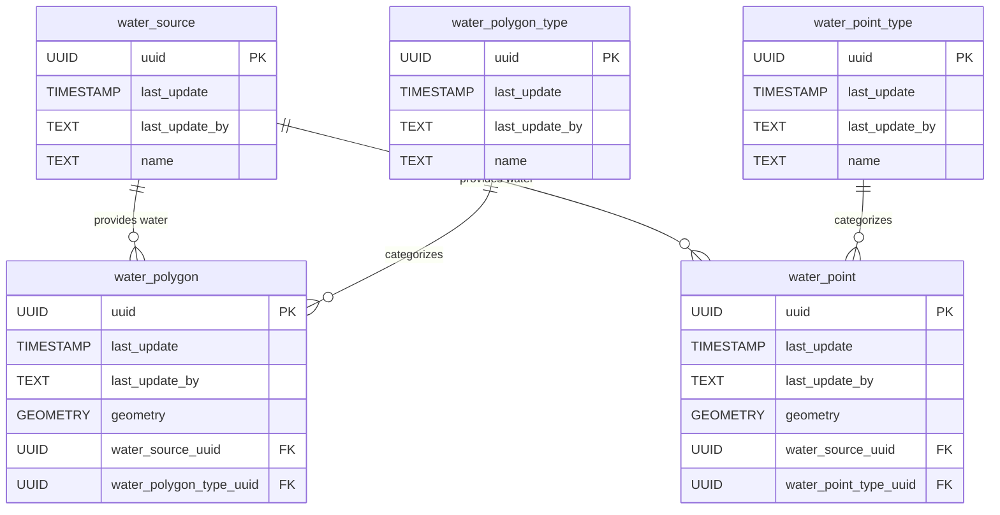
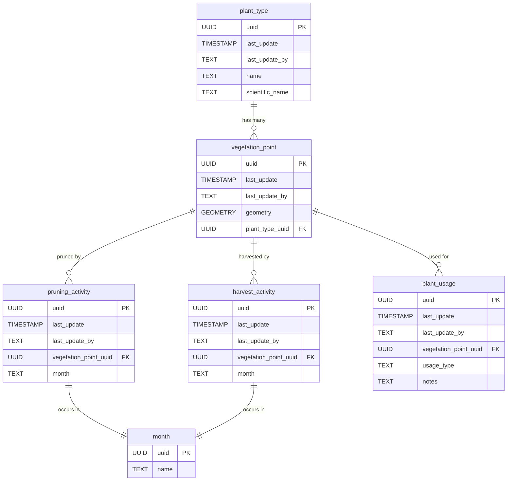
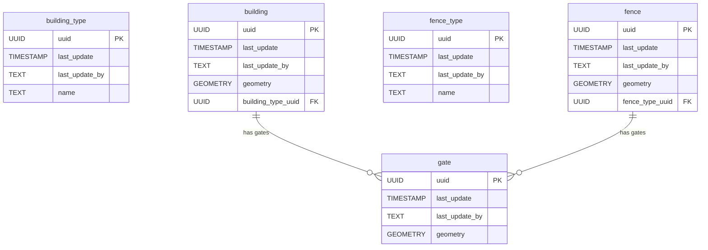
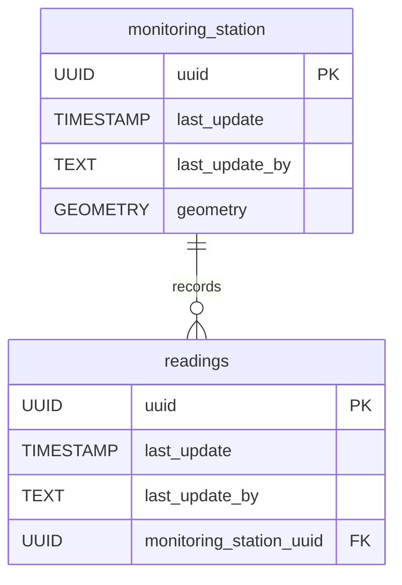
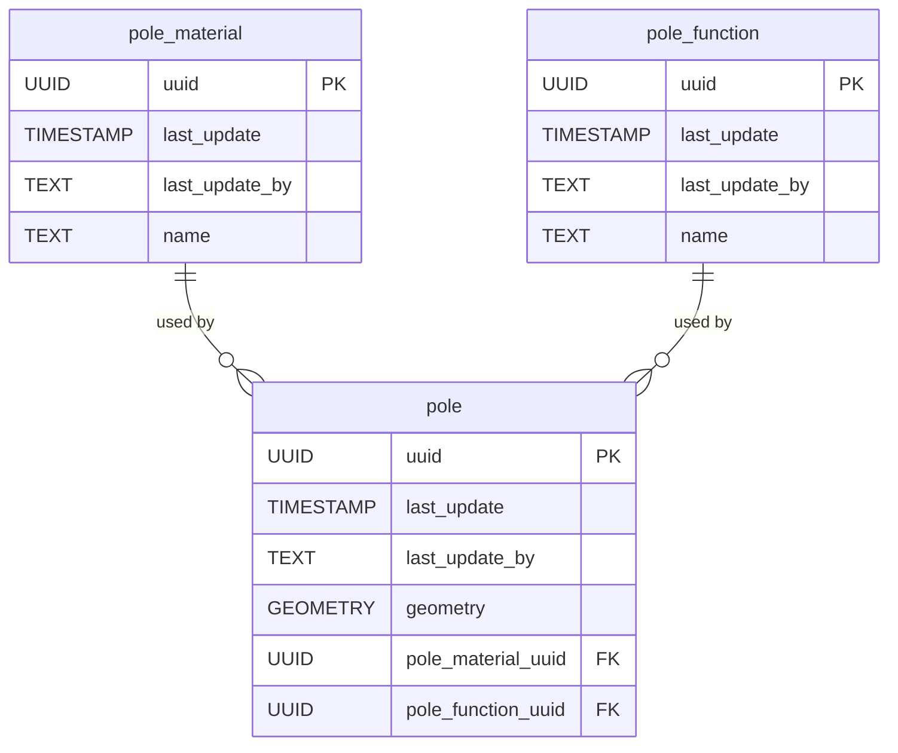
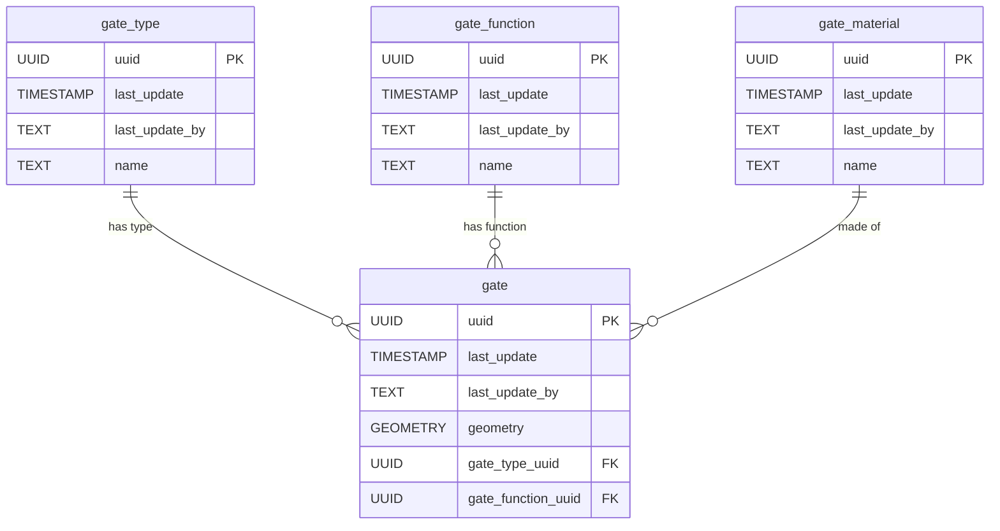
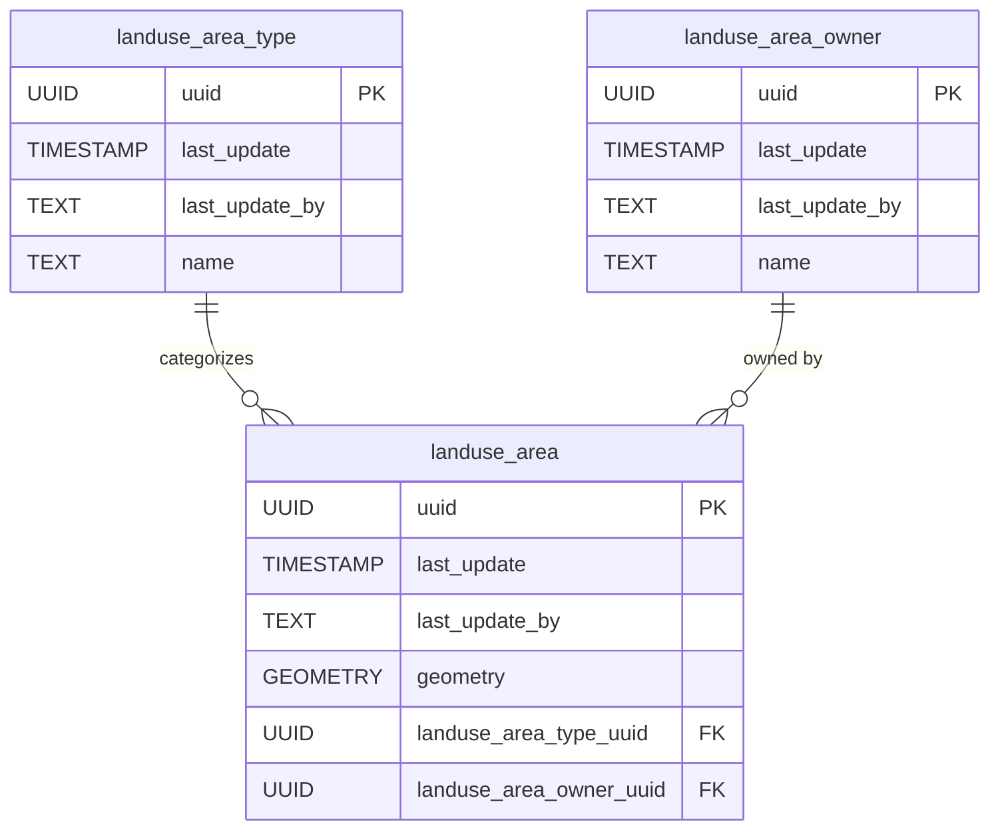

# 📊 Infrastructure Mapper Schema Documentation

This document provides an overview of the database schema for **Infrastructure Mapper** using Mermaid diagrams. The schema is broken into logical units for better understanding.

---

## 📂 Table of Contents

- [📊 Infrastructure Mapper Schema Documentation](#-infrastructure-mapper-schema-documentation)
  - [📂 Table of Contents](#-table-of-contents)
  - [🏗️ Infrastructure](#️-infrastructure)
  - [⚡ Electricity](#-electricity)
  - [💧 Water](#-water)
  - [🌱 Vegetation](#-vegetation)
  - [🏠 Buildings and Fences](#-buildings-and-fences)
  - [📡 Monitoring Stations](#-monitoring-stations)
  - [📍 Poles](#-poles)
  - [🚪 Gates](#-gates)
  - [🌍 Land Use Areas](#-land-use-areas)
  - [🛣️ Roads](#️-roads)

---

## 🏗️ Infrastructure

This section describes the core infrastructure elements, including types, items, and management logs.



***Explanation***

- **`infrastructure_type`**: Defines the type of infrastructure (e.g., roads, bridges).
- **`infrastructure_item`**: Represents individual infrastructure items with geometry and metadata.
- **`infrastructure_log_action`**: Tracks actions performed on infrastructure (e.g., maintenance, inspections).
- **`infrastructure_management_log`**: Logs management activities for infrastructure items.

---

## ⚡ Electricity

This section covers the schema for managing electricity infrastructure, including lines, types, and conditions.



***Explanation***

- **`electricity_line_type`**: Defines types of electricity lines (e.g., high voltage, low voltage).
- **`electricity_line`**: Represents individual electricity lines with geometry and metadata.
- **`electricity_line_condition_type`**: Defines possible conditions for electricity lines (e.g., damaged, operational).
- **`electricity_line_conditions`**: Tracks the condition of electricity lines over time.

---

## 💧 Water

This section describes the schema for managing water infrastructure, including sources, polygons, and points.



***Explanation***

- **`water_source`**: Represents sources of water (e.g., rivers, reservoirs).
- **`water_polygon_type`**: Categorizes water polygons (e.g., lakes, ponds).
- **`water_polygon`**: Represents water bodies with geometry and metadata.
- **`water_point_type`**: Categorizes water points (e.g., wells, taps).
- **`water_point`**: Represents specific water points with geometry and metadata.

---

## 🌱 Vegetation

This section focuses on vegetation, including plant types, pruning, harvesting, and usage.



***Explanation***

- **`plant_type`**: Defines the type of plant, including its scientific name.
- **`vegetation_point`**: Represents a specific plant's location and type.
- **`pruning_activity`**: Tracks pruning activities, including the month they occurred.
- **`harvest_activity`**: Tracks harvesting activities, including the month they occurred.
- **`plant_usage`**: Records how a plant is used (e.g., medicinal, ornamental, food) and any additional notes.
- **`month`**: Represents the month in which pruning or harvesting activities occur.

---

## 🏠 Buildings and Fences

This section describes buildings, fences, and their associated materials and conditions.



***Explanation***

- **`building_type`**: Defines types of buildings (e.g., residential, commercial).
- **`building`**: Represents individual buildings with geometry and metadata.
- **`fence_type`**: Defines types of fences (e.g., wooden, metal).
- **`fence`**: Represents individual fences with geometry and metadata.
- **`gate`**: Represents gates attached to buildings or fences.

---

## 📡 Monitoring Stations

This section describes monitoring stations and their associated readings.



***Explanation***

- **`monitoring_station`**: Represents monitoring stations with geometry and metadata.
- **`readings`**: Tracks readings recorded by monitoring stations.

---

## 📍 Poles

This section describes poles, their materials, functions, and conditions.



***Explanation***

- **`pole_material`**: Defines materials used for poles (e.g., wood, steel).
- **`pole_function`**: Defines functions of poles (e.g., electricity, communication).
- **`pole`**: Represents individual poles with geometry and metadata.

---

## 🚪 Gates

This section describes gates, their types, functions, materials, and conditions.



***Explanation***

- **`gate_type`**: Defines types of gates (e.g., wooden, metal).
- **`gate_function`**: Defines functions of gates (e.g., entry, exit).
- **`gate_material`**: Defines materials used for gates (e.g., wood, steel).
- **`gate`**: Represents individual gates with geometry and metadata.

---

## 🌍 Land Use Areas

This section describes land use areas, their types, ownership, and conditions.



***Explanation***

- **`landuse_area_type`**: Defines types of land use areas (e.g., residential, agricultural).
- **`landuse_area_owner`**: Represents owners of land use areas.
- **`landuse_area`**: Represents individual land use areas with geometry and metadata.

---

## 🛣️ Roads

This section describes roads, their segments, connecting points, type, construction/usage status, surface material, and conditions.

```mermaid
erDiagram
    segment_type {
        SERIAL id PK
        UUID uuid UNIQUE
        TIMESTAMP last_update
        TEXT last_update_by
        VARCHAR type_name UNIQUE
        TEXT description
    }
    
    segment_status {
        SERIAL id PK
        UUID uuid UNIQUE
        TIMESTAMP last_update
        TEXT last_update_by
        VARCHAR status_name UNIQUE
        TEXT description
    }

    segment_surface {
        SERIAL id PK
        UUID uuid UNIQUE
        TIMESTAMP last_update
        TEXT last_update_by
        VARCHAR surface_name UNIQUE
        TEXT description
    }

    segment_condition {
        SERIAL id PK
        UUID uuid UNIQUE
        TIMESTAMP last_update
        TEXT last_update_by
        VARCHAR condition_name UNIQUE
        TEXT description
    }

    intersection {
        SERIAL id PK
        UUID uuid UNIQUE
        TIMESTAMP last_update
        TEXT last_update_by
        GEOMETRY geom
    }

    road {
        SERIAL id PK
        UUID uuid UNIQUE
        TIMESTAMP last_update
        TEXT last_update_by
        TEXT name
    }

    road_segment {
        SERIAL id PK
        UUID uuid UNIQUE
        TIMESTAMP last_update
        TEXT last_update_by
        INT segment_number UNIQUE
        INT lanes
        FLOAT length_m
        INT speed_limit_kmh
        BOOLEAN one_way
        GEOMETRY geom
        UUID road_uuid FK
        UUID type_uuid FK
        UUID status_uuid FK
        UUID surface_uuid FK
        UUID condition_uuid FK
        UUID start_node FK
        UUID end_node FK
    }

    segment_type ||--o{ road_segment : "defines type"
    segment_status ||--o{ road_segment : "defines status"
    segment_surface ||--o{ road_segment : "defines surface"
    segment_condition ||--o{ road_segment : "defines condition"
    intersection ||--o{ road_segment : "as start node"
    intersection ||--o{ road_segment : "as end node"
    road ||--o{ road_segment : "has segments"
```

***Explanation***

- **`segment_type`**: Defines the classification of road segments (e.g., National, Main Road, Gravel Road).
- **`segment_status`**: Describes the current status of road segments (e.g., In Use, Planned, Under Construction).
- **`segment_surface`**: Specifies the surface material of road segments (e.g., Asphalt, Gravel, Dirt).
- **`segment_condition`**: Records the current condition of road segments (e.g., Good, Poor, Flooded, Under Repair).
- **`intersection`**: Represents physical nodes (points) where road segments begin, end, or connect.
- **`road`**: Represents logical roads, typically composed of one or more connected road segments.
- **`road_segment`**: Represents physical sections of a road, linking two intersections and holding detailed metadata including type, status, surface, and condition.

---
